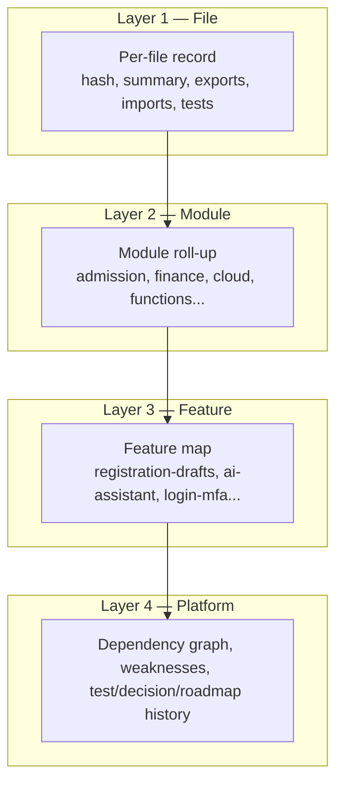

# AI Code Memory Design

**Project:** Madrasa EMS — Super Admin AI Advisor  
**Document type:** Code Memory Index (CMI) design proposal  
**Date:** 2026-07-09  
**Status:** Proposal only — no implementation

---

## 1. Purpose

Define a **permanent, incrementally maintained Code Memory Index (CMI)** that lets the Super Admin AI Advisor understand the EMS codebase deeply **without**:

- Re-reading the full repository on every question
- Sending the whole codebase to an LLM repeatedly
- Running continuous AI ingestion

The CMI is the **single source of truth** for software-advisor context.

---

## 2. Design Principles

| Principle | Implementation |
|-----------|----------------|
| **Index once** | Full build on release tag or 6/12-month schedule |
| **Update diffs only** | SHA-256 per file; re-index if hash changes |
| **Local before cloud** | Deterministic extraction before any LLM call |
| **Hierarchical roll-up** | File → module → feature → platform |
| **Citation-ready** | Every summary links to `fileId`, `gitSha`, line range |
| **Versioned** | Immutable snapshots; pointer to `currentVersion` |
| **Inspectable** | SA can browse CMI without asking AI |

---

## 3. Memory Layers



### 3.1 File summaries

**One record per indexable source file.**

| Field | Source | LLM? |
|-------|--------|------|
| `fileId` | Stable path hash | No |
| `path` | Relative repo path | No |
| `gitSha` | Commit when indexed | No |
| `contentHash` | SHA-256 of file bytes | No |
| `language` | Extension map | No |
| `lineCount` | wc | No |
| `exports` | Regex/AST-lite | No |
| `imports` | require/import parse | No |
| `globalFunctions` | `function name` / `exports.` scan | No |
| `linkedTests` | Path match to `tests/**` | No |
| `summaryShort` | 1–2 sentences | **Yes** (on create/change) |
| `summaryDetailed` | 5–10 sentences | **Yes** (on create/change) |
| `tags` | module, feature, layer | Partial LLM |
| `riskHints` | complexity, no tests nearby | Local rules + optional LLM |
| `indexedAt` | ISO timestamp | No |
| `indexMethod` | `local` \| `local+llm` | No |

**Example paths indexed:**
- `admission.js`, `finance.js`, `cloud/ems-ai-*.js`
- `functions/lib/**/*.js`
- `firestore.rules`, `firebase.json`
- `docs/*.md`
- `tests/unit/*.test.js`
- `scripts/*.js` (deploy, backup, bench)

**Excluded:** `dist/`, `node_modules/`, binary blobs, backup folders.

---

### 3.2 Module summaries

**Modules** are curated groupings (not necessarily 1:1 folders):

| moduleId | Typical paths |
|----------|---------------|
| `registration` | `admission.js`, `registration-ui.js`, `ems-registration-*.js` |
| `finance` | `finance.js`, fee-related cloud modules |
| `attendance` | attendance scripts and IDB keys |
| `ai-assistant` | `cloud/ems-ai-*.js`, `functions/lib/ai/` |
| `cloud-sync` | `cloud/sync-engine.js`, pull/push modules |
| `auth-security` | `auth.js`, `security-*.js`, login functions |
| `super-admin` | `superadmin.js`, `sa/*`, SA functions |
| `hosting-deploy` | `scripts/prepare-hosting.js`, `firebase.json` |
| `tests-infra` | `vitest.config.js`, `tests/**` |

**Module record fields:**

```json
{
  "moduleId": "registration",
  "labelUr": "رجسٹریشن",
  "fileIds": ["..."],
  "summary": "Offline-first registration with cloud SSOT...",
  "entryPoints": ["processRegistration", "emsRegSaveDraft"],
  "dependencies": ["cloud-sync", "auth-security"],
  "dependents": ["finance", "attendance"],
  "featureIds": ["registration-drafts", "duplicate-detection"],
  "testFileCount": 14,
  "lastTestPassRate": 1.0,
  "knownWeaknessIds": ["weak-003"],
  "lastRollupAt": "2026-07-09T08:00:00Z",
  "rollupGitSha": "abc123"
}
```

**Roll-up rule:** Module summary regenerated when **any child file** hash changes — using **local merge of file summaries** + optional **single LLM call per module** (not per query).

---

### 3.3 Dependency map

**Graph stored in GCS** (`dependencies/graph.json`), metadata in Firestore.

**Edge types:**

| Edge | Example |
|------|---------|
| `imports` | `ems-ai-orchestrator.js` → `ems-ai-client.js` |
| `loads` | `ems-post-auth-loader.js` → `cloud/ems-ai-guard-client.js` |
| `calls` | `dashboard.js` → `emsAiOpenPanel` (static reference) |
| `firestore` | `ems-ai-settings.js` → `SystemSettings_Config/ai_config` |
| `callable` | `ems-ai-client.js` → `aiAsk` |
| `tests` | `ems-registration-drafts-phasea.test.js` → `ems-registration-drafts.js` |

**Built locally** from import scan + loader manifests + grep for `emsCallFunction('...')`.

**Used for:** "What breaks if I change X?", "What depends on registration audit?"

---

### 3.4 Feature map

**Features** are product capabilities spanning modules:

| featureId | Modules | Status source |
|-----------|---------|---------------|
| `registration-drafts` | registration | Flag `EMS_REG_DRAFTS_ENABLED` |
| `ai-assistant-fab` | ai-assistant | `cloud/ems-ai-ui.js` |
| `enterprise-search` | registration, cloud | Typesense integration |
| `login-mfa` | auth-security | `security-mfa.js` |
| `phase-a-drafts` | registration | docs + code |

**Feature record:**

```json
{
  "featureId": "registration-drafts",
  "label": "Phase A Draft Admission",
  "modules": ["registration"],
  "fileIds": ["ems-registration-drafts.js", "admission.js"],
  "docRefs": ["docs/REGISTRATION_PHASEA_ARCHITECTURE.md"],
  "status": "active",
  "flagKeys": ["EMS_REG_DRAFTS_ENABLED"],
  "testIds": ["tests/unit/ems-registration-drafts-phasea.test.js"],
  "roadmapRefs": ["REGISTRATION_PHASE2 Phase A"]
}
```

**Maintained by:** Local rules + manual SA overrides + doc parser for roadmap sync.

---

### 3.5 Known weaknesses

**Sources:**
- Auto: files with no linked tests, high line count (>2000), TODO/FIXME density
- Auto: security patterns (plaintext key storage flagged in `ems-ai-settings.js`)
- Manual: SA or architect entries after audits
- Imported: `docs/AI_SYSTEM_SECURITY_REPORT.md` risk register

**Weakness record:**

```json
{
  "weakId": "weak-ai-001",
  "severity": "high",
  "category": "security",
  "title": "Gemini API keys stored plaintext in Firestore ai_config",
  "fileIds": ["cloud/ems-ai-settings.js", "functions/lib/ai/key-vault.js"],
  "moduleIds": ["ai-assistant"],
  "status": "open",
  "source": "AI_SYSTEM_SECURITY_REPORT",
  "discoveredAt": "2026-07-09",
  "resolvedAt": null
}
```

---

### 3.6 Test history

**Ingested from CI** after each run — **no LLM**.

```json
{
  "runId": "vitest-2026-07-09T0733",
  "gitSha": "abc123",
  "suite": "vitest",
  "passed": 530,
  "failed": 0,
  "skipped": 6,
  "durationMs": 19830,
  "failedTests": [],
  "moduleBreakdown": {
    "registration": { "passed": 45, "failed": 0 },
    "ai-assistant": { "passed": 0, "failed": 0, "note": "no tests" }
  }
}
```

**Playwright / e2e:** Separate run records with classification tags.

---

### 3.7 Decision history

**Architecture Decision Records (ADR)** — parsed from docs + manual SA entries:

| Source | Example |
|--------|---------|
| `docs/REGISTRATION_PHASEA_ARCHITECTURE.md` | Drafts separate from SSOT |
| `docs/REGISTRATION_PHASE1_LESSONS_LEARNED.md` | Phase gates |
| Manual SA input | "We chose Gemini over OpenAI for Phase 1" |

```json
{
  "decisionId": "adr-001",
  "title": "Drafts must not enter SSOT until approve/reject",
  "date": "2026-07-08",
  "status": "accepted",
  "context": "Phase A draft admission",
  "docRefs": ["docs/REGISTRATION_PHASEA_ARCHITECTURE.md"],
  "consequences": ["Separate IDB keys", "Cloud mirror optional"]
}
```

---

### 3.8 Roadmap history

**Snapshots** when roadmap docs change (hash diff):

- `docs/REGISTRATION_PHASE2_IMPLEMENTATION_PLAN.md`
- `docs/REGISTRATION_FINAL_ROADMAP.md`
- `docs/AI_ROADMAP_RECOMMENDATIONS.md`

**Parsed fields:** phases, features, dates, locked items (e.g., Phase B–E LOCKED).

**Enables:** "What changed in roadmap since last month?", "Is registration AI still locked?"

---

## 4. Index Build Pipeline

### 4.1 Full build (`cmi-full-build`)

**Trigger:**
- Git release tag (`v*`)
- Scheduled: every **6 months** (default) or **12 months** (config flag)
- Manual SA button: "Rebuild code memory" (rate-limited 1/week)

**Steps:**

```
1. Checkout clean git tree at SHA
2. Enumerate indexable files (manifest allowlist)
3. FOR EACH file (parallel workers):
   a. Compute contentHash
   b. Run local extractor (exports, imports, tests, lines)
   c. Queue for LLM batch if new or hash changed
4. Batch LLM: summarize files in groups of 20 (max tokens capped)
5. Roll up module summaries (local merge + optional 1 LLM/module)
6. Rebuild dependency graph
7. Refresh feature map from rules + docs parser
8. Snapshot test history from latest CI artifact
9. Import weaknesses from audit docs + auto rules
10. Parse roadmap docs → snapshot
11. Write new CMI version; update meta/currentVersion
12. Invalidate answer cache keys tied to old version
```

**LLM calls (full build, ~190 files):** ~10–15 batch calls — **one-time per 6 months**, not per query.

---

### 4.2 Incremental update (`cmi-incremental`)

**Trigger:** Merge to `main` (CI on push)

**Steps:**

```
1. Load meta/currentVersion content hashes
2. git diff --name-only HEAD~1 HEAD (or since last indexed SHA)
3. FOR EACH changed path in indexable set:
   IF contentHash unchanged → skip
   ELSE → local extract + LLM summarize THIS FILE ONLY
4. Identify affected modules → roll up those modules only
5. IF dependency-relevant file → partial graph patch
6. IF roadmap doc changed → new roadmap snapshot
7. Bump cmiVersion patch (1.3.0 → 1.3.1)
8. Invalidate cache for affected tags
```

**Typical merge:** 3–15 files → **3–15 LLM file summaries** (~$0.01–0.05).

**No changed files:** Zero LLM cost; metadata-only version bump optional.

---

### 4.3 Deletion handling

When file removed from repo:
- Mark `files/{fileId}.status = deleted`
- Remove from module `fileIds` on next roll-up
- Keep record for history (soft delete)

---

## 5. Retrieval Strategy (Query Time)

**No LLM for retrieval at MVP** — keyword + tag matching:

| Step | Action |
|------|--------|
| 1 | Parse SA question → tokens + intent (`software`) |
| 2 | Match `tags`, `moduleId`, `featureId`, `weakness` keywords |
| 3 | Score file summaries by relevance |
| 4 | Take top 8–15 file summaries + 2 module summaries + relevant weaknesses |
| 5 | Attach latest test snapshot for matched modules |
| 6 | Attach decision/roadmap entries if question mentions "roadmap", "phase", "why" |
| 7 | Pack into PSC ≤ 32 KB |

**Phase 2 optional:** Embedding index for semantic retrieval (still retrieves stored summaries, not raw files).

---

## 6. Storage & Versioning

### 6.1 Version scheme

`cmiVersion`: `MAJOR.MINOR.PATCH`
- **MAJOR:** Full rebuild
- **MINOR:** Structural schema change
- **PATCH:** Incremental file updates

### 6.2 Retention

| Data | Retention |
|------|-----------|
| Current file records | Indefinite |
| Deleted file records | 24 months |
| Full CMI snapshots | Last 3 major versions in GCS |
| Test history | 12 months rolling |
| Roadmap snapshots | All (small) |

### 6.3 Size estimate (EMS today)

| Layer | Records | Est. size |
|-------|---------|-----------|
| Files | ~350 source files | ~2 MB Firestore + 5 MB GCS |
| Modules | ~15 | ~50 KB |
| Features | ~40 | ~100 KB |
| Dependency graph | 1 blob | ~500 KB |
| Test history | ~365 runs/year | ~2 MB/year |
| Weaknesses | ~50 | ~30 KB |
| **Total** | | **< 15 MB** |

---

## 7. Local Summarization (No LLM)

**Always run locally — free:**

| Extractor | Output |
|-----------|--------|
| `extractImports` | Dependency edges |
| `extractExports` | Public API surface |
| `matchTests` | Test coverage linkage |
| `scanFlags` | `EMS_*_ENABLED` constants |
| `scanCallables` | Firebase function names |
| `docFrontMatter` | Title, date from markdown |
| `complexityHeuristic` | Lines, nesting depth estimate |
| `securityPatterns` | `apiKey`, `password`, `eval(` flags |

These populate CMI even when LLM batch is skipped (e.g., budget freeze).

---

## 8. LLM Usage Boundaries

| Event | LLM? | Max tokens/file |
|-------|------|-----------------|
| Full build (all files) | Yes, batch | ~400 input + 200 output |
| Incremental (changed) | Yes | ~400 + 200 per file |
| Module roll-up | Optional | ~800 + 400 per module |
| SA query | Yes, once | PSC ≤ 8K input + 2K output |
| SA query cache hit | **No** | 0 |
| Continuous polling | **Never** | — |

---

## 9. Consistency & Accuracy

| Challenge | Mitigation |
|-----------|------------|
| Summary outdated vs code | `contentHash` mismatch triggers re-index on next CI |
| LLM wrong file summary | SA can flag → `summaryOverride` field (manual) |
| Missing new file until CI | SA UI shows "CMI lags git by N commits" |
| Feature map drift | Doc parser + manual feature registry |

**Every AI answer must include footer:**
`CMI v1.3.2 @ gitSha abc123 | Retrieved: 12 files, 2 modules`

---

## 10. Interface to SAA Gateway

**Platform SCP (PSC) — software mode:**

```json
{
  "pscVersion": 1,
  "intent": "software_advice",
  "cmiVersion": "1.3.2",
  "gitSha": "abc123",
  "retrievedAt": "2026-07-09T08:30:00Z",
  "question": "...",
  "slices": {
    "files": [ /* top-K file summary records */ ],
    "modules": [ /* 1-2 module roll-ups */ ],
    "weaknesses": [ /* relevant open items */ ],
    "tests": { /* latest module test snapshot */ },
    "decisions": [ /* relevant ADRs */ ],
    "roadmap": { /* current phase snapshot excerpt */ }
  }
}
```

Gateway validates PSC size, passes to LLM with system prompt: *"Answer only from slices; cite fileId; say unknown if missing."*

---

## 11. Success Criteria

- [ ] Full codebase indexed in one CI job without runtime git access
- [ ] Incremental job processes ≤ 20 changed files in < 5 minutes
- [ ] SA query retrieves ≤ 15 file summaries — never full repo
- [ ] Zero LLM calls when answer served from cache
- [ ] CMI browsable in SA UI without AI
- [ ] 6-month full refresh automated with SA notification

---

## 12. Conclusion

The **Code Memory Index** is the cornerstone of cost-efficient Super Admin AI. By separating **index time** (CI, batch, incremental) from **query time** (retrieve + single LLM call), EMS avoids repeated full-codebase AI reading while maintaining deep software understanding.

---

*Proposal only — no code implemented.*
