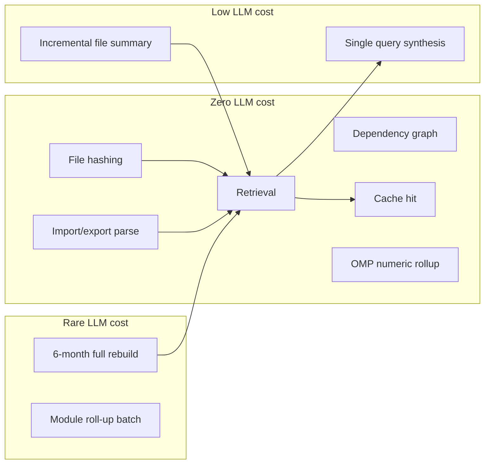

# AI Cost Control Plan

**Project:** Madrasa EMS — Super Admin AI Advisor  
**Document type:** Cost control proposal  
**Date:** 2026-07-09  
**Status:** Proposal only — no implementation

---

## 1. Objective

Enable deep Super Admin AI advice **without**:

- Continuous AI reading of the codebase
- Sending the full repository to an LLM on every question
- Unbounded token spend
- Surprise monthly bills

**Target:** Platform AI advisor cost **≤ $25/month** at moderate use; **≤ $75/month** at heavy use with hard caps.

---

## 2. Cost Drivers

| Driver | Risk level | Control mechanism |
|--------|------------|-------------------|
| Full codebase re-read per query | **Critical** | CMI retrieval — prohibited by architecture |
| Full rebuild too frequently | High | 6/12-month schedule + release tags only |
| Incremental over-summarization | Medium | Hash gate — skip unchanged files |
| SA query spam | High | Per-admin daily limits |
| Large PSC payloads | Medium | 32 KB cap |
| Uncached repeat questions | Medium | Answer cache 24h–7d |
| Institution OMP refresh | Low | Nightly aggregates, no LLM |
| Module roll-up LLM on every commit | Medium | Optional; batch weekly instead |

---

## 3. Core Cost Architecture



**Rule:** 80%+ of system operations must fall in **Zero LLM cost** bucket.

---

## 4. Indexing Cost Controls

### 4.1 One-time full read

| Parameter | Value |
|-----------|-------|
| Frequency | Release tag + every **6 months** (config: `cmiFullRefreshMonths: 6\|12`) |
| Files indexed | ~350 source (~190 deploy-critical) |
| LLM batch size | 20 files per call |
| Est. LLM calls | 15–18 batches |
| Est. tokens | ~400K input + 80K output |
| Est. cost (Gemini Flash) | **$0.30 – $1.50 per full build** |
| Annual cost (2×/year) | **$0.60 – $3.00** |

### 4.2 Incremental updates only

| Parameter | Value |
|-----------|-------|
| Trigger | CI on merge to `main` |
| Typical changed files | 3–15 per merge |
| LLM per changed file | 1 summary call (batched) |
| Skip condition | `contentHash` identical |
| Est. cost per merge | **$0.01 – $0.08** |
| Est. monthly (20 merges) | **$0.20 – $1.60** |

### 4.3 No continuous reading

| Prohibited | Alternative |
|------------|-------------|
| Watchdog re-index every hour | CI-triggered incremental only |
| Runtime git clone in Cloud Function | Pre-built CMI in Firestore |
| LLM on every file open in SA UI | Read stored `summaryShort` from CMI |
| Auto-sync from developer laptops | CI is sole indexer |

---

## 5. Query Cost Controls

### 5.1 Local retrieval before cloud

Every SA question:

```
1. Classify intent          → 0 tokens
2. Retrieve CMI slices      → 0 tokens
3. Build PSC (32 KB max)    → 0 tokens
4. Check answer cache       → 0 tokens if hit
5. ONE LLM call if miss     → ~2K–10K tokens
```

**Never:** Multi-turn agent loops, tool-use chains, or "read another 50 files" expansions at MVP.

### 5.2 Answer caching

| Cache key | Components |
|-----------|------------|
| Hash input | `normalizedQuestion + intent + cmiVersion + tenantScope?` |

| Query type | TTL |
|------------|-----|
| Architecture overview | 7 days |
| "What's the status of X?" | 24 hours |
| Institution KPI advice | 12 hours (OMP version in key) |
| Security audit question | 24 hours |

**Cache storage:** Firestore `Platform_CodeMemory/cache/answers/{hash}`

**Expected hit rate:** 35–50% after month 1.

**Savings example:** 200 queries/mo × 40% hit = 80 free responses → **~$2–5 saved**.

### 5.3 PSC size cap

| Limit | Value |
|-------|-------|
| Max PSC serialized | 32 KB (~8K tokens) |
| Max file summaries per query | 15 |
| Max module summaries | 3 |
| Max weakness entries | 10 |
| Truncation | Drop lowest-relevance files first |

Compare: full codebase ~5 MB deploy = **~1.3M tokens** — cap prevents **99%+ token waste**.

### 5.4 Usage limits

| Limit | Default | Configurable |
|-------|---------|--------------|
| SA queries per admin per day | 30 | Platform config |
| SA queries platform-wide per day | 100 | Hard cap |
| Max output tokens | 2048 | Per intent |
| Max input tokens | 8192 | PSC + question |
| Concurrent queries per admin | 1 | Prevents double-spend |
| "Rebuild CMI" manual trigger | 1/week | SA only |

**Exceeded limit response:** Cached FAQ answers still allowed; new LLM calls blocked with Urdu/EN message.

### 5.5 Model selection for cost

| Task | Model | Rationale |
|------|-------|-----------|
| File summary (batch) | Gemini 2.5 Flash | Cheapest adequate quality |
| SA query synthesis | Gemini 2.5 Flash | Urdu + code reasoning sufficient |
| Deep security audit (optional) | Claude Sonnet | Premium tier — SA opt-in, 5/day cap |
| Local retrieval | None | Free |

**Avoid:** Pro models for indexing; Opus-class for routine queries.

---

## 6. Institution Advisor Cost Controls

Institution mode uses **Operational Memory Pack (OMP)** — numeric aggregates built **without LLM**:

| Step | LLM? |
|------|------|
| Nightly tenant KPI rollup | No |
| Store OMP in Firestore | No |
| Retrieve OMP for question | No |
| Synthesize advice | Yes — one call |

**OMP refresh:** Cloud Scheduler + aggregate function (same pattern as `scheduledAggregate` stats).

**Cost:** Identical to software query — **one LLM call per cache miss**.

**PII premium path (disabled by default):** If SA explicitly enables named student analysis, charge against **separate lower limit** (5/day) and log elevated audit.

---

## 7. Cloud vs Local vs Hybrid — Cost Comparison

Assumptions: 200 SA queries/mo, 20 incremental merges/mo, 2 full rebuilds/year.

| Approach | Indexing/mo | Queries/mo | Infra/mo | Total/mo |
|----------|-------------|------------|----------|----------|
| **Naive cloud** (full repo per query) | — | $500+ | $5 | **$500+** ❌ |
| **Cloud + CMI (recommended hybrid)** | $0.15 | $8–15 | $3 | **$11–18** ✓ |
| **Full local LLM** | $0 | $0 | $80–200 GPU | **$80–200** |
| **Local retrieve + cloud answer** | $0.15 | $8–15 | $10 | **$18–25** ✓ |
| **Embeddings vector (add-on)** | $2–5 | $10–20 | $5 | **$17–30** |

**Winner:** **Hybrid** — local indexing/retrieval/cache + cloud synthesis.

---

## 8. Budget Enforcement

### 8.1 Platform budget config

```json
{
  "monthlyTokenBudget": 500000,
  "monthlyCostCapUsd": 50,
  "alertThresholdPct": 80,
  "hardStopAtCap": true,
  "cmiFullRefreshMonths": 6
}
```

### 8.2 Monitoring

| Metric | Source |
|--------|--------|
| Tokens per query | LLM response metadata |
| Daily spend estimate | Rolling sum in Firestore |
| Cache hit rate | Cache writes vs LLM calls |
| Incremental files summarized | CMI job logs |
| Top query topics | Audit log aggregation |

**SA dashboard widget:** "AI Advisor spend this month: $4.20 / $50.00"

### 8.3 Degraded modes

| Budget state | Behavior |
|--------------|----------|
| Normal | Full SAA |
| > 80% cap | Warn SA; suggest cache-friendly queries |
| > 100% cap | New LLM calls blocked; CMI browse + cached answers only |
| Emergency | Local summaries only — no LLM until next month |

---

## 9. Scheduled Refresh Policy

| Event | Schedule | LLM cost |
|-------|----------|----------|
| Incremental index | Each merge to `main` | Pennies |
| Full CMI rebuild | Every **6 months** (default) | ~$1 |
| Full CMI rebuild alt | Every **12 months** (low-churn) | ~$1 |
| OMP nightly rollup | 02:00 UTC daily | $0 |
| Test history ingest | Each CI test run | $0 |
| Roadmap snapshot | When roadmap doc hash changes | $0 |
| Module LLM roll-up | Weekly batch (optional) | ~$0.10/week |

**SA notification:** Email/in-app 7 days before scheduled full rebuild.

---

## 10. Cost Scenarios

### Scenario A — Light (small team)

| Item | Volume | Cost |
|------|--------|------|
| SA queries | 50/mo | $2–4 |
| Incremental merges | 8/mo | $0.08 |
| Full rebuild | 2/year | $0.25/mo amortized |
| Firestore/GCS/Functions | — | $2 |
| **Total** | | **~$5–7/mo** |

### Scenario B — Moderate (recommended planning)

| Item | Volume | Cost |
|------|--------|------|
| SA queries | 200/mo | $8–15 |
| Incremental merges | 20/mo | $0.40 |
| Full rebuild | 2/year | $0.25/mo |
| Infra | — | $3 |
| **Total** | | **~$12–19/mo** |

### Scenario C — Heavy (multiple SA operators)

| Item | Volume | Cost |
|------|--------|------|
| SA queries | 600/mo (cap-limited) | $25–40 |
| Incremental merges | 40/mo | $0.80 |
| Premium Sonnet audits | 20/mo | $5–10 |
| Infra | — | $5 |
| **Total** | | **~$36–56/mo** (under $75 cap) |

---

## 11. Anti-Patterns (Explicitly Forbidden)

| Anti-pattern | Why |
|--------------|-----|
| Send `dist/` or full repo in prompt | 1M+ tokens |
| Re-summarize all files on each query | Linear cost explosion |
| Agent loop "read more files" without cap | Unbounded |
| Per-tenant CMI duplicate | Storage + indexing waste |
| Real-time LLM on git webhook per file | Continuous cost |
| Embedding entire codebase weekly | $5–20/mo for marginal gain at MVP |

---

## 12. Implementation Checklist (Cost-Related)

- [ ] `contentHash` gate on incremental indexer
- [ ] PSC 32 KB validator in gateway
- [ ] Answer cache with version-aware keys
- [ ] Per-admin daily query counter
- [ ] Platform monthly token budget with hard stop
- [ ] LLM call only in `saAdvisorAsk` — not in indexer UI
- [ ] Batch file summarization in CI (not interactive)
- [ ] Cost dashboard in SA console
- [ ] Config flag `cmiFullRefreshMonths: 6 | 12`

---

## 13. ROI Justification

| Manual alternative | Time | SAA value |
|--------------------|------|-----------|
| Architecture audit | 8–16 hrs/quarter | Automated from CMI |
| "Where is X implemented?" | 30–60 min | Seconds via retrieval |
| Roadmap vs code gap analysis | 4 hrs | Feature map query |
| Post-release weakness review | 4 hrs | Weakness registry |

**Break-even:** ~2 hours SA time saved per month vs **~$15 AI cost**.

---

## 14. Conclusion

Cost control is **architectural**, not optional. The CMI + incremental update + retrieval + cache + rate limit stack keeps Super Admin AI at **~$10–25/month** for normal use — versus **hundreds or thousands** if the full codebase were sent to the model repeatedly.

**Recommended default:** 6-month full refresh, hybrid local/cloud, 30 queries/admin/day, 32 KB PSC cap.

---

*Proposal only — no code implemented.*
