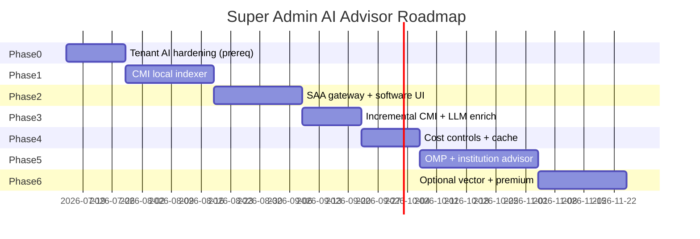

# AI Implementation Roadmap

**Project:** Madrasa EMS — Super Admin AI Advisor  
**Document type:** Implementation roadmap proposal  
**Date:** 2026-07-09  
**Status:** Proposal only — no implementation

---

## 1. Executive Recommendation

**Build order:** Code Memory first → Software Advisor → Cost/security hardening → Institution Advisor → Optional enhancements.

**Architecture:** **Hybrid** (local index/retrieve/cache + cloud LLM synthesis).

**Estimated total effort:** ~14–18 weeks (1 senior developer + part-time SA/QA).

**Estimated running cost:** **$8–25/month** (moderate use).

---

## 2. Options Comparison Summary

| Option | Pros | Cons | Verdict |
|--------|------|------|---------|
| **Cloud-only** | Best Urdu; simple ops | Indexing cost if naive | ✓ **For LLM synthesis only** |
| **Local-only** | No data leaves; fixed cost | Weak Urdu; poor code advice; GPU ops | ✗ Not for MVP |
| **Hybrid** | Local CMI + cache; cloud for summaries/answers | Two subsystems | ✓ **Recommended** |
| **Naive "ask ChatGPT whole repo"** | Fast to hack | $500+/mo; insecure | ✗ **Forbidden** |

---

## 3. Implementation Phases



---

## Phase 0 — Prerequisites (2 weeks)

**Goal:** Harden existing tenant AI so SAA can reuse patterns safely.

| Task | Deliverable | Owner |
|------|-------------|-------|
| Move tenant Gemini keys to Secret Manager | Security fix on `aiAsk` path | Backend |
| Add rate limit skeleton on `aiAsk` | Reusable limiter for SAA | Backend |
| Document SCP/gateway patterns | Internal ADR | Architect |

**Exit:** Tenant AI security ≥ 70; limiter module extractable.

**Not SAA scope but blocks shared infrastructure risk.**

---

## Phase 1 — Code Memory Index local foundation (3 weeks)

**Goal:** Permanent code memory with **zero LLM cost**.

| Week | Tasks |
|------|-------|
| 1 | CMI Firestore/GCS schema; file enumerator; hash index |
| 2 | Local extractors: imports, exports, tests, flags, callables |
| 3 | Module/feature registry; dependency graph; CI `cmi-full-build` (local only) |

**Deliverables:**
- `Platform_CodeMemory/meta/currentVersion`
- ~350 file records with local metadata
- 15 module roll-ups (rule-based, no LLM)
- Dependency graph JSON
- SA "Browse Code Memory" read-only UI (no AI yet)

**Exit criteria:**
- Full index builds in CI < 10 min
- No LLM calls
- SA can browse modules/files without AI

**Priority:** **BUILD FIRST** — foundation for everything else.

---

## Phase 2 — Software Advisor MVP (3 weeks)

**Goal:** SA can ask software questions using CMI retrieval + one LLM call.

| Week | Tasks |
|------|-------|
| 1 | `saAdvisorAsk` callable; SA auth; Platform_AiAuditLog |
| 2 | Retrieval engine (keyword + tag); PSC builder (32 KB cap) |
| 3 | SA Advisor panel (software mode); Urdu/EN responses; citations |

**Deliverables:**
- Software intent: UI/UX, security, tests, performance, roadmap questions
- Answer footer with CMI version + git SHA
- 10 manual test scenarios documented

**Exit criteria:**
- SA asks "What tests missing for registration?" → cited answer from CMI
- Non-SA denied
- No full repo sent (verify token logs)

---

## Phase 3 — Incremental CMI + LLM enrichment (2 weeks)

**Goal:** Changed-files-only updates with batch summarization.

| Task | Detail |
|------|--------|
| `cmi-incremental` CI job | git diff + hash gate |
| LLM batch summarizer | Changed files only |
| Module roll-up refresh | Affected modules only |
| Weakness auto-import | From audit docs + heuristics |
| Test history ingest | Vitest JSON artifact → CMI |
| Roadmap snapshot parser | Hash diff on `docs/*ROADMAP*` |

**Exit criteria:**
- Merge with 5 changed files → 5 LLM summaries, not full rebuild
- `cmiVersion` patch bump automatic

---

## Phase 4 — Cost controls & cache (2 weeks)

**Goal:** Sustainable spend at scale.

| Task | Detail |
|------|--------|
| Answer cache | Hash key + TTL tiers |
| Per-admin rate limits | 30/day default |
| Platform budget cap | $50/mo hard stop |
| Cost dashboard | SA widget |
| Scheduled full refresh | 6-month Cloud Scheduler reminder + job |
| PSC validator | Reject > 32 KB |

**Exit criteria:**
- Repeat question → cache hit, 0 LLM tokens
- 31st query in day → blocked with message
- Full rebuild runs on schedule only

---

## Phase 5 — Institution Advisor (4 weeks)

**Goal:** OMP-based institution improvement advice.

| Week | Tasks |
|------|-------|
| 1 | OMP schema; nightly tenant rollup function |
| 2 | Benchmark aggregator (k-anonymity ≥ 10) |
| 3 | Institution PSC builder; SA tenant picker |
| 4 | Institution + combined modes; OMP on-demand refresh |

**Deliverables:**
- Admissions, attendance, finance, communication, teacher, ops domains
- Cross-tenant benchmark compare (SA only)
- Aggregate-only default; PII mode off

**Exit criteria:**
- "How improve fee collection?" → OMP-based Urdu advice
- Zero student names in default mode audit sample

---

## Phase 6 — Optional enhancements (3 weeks)

**Only after Phase 5 stable.**

| Enhancement | Value | Cost impact |
|-------------|-------|-------------|
| Vector embeddings on CMI summaries | Better retrieval for vague questions | +$5–15/mo |
| Premium Claude audits | Deep security reviews | +$5–10/mo |
| Auto-generated weekly SA report | Scheduled retrieval + template | +$1–2/mo |
| OMP email digest to SA | Operational | Low |

---

## 4. What to Build First (Priority List)

| Rank | Component | Why first |
|------|-----------|-----------|
| **1** | CMI local indexer + schema | Zero AI cost; permanent memory |
| **2** | `saAdvisorAsk` + SA auth + audit | Safe query path |
| **3** | Retrieval + software PSC | Immediate SA value |
| **4** | SA software advisor UI | Usability |
| **5** | Incremental hash diff CI | Ongoing cost control |
| **6** | LLM file summarization (changed only) | Richer memory without full re-read |
| **7** | Answer cache + rate limits | Cost sustainability |
| **8** | 6-month full refresh scheduler | Long-term accuracy |
| **9** | OMP nightly builder | Institution domain foundation |
| **10** | Institution advisor UI | Second value stream |

---

## 5. Team & Responsibilities

| Role | Responsibility |
|------|----------------|
| Backend developer | CMI jobs, callables, OMP builder |
| Frontend developer | SA console panel |
| SA product owner | Feature registry, weakness entries, UAT |
| DevOps | CI jobs, Secret Manager, Scheduler |
| Security review | Phase 2 + 5 gate |

---

## 6. Risks & Mitigations

| Risk | Phase | Mitigation |
|------|-------|------------|
| CMI schema churn | 1 | Version field; migration script |
| SA low adoption | 2 | Start with software QA questions |
| OMP data gaps offline tenants | 5 | Show sync health; partial OMP |
| Cost overrun | 4 | Caps before institution launch |
| Hallucinated citations | 2 | Require fileId from retrieval set |
| Scope creep into auto-fix | All | Read-only charter in ADR |

---

## 7. Testing Strategy

| Phase | Tests |
|-------|-------|
| 1 | CMI schema validation; hash consistency; graph integrity |
| 2 | SA auth deny; PSC size; retrieval relevance fixtures |
| 3 | Incremental diff only changed; version bump |
| 4 | Cache hit; rate limit; budget stop |
| 5 | OMP aggregate-only; no PII field scan |
| 6 | Embedding retrieval regression |

**Target:** 40+ automated tests by Phase 4 end.

---

## 8. Documentation Deliverables

| Doc | When |
|-----|------|
| ADR: SAA read-only charter | Phase 0 |
| CMI operator guide | Phase 1 |
| SA Advisor user guide (Urdu) | Phase 2 |
| OMP metric dictionary | Phase 5 |
| Runbook: key rotation | Phase 2 |

*Architecture proposals already delivered in this audit package.*

---

## 9. Success Criteria (Program Level)

- [ ] Full codebase indexed once; incremental updates only
- [ ] SA software questions answered without full repo LLM read
- [ ] Monthly platform AI cost ≤ $25 at moderate use
- [ ] 100% queries audited
- [ ] Institution advice works on aggregates default
- [ ] Zero auto code/deploy/DB changes
- [ ] 6-month full refresh automated
- [ ] SA cites CMI fileIds in software answers

---

## 10. Estimated Costs

### Development (one-time)

| Phase | Effort |
|-------|--------|
| 0 | 5 dev-days |
| 1 | 12 dev-days |
| 2 | 12 dev-days |
| 3 | 8 dev-days |
| 4 | 8 dev-days |
| 5 | 16 dev-days |
| 6 | 10 dev-days (optional) |
| **Total MVP (0–5)** | **~61 dev-days (~12 weeks)** |

### Operations (recurring)

| Item | Monthly |
|------|---------|
| Hybrid LLM (index + queries) | $8–20 |
| Firestore/GCS/Functions | $3–5 |
| Secret Manager | < $1 |
| **Total** | **$12–26** |

---

## 11. Go / No-Go Gates

| Gate | After phase | Decision |
|------|-------------|----------|
| G1 | Phase 1 | CMI useful without AI? Browse OK? |
| G2 | Phase 2 | SA software answers accurate enough? |
| G3 | Phase 4 | Cost within budget? |
| G4 | Phase 5 | Institution privacy review pass? |

**No-Go:** If G1 fails, fix indexer before any LLM spend.

---

## 12. Relationship to Registration Phase E AI

Registration **Phase E** (`emsRegAiAssist`) is **tenant staff AI** — separate product surface.

| Item | Registration Phase E | SAA |
|------|---------------------|-----|
| User | Staff | Super Admin |
| Memory | Live registration SCP | CMI + OMP |
| Build order | After Registration Phase A stable | Platform track parallel OK |

**Recommendation:** SAA Phase 1–4 can proceed **in parallel** with Registration Phase B/C; avoid Registration Phase E until SAA cost controls proven.

---

## 13. Final Architecture Recommendation

```
┌─────────────────────────────────────────────────────────┐
│                 SUPER ADMIN AI ADVISOR                   │
├─────────────────────────────────────────────────────────┤
│  UI: superadmin.js — Platform Advisor panel             │
├─────────────────────────────────────────────────────────┤
│  Runtime: saAdvisorAsk (isolated callable)              │
│    → retrieve CMI / OMP (local, no LLM)                 │
│    → check cache                                        │
│    → single Gemini Flash call                           │
│    → audit                                              │
├─────────────────────────────────────────────────────────┤
│  Index CI: cmi-full-build (6mo) + cmi-incremental       │
│    → local parse + changed-file LLM enrich              │
├─────────────────────────────────────────────────────────┤
│  OMP CI: nightly aggregate (no LLM)                     │
├─────────────────────────────────────────────────────────┤
│  Storage: Platform_CodeMemory + Platform_OperationalMemory│
│  Keys: Secret Manager (platform only)                   │
└─────────────────────────────────────────────────────────┘
```

**Hybrid:** Local memory + retrieval + cache; cloud for enrichment and answers.

**Not recommended:** Local LLM primary; full-repo cloud reads; merging with tenant `aiAsk`.

---

## 14. Document Index

| Report | Path |
|--------|------|
| Architecture | `docs/SUPER_ADMIN_AI_ADVISOR_ARCHITECTURE.md` |
| Code Memory | `docs/AI_CODE_MEMORY_DESIGN.md` |
| Cost Control | `docs/AI_COST_CONTROL_PLAN.md` |
| Security & Privacy | `docs/AI_SECURITY_AND_PRIVACY_PLAN.md` |
| Institution Advisor | `docs/AI_INSTITUTION_ADVISOR_PLAN.md` |
| Roadmap (this doc) | `docs/AI_IMPLEMENTATION_ROADMAP.md` |

---

## 15. Conclusion

The Super Admin AI Advisor is **feasible, cost-controllable, and secure** when implemented as a **memory-first hybrid system**. **Build the Code Memory Index first** — it delivers immediate browse value at zero AI cost and makes every subsequent query cheap.

**Recommended start date:** After Phase 0 tenant AI key hardening (or in parallel if separate owner).

---

*Proposal only — no code implemented.*
