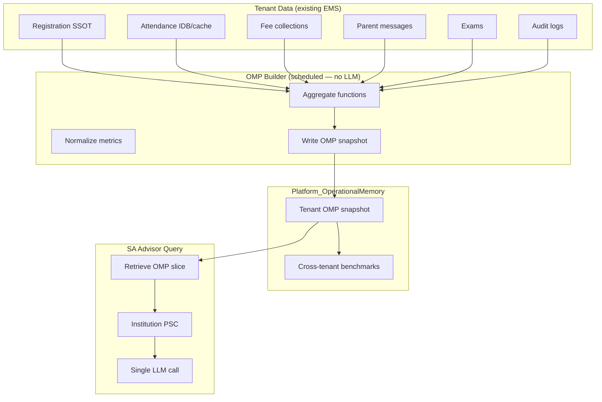

# AI Institution Advisor Plan

**Project:** Madrasa EMS — Super Admin AI Advisor  
**Document type:** Institution improvement domain proposal  
**Date:** 2026-07-09  
**Status:** Proposal only — no implementation

---

## 1. Purpose

Extend the Super Admin AI Advisor beyond **software/code** questions to **institution improvement** advice — helping madrasas operate better across admissions, attendance, finance, parent communication, teacher performance, and general operations.

**Critical constraint:** Institution advice must **not** re-read the codebase or send bulk student data to the LLM. It uses **Operational Memory Packs (OMP)** — pre-computed, aggregate, tenant-scoped statistics.

---

## 2. Two Advisor Domains (Unified Console)

| Domain | Memory source | Example question |
|--------|---------------|------------------|
| **A. Software** | Code Memory Index (CMI) | "What registration tests are missing?" |
| **B. Institution** | Operational Memory Pack (OMP) | "How can this madrasa improve fee collection?" |

SA selects mode or asks combined questions — gateway retrieves from **both** slices with strict size caps.

---

## 3. Institution Advisor Goals

### 3.1 Admissions improvement

| Insight type | OMP metrics |
|--------------|-------------|
| Enrollment funnel | Applications started vs completed vs approved (counts) |
| Approval latency | Median days pending |
| Duplicate rate | Duplicate flags per 100 registrations |
| Draft recovery | Draft save rate, resume success (Phase A) |
| Rejection reasons | Top coded reasons (counts, not names) |
| Seasonal pattern | Monthly enrollment trend 12mo |

**Sample advice output:**
- Simplify fields with highest abandonment correlation
- Enable draft auto-save reminders if recovery rate low
- Staff training on duplicate review when false-positive rate high

### 3.2 Attendance improvement

| Insight type | OMP metrics |
|--------------|-------------|
| Institution attendance rate | Today + 30/90 day % |
| Class variance | Std dev of class rates |
| Chronic absenteeism band | Count of students below 70% (band, not list) |
| Marking consistency | Days with zero marks vs school days |
| Department comparison | Aggregate by department |

### 3.3 Finance improvement

| Insight type | OMP metrics |
|--------------|-------------|
| Collection rate | % collected vs billed |
| Arrears concentration | % arrears from top 20% defaulters (band) |
| Class-wise collection | Per-class aggregate |
| Concession usage | % students with discount |
| Ledger expense trend | Monthly expense totals |
| Fee setup completeness | % students with fee plan configured |

### 3.4 Parent communication

| Insight type | OMP metrics |
|--------------|-------------|
| Message volume | Sent/received counts |
| Response time | Median hours to first staff reply |
| Unread backlog | Count |
| Portal adoption | Linked parents / total students % |
| Announcement reach | Read rate if tracked |

### 3.5 Teacher performance

| Insight type | OMP metrics |
|--------------|-------------|
| Attendance marking timeliness | % marks within 24h |
| Class exam avg vs institution avg | Department delta |
| Complaint rate per class | Aggregate |
| Training completion | % staff completed modules |

*Note: Teacher **personal** files not sent — class/department aggregates only.*

### 3.6 Operational recommendations

Cross-cutting OMP dashboard:

| Area | Signals |
|------|---------|
| Data quality | Missing phone %, incomplete registration fields |
| Cloud sync health | Outbox depth, last sync age |
| Module adoption | Which ribbon modules used (telemetry if available) |
| Mobile usage | Android vs web ratio (if tracked) |
| AI assistant usage | Tenant `AiAuditLog` counts (aggregate) |

---

## 4. Operational Memory Pack (OMP) Design

### 4.1 Architecture



### 4.2 OMP snapshot schema (per tenant)

```json
{
  "ompVersion": "2026-07-09T02:00:00Z",
  "tenantId": "madrasa_xyz",
  "tenantLabel": "Jamia Example",
  "period": { "from": "2025-07-09", "to": "2026-07-09" },
  "admissions": {
    "enrolledCount": 420,
    "pendingCount": 18,
    "rejectedCount": 12,
    "duplicateFlagRate": 0.04,
    "draftRecoveryRate": 0.72,
    "medianApprovalDays": 3
  },
  "attendance": {
    "rate30d": 0.91,
    "rate90d": 0.89,
    "chronicAbsentBandCount": 34,
    "classVarianceScore": 0.12
  },
  "finance": {
    "collectionRate": 0.78,
    "totalArrears": 1250000,
    "arrearsBandTop20Pct": 0.55,
    "concessionRate": 0.15
  },
  "communication": {
    "parentLinkRate": 0.62,
    "medianReplyHours": 18,
    "unreadBacklog": 45
  },
  "teachers": {
    "markingTimelinessRate": 0.85,
    "trainingCompletionRate": 0.40
  },
  "operations": {
    "syncOutboxDepth": 2,
    "lastSyncAgeHours": 4,
    "dataQualityScore": 0.88
  },
  "benchmarks": {
    "collectionRatePercentile": 45,
    "attendanceRatePercentile": 62
  }
}
```

**No names, CNIC, phones, or free-text complaint bodies.**

### 4.3 Cross-tenant benchmarks

Platform-level anonymous aggregates for SA comparison:

| Benchmark | Use |
|-----------|-----|
| Median collection rate (all tenants) | "This madrasa is below p50" |
| p25/p75 attendance | Context for advice |
| Enrollment growth distribution | Seasonal norms |

**K-anonymity rule:** Benchmarks published only when ≥ 10 tenants contribute stat.

---

## 5. OMP Builder (No LLM)

### 5.1 Schedule

| Job | Frequency | LLM |
|-----|-----------|-----|
| `omp-tenant-rollup` | Nightly 02:00 UTC | No |
| `omp-benchmark-rollup` | Weekly Sunday | No |
| `omp-on-demand` | SA button (rate 1/tenant/day) | No |

### 5.2 Data sources (reuse existing EMS patterns)

| Metric | Source module |
|--------|---------------|
| Admissions | Registration SSOT, duplicate module, draft module |
| Attendance | Same localStorage/cache scan as `ems-ai-macro-builders` — but aggregated server-side from synced Firestore where available |
| Finance | Fee collections cache / Firestore sync |
| Parent | `ParentMessages`, link tables |
| Teachers | Attendance marking timestamps, training module |

**Prefer server-side aggregation** from Firestore (trusted sync) over client-only IDB for OMP — SA view is platform/cloud context.

### 5.3 OMP versioning

- `ompVersion` = ISO timestamp of build
- Included in institution PSC and cache keys
- SA answer footer: `OMP @ 2026-07-09T02:00:00Z`

---

## 6. Institution Query Flow

```
1. SA selects tenant(s) — max 3 for compare mode
2. SA selects domain: admissions | attendance | finance | communication | teachers | operations | all
3. Gateway loads OMP snapshot(s) + optional benchmark slice
4. Retrieve relevant CMI features (e.g., "registration-drafts" docs) if software context needed
5. Build Institution PSC (≤ 32 KB)
6. Cache check
7. LLM synthesize recommendations in Urdu/English
8. Audit with tenantId list
```

### 6.1 Institution PSC example

```json
{
  "pscVersion": 1,
  "intent": "institution_advice",
  "domain": "finance",
  "tenantIds": ["madrasa_xyz"],
  "ompSnapshots": [ /* aggregate only */ ],
  "benchmarks": { /* optional */ },
  "relatedFeatures": [
    { "featureId": "registration-drafts", "status": "active" }
  ],
  "question": "How can fee collection improve before Ramadan?"
}
```

---

## 7. Advice Categories & Output Format

### 7.1 Structured response template

```markdown
## خلاصہ (Executive Summary)
...

## اہم مسائل (Key Issues)
1. ...

## تجویز کردہ اقدامات (Recommended Actions)
| Priority | Action | Expected impact | Effort |
|----------|--------|-----------------|--------|
| P0 | ... | ... | Low |

## متعلقہ سافٹویر فیچرز (Related EMS Features)
- registration-drafts: ...

## ڈیٹا نوٹ (Data Note)
OMP @ 2026-07-09 | Aggregates only | CMI v1.3.2
```

### 7.2 Combined software + institution questions

**Example:** "Enrollment is low — is it a software UX issue or operational?"

Retrieval:
- OMP: enrollment trend, draft abandonment, mobile usage
- CMI: `registration-ui.js`, mobile module summaries, known UX weaknesses

Single LLM call with both slices — capped at 32 KB total.

---

## 8. Privacy Modes

| Mode | Default | Data |
|------|-------|------|
| **Aggregate** | ✓ Yes | OMP only |
| **Benchmark compare** | Optional | OMP + anonymous platform stats |
| **Named student** | ✗ Off | Requires explicit SA checkbox; reuses masked student SCP; 5/day limit |

**Super Admin institution advice never needs named students for strategic recommendations.**

---

## 9. Relationship to Tenant AI (`aiAsk`)

| Aspect | Tenant AI | SA Institution Advisor |
|--------|-----------|------------------------|
| User | Owner/staff | Super Admin |
| Scope | Single tenant live query | Platform view + OMP |
| Data freshness | Live local cache | Nightly OMP (+ on-demand) |
| Cross-tenant compare | No | Yes (benchmarks) |
| Purpose | Day-to-day staff commentary | Strategic improvement advice |
| PII | Student summaries | Aggregates default |

**Complementary, not duplicate.**

---

## 10. Institution Advisor Limitations (Disclosed to SA)

| Limitation | Mitigation |
|------------|------------|
| OMP lags up to 24h | On-demand OMP refresh button |
| Offline-only tenant data may delay OMP | Show sync health in OMP |
| Cannot see classroom reality | Advice labeled data-driven only |
| LLM may overgeneralize | Cite OMP fields in response |
| No automatic SMS/actions | Read-only |

---

## 11. Example SA Questions & Retrieval Map

| Question | OMP domains | CMI add-on |
|----------|-------------|------------|
| "Improve admissions before new year" | admissions, operations | registration module |
| "Why arrears high?" | finance, attendance | finance module |
| "Parent engagement weak?" | communication | parent-portal feature |
| "Compare madrasa A vs B attendance" | attendance × 2 tenants | — |
| "Teacher marking delays — software or staff?" | teachers, operations | attendance module |
| "Platform-wide collection benchmark" | benchmarks | — |

---

## 12. Success Metrics

| KPI | Target |
|-----|--------|
| OMP build success rate | > 99% tenants/night |
| Aggregate-only queries | > 95% of institution queries |
| SA satisfaction (qualitative) | Actionable recommendations |
| Zero PII incidents | 0 |
| Institution query cost | Same as software (~$0.03–0.08/query) |

---

## 13. Risks

| Risk | Mitigation |
|------|------------|
| OMP exposes sensitive aggregates | No small-N deanonymization; suppress stats if n < 10 |
| Wrong advice harms madrasa ops | Disclaimer + human verification |
| Tenant feels "spied on" | Platform ToS; SA-only access |
| Stale OMP misguides | Show build timestamp prominently |

---

## 14. Conclusion

The **Institution Advisor** completes the Super Admin AI value proposition: not only *how the software works* but *how each madrasa can improve operations* — using **pre-aggregated OMP snapshots**, **zero continuous LLM ingestion**, and **strict privacy defaults**.

Build **after** CMI + software advisor path is stable.

---

*Proposal only — no code implemented.*
