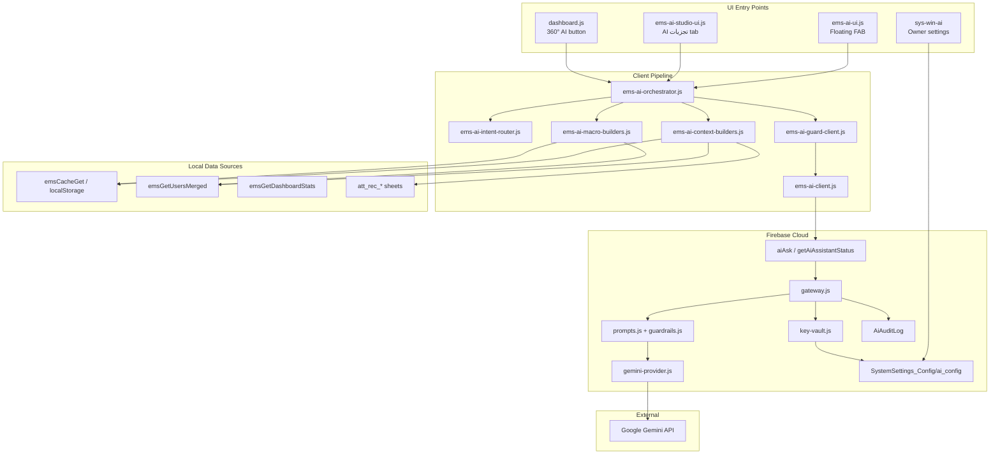

# AI System Architecture Report

**Project:** Madrasa EMS  
**Audit type:** Read-only deep audit  
**Date:** 2026-07-09  
**Scope:** Entire codebase (source of truth: workspace root, excluding `node_modules/` mirrors)

---

## Executive Summary

Madrasa EMS implements a **Phase 1 cloud LLM assistant** branded **"Madrasa AI مشیر (Beta)"**, powered by **Google Gemini** via Firebase Cloud Functions. The design follows a **Structured Context Pack (SCP)** pattern: the client never sends raw database dumps or API keys; it sends schema-bound JSON summaries that the server validates before calling the LLM.

There is **one production AI stack** (analytics/consulting). Registration, finance, parent portal, and Super Admin have **no dedicated AI modules** — only roadmap documentation.

---

## 1. Complete File Inventory

### 1.1 Client modules (`cloud/`)

| File | Role |
|------|------|
| `ems-ai-guard-client.js` | Layer 1 guardrails, online readiness, access gate (`emsAiCanUse`) |
| `ems-ai-intent-router.js` | 4 intents + default Urdu questions |
| `ems-ai-context-builders.js` | SCP builders: student, class compare, institution KPI |
| `ems-ai-macro-builders.js` | Macro SCP for AI Studio deep dive (department/class/date) |
| `ems-ai-client.js` | Firebase callable wrapper (`emsAiAsk`, `emsAiGetStatus`) |
| `ems-ai-orchestrator.js` | Intent → SCP → gateway pipeline |
| `ems-ai-settings.js` | Owner admin UI ↔ Firestore `ai_config` |
| `ems-ai-ui.js` | Floating FAB + chat panel |
| `ems-ai-studio-ui.js` | Full "AI تجزیات" ribbon module |

### 1.2 Server modules (`functions/lib/ai/`)

| File | Role |
|------|------|
| `gateway.js` | Callable `aiAsk`, `getAiAssistantStatus` |
| `router.js` | Multi-provider adapter resolution |
| `key-vault.js` | API key resolution (Firestore → Secret Manager → env) |
| `prompts.js` | Urdu system/user prompt templates |
| `guardrails.js` | Server domain filter + output sanitization |
| `context-schema.js` | SCP validation (64 KB max, 4 intents) |
| `tenant-access.js` | Owner/staff gate; parents denied |
| `audit.js` | Writes `AiAuditLog` entries |
| `providers/gemini-provider.js` | Active Gemini REST adapter |
| `providers/openai-provider.js` | **Stub** — throws on use |
| `providers/anthropic-provider.js` | **Stub** — throws on use |
| `providers/base-provider.js` | Provider interface |

### 1.3 Wiring / integration files

| File | AI role |
|------|---------|
| `functions/index.js` | Exports `aiAsk`, `getAiAssistantStatus` |
| `ems-post-auth-loader.js` | Loads AI client stack sequentially after auth |
| `ems-lazy-loader.js` | Lazy-loads AI Studio (`macro-builders`, `studio-ui`) |
| `cloud/ems-cloud-manifest.js` | `lazy['ai-studio']` manifest entry |
| `index.html` | Ribbon tab `#tab-ai-studio`, settings `#sys-win-ai`, FAB `#ems-ai-fab-root` |
| `auth.js` | Module access `ai-studio`, `emsAiStudioAccessAllowed()` |
| `sys-settings.js` | Initializes AI settings tab |
| `dashboard.js` | 360° report "AI تجزیہ" button → FAB |
| `firestore.rules` | `ai_config` owner/SA read; `AiAuditLog` staff read / server write |
| `sa/rbac-config.js`, `functions/lib/rbac-config.js` | Permission `ai.assistant.use` defined |

### 1.4 Documentation (planned AI — not implemented)

| File | Content |
|------|---------|
| `docs/REGISTRATION_PHASE2_IMPLEMENTATION_PLAN.md` | Phase E: Analytics + AI Assistant |
| `docs/REGISTRATION_PHASE2_GLOBAL_FEATURES.md` | Feature 10: Registration AI Assistant |
| `docs/REGISTRATION_GLOBAL_COMPARISON.md` | 5 AI/intelligence gaps |
| `docs/REGISTRATION_FUTURE_ROADMAP.md` | AI form fill, admission assistant |
| `docs/REGISTRATION_DUPLICATE_DETECTION_PLAN.md` | AI-assisted duplicate review (planned) |

### 1.5 Explicitly NOT AI (common confusion)

| Component | Actual technology |
|-----------|-------------------|
| `cloud/ems-enterprise-search.js` | Typesense **keyword** search, not embeddings |
| `functions/lib/tenant-registration-search.js` | Server-side keyword search index |
| Duplicate detection (`ems-registration-duplicates.js`) | Rule/fuzzy matching, not LLM |

---

## 2. Architecture Diagram



---

## 3. Entry Points

| Entry point | Trigger | Intent(s) |
|-------------|---------|-----------|
| FAB (`#ems-ai-fab-root`) | User opens panel, submits question | `student_performance`, `class_compare`, `institution_kpi`, `institutional_deep_dive`* |
| AI Studio (`#module-ai-studio`) | Ribbon tab "AI تجزیات" | `institutional_deep_dive` |
| System Settings → AI مشیر | Owner configures Gemini key | N/A (config only) |
| Dashboard 360° → AI تجزیہ | Student selected in 360 report | `student_performance` (prefilled) |
| Callable `getAiAssistantStatus` | Settings probe button | Status only |

\*FAB renders all intents including `institutional_deep_dive`, but macro builder loads lazily with AI Studio; FAB path may fail if macro module not loaded.

---

## 4. Data Flow (Request Lifecycle)

1. **Auth gate (client):** `emsAiCanUse()` — blocks guest/parent; allows owner/staff (and loosely any signed-in tenant user).
2. **Online gate (client):** `emsAiEnsureOnlineReady()` — requires network + Firebase Functions.
3. **Client guard:** `emsAiClientGuard()` — length limit, off-domain regex block.
4. **Intent resolution:** `emsAiResolveIntent(opts)`.
5. **SCP build:** Context builders read **local cache / localStorage** only — no live Firestore read in builders.
6. **Callable `aiAsk`:** Client sends `{ tenantId, intent, question, contextPack, provider? }`.
7. **Server gate:** `assertTenantStaffAccess()` — Firebase Auth + owner or active `Staff_Links`.
8. **Validation:** Question length, SCP schema, tenantId match, domain guardrails.
9. **Key resolve:** Firestore `ai_config` → optional Secret Manager → env/`functions.config()`.
10. **LLM call:** Gemini with Urdu system prompt + JSON summary in user prompt.
11. **Sanitize + audit:** Output redaction; write `AiAuditLog`.
12. **Render:** Answer shown in FAB or Studio panel.

---

## 5. Intents & Context Packs

| Intent | SCP builder | Data included (summary level) |
|--------|-------------|-------------------------------|
| `student_performance` | `emsAiBuildStudentContextPack` | Profile (name, id, class, masked phone), 3mo attendance, fee paid/outstanding, exam trend (6), discipline sample |
| `class_compare` | `emsAiBuildClassCompareContextPack` | Per-class student count, avg exam %, avg attendance % |
| `institution_kpi` | `emsAiBuildInstitutionContextPack` | Headcounts, finance totals, today attendance |
| `institutional_deep_dive` | `emsAiBuildMacroContextPack` | Department/class scoped aggregates: attendance, fees, exams, discipline, class breakdown (max 12) |

**SCP constraints:** version 1, max 64 KB serialized, no raw row dumps by design.

---

## 6. Dependencies

### Client dependencies
- Firebase Auth (signed-in user)
- Firebase Functions (`emsCallFunction` / `firebase.functions()`)
- EMS cache layer (`emsCacheGet`, `emsGetUsersMerged`, `emsGetDashboardStats`)
- localStorage attendance sheets (`att_rec_*`)
- Post-auth loader sequence

### Cloud dependencies
- Firebase Cloud Functions (Node 20)
- Firestore (`ai_config`, `AiAuditLog`, `Staff_Links`, `All_Madrasas`)
- Google Gemini API (`generativelanguage.googleapis.com`)
- Optional: Google Secret Manager (code present; **not in `functions/package.json`**)

### External API
- **Gemini models:** `gemini-2.5-flash` (default), fallback `gemini-2.0-flash`

---

## 7. Permissions Model

| Layer | Rule |
|-------|------|
| Firestore `ai_config` read | Owner or Super Admin only |
| Firestore `ai_config` write | Owner or Super Admin |
| Firestore `AiAuditLog` read | Any tenant staff (`canReadTenantStaff`) |
| Firestore `AiAuditLog` write | Server only (`allow write: if false`) |
| Callable `aiAsk` | Owner or active staff link; **parents blocked** |
| Client `emsAiCanUse` | owner/staff; blocks parent/guest |
| RBAC `ai.assistant.use` | Defined for admin/teacher roles — **not enforced in AI client code** |
| AI Studio module tab | `auth.js` → `emsAiStudioAccessAllowed()` |

---

## 8. Offline Behavior

| Mode | Behavior |
|------|----------|
| Offline / offline-only EMS | AI **fully unavailable** — banner shown, submit disabled |
| Online without API key | Server returns `ai_key_missing` |
| Online with AI disabled in config | Server returns `ai_disabled` |
| Planned (Phase E registration) | `emsRegAiRulesFallback` — **not implemented** |

AI is **not offline-first**. It is an online overlay on offline-local data.

---

## 9. Settings & Configuration

**Firestore path:** `All_Madrasas/{tenantId}/SystemSettings_Config/ai_config`

```json
{
  "enabled": true,
  "defaultProvider": "gemini",
  "defaultModel": "gemini-2.5-flash",
  "providers": {
    "gemini": {
      "apiKey": "<stored by owner UI>",
      "model": "gemini-2.5-flash"
    }
  }
}
```

**Environment fallbacks:** `GEMINI_API_KEY`, `GEMINI_MODEL`, `functions.config().ai.*`

**Local prefs:** `localStorage` key `ems_ai_ui_prefs` (UI preferences only)

---

## 10. Loader Order

**Post-auth (`ems-post-auth-loader.js`):**
```
ems-ai-guard-client → intent-router → context-builders → client → orchestrator → settings → ui
```

**Lazy (`ems-lazy-loader.js` / cloud manifest):**
```
ai-studio tab → ems-ai-macro-builders → ems-ai-studio-ui
```

Event: `ems:ai-client-ready` dispatched after stack load.

---

## 11. Architecture Assessment

| Strength | Detail |
|----------|--------|
| Gateway pattern | API keys never on client |
| SCP pattern | Bounded, validated payloads |
| Adapter router | Ready for multi-LLM |
| Audit trail | Per-query logging |
| Urdu-first prompts | Domain-specific consultant persona |
| Layered guardrails | Client + server filters |

| Gap | Detail |
|-----|--------|
| No AI unit/e2e tests | Zero coverage in `tests/` |
| RBAC permission unused | `ai.assistant.use` not wired |
| No rate limiting | Cost/abuse exposure |
| Plaintext API keys in Firestore | Should use Secret Manager only |
| Single provider active | OpenAI/Anthropic are stubs |
| No registration/finance AI modules | Docs only |

**Architecture score (this report):** **74 / 100** — solid foundation, incomplete hardening and module spread.

---

*End of AI System Architecture Report*
