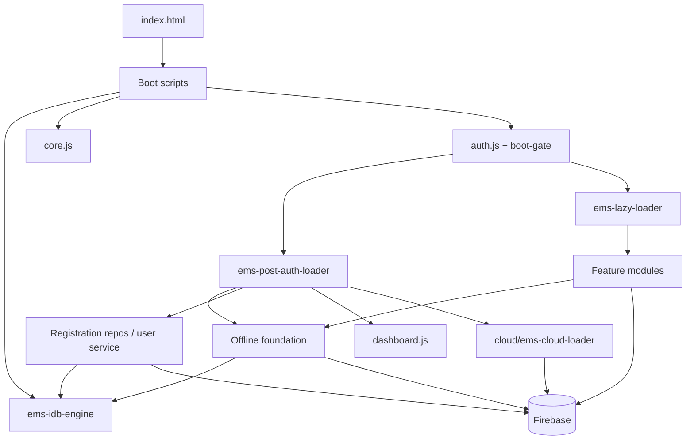

# Dependency map — Madrasa EMS

> How scripts load, what they share globally, and what is **too coupled to move safely**.  
> Audited: 2026-07-17 · **Documentation only.**

---

## 1. Load-first order (critical path)

```text
index.html parses
  → defer scripts (order preserved):
      ems-runtime-mode.js
      ems-native-app-boot.js
      ems-status-bar.js
      ems-mobile-shell.js
      ems-search-index.js
      ems-idb-engine.js
      ems-search-index-lock.js
      ems-storage-quota.js
      ems-search-index-bg.js
      ems-query-utils.js
      ems-repository.js
      ems-online-mode.js
      cloud/ems-cloud-manifest.js
      cloud/ems-cloud-loader.js
      ems-deferred-libs.js
      ems-utils.js
      ems-sync-cursor-idb.js
      cache-policy.js
      ems-master-data.js → ems-ui-kit.js → ems-branding.js → ems-i18n.js
      ems-module-perf.js → ems-demo-sandbox.js
      tenant-context.js → ems-tenant-storage.js → ems-firestore-paths.js
      ems-cloud-pull.js → ems-tenant-resolver.js → department-context.js
      ems-sw-update.js
      core.js
      portal-access.js → landing.js
      ems-offline-session-cache.js → ems-offline-policy.js
      ems-native-google-auth.js
      auth.js
      ems-boot-gate.js
      ems-post-auth-loader.js → (async batches after auth)
      ems-lazy-loader.js
      ems-offline-mode.js → ems-offline-config.js → ems-device-identity.js
      ems-global-sync.js
  → QRCode CDN script (earlier in page for QR features)
  → service worker registration (via core / sw-update paths)
```

**Rule:** Anything earlier in this list may be assumed by later files via `window.*`. Reordering is as dangerous as moving.

---

## 2. Global-variable dependency style

Almost all client code is **IIFE + `window` / `global` attachment**, not ES modules.

Typical patterns:

- `window.ems…` APIs (`emsLazyLoadModule`, `emsIsCloudEnabled`, IDB helpers)
- Shared flags (`EMS_OFFLINE_ONLY`, runtime mode flags)
- Module objects (`RegistrationModule`, layout menus, ribbon handlers in `core.js`)
- DOM IDs and classes defined in `index.html`

**Implication:** Moving a file without updating loaders still “works” only if the **URL path** stays correct. Renaming paths breaks static tags and dynamic loaders even if globals are unchanged.

---

## 3. Scripts loaded directly from `index.html`

See defer list above (~45 client scripts + CDN).  
Also: large **inline HTML templates / styles** inside `index.html` (not separate files yet).

CDN:

- `qrcode.min.js` (cdnjs) — printing/QR features

---

## 4. Dynamic loaders (second-order graph)

### 4.1 `ems-post-auth-loader.js`

Depends on auth success / unlock path, then injects:

1. Offline foundation (outbox → offline-write → cloud-mutation → …)  
2. Offline core (registration repos, user service, …)  
3. Dashboard  
4. AI client stack (ordered)  
5. Deferred sys-* / diagnostics / dashboard-pro  

### 4.2 `ems-lazy-loader.js`

Depends on `emsIsCloudEnabled` / `emsCloudLazyScripts`. Per-module chains (abbreviated):

| modId | Depends on prior boot | Scripts (first party) |
|-------|----------------------|------------------------|
| admission | offline foundation + registration core preferred | reg-dashboard → mobile → drafts → admission → idcard → import* → registration-ui |
| attendance | offline-write | att-dashboard → attendance |
| exams | core | exams |
| curriculum | core | curriculum |
| training | core | training |
| finance | core | smart-slip → finance |
| ledger | core | ledger |
| announcements | core | announcements |
| complaints | core | complaints |
| ai-studio | AI stack ideally ready | AI studio UI scripts |
| admin-panel | access keys / parent-shared | access-keys → parent-shared → admin-panel |
| parent-portal | parent-shared | parent-shared → parent-portal |
| superadmin | sa/* chain | many `sa/*.js` → superadmin.js |

### 4.3 `cloud/ems-cloud-loader.js`

Loads cloud-only extras when cloud mode enabled; couples modules to `cloud/*`.

---

## 5. Circular / bidirectional couplings (practical)

True ES-module cycles are rare (few `import` graphs). **Practical cycles** exist via globals:

| Cycle / tangle | Files | Why unsafe |
|----------------|-------|------------|
| Auth ↔ boot ↔ offline flags | `auth.js`, `ems-boot-gate.js`, `ems-native-app-boot.js`, runtime mode | Unlock order bugs cause blank UI |
| Core shell ↔ mobile shell ↔ layout builders | `core.js`, `ems-mobile-shell.js`, `sys-layout-builder.js` | Mobile reads live DOM tabs from shell |
| Registration repo ↔ offline write ↔ cloud pull | `ems-registration-repository.js`, `ems-offline-write.js`, `ems-cloud-pull.js` | Data loss risk |
| Sync engines (root ↔ cloud) | `sync-engine.js`, `cloud/sync-engine.js` | Dual surfaces — consolidate only after call-site map |
| Tenant context ↔ firestore paths ↔ resolvers | `tenant-context.js`, `ems-firestore-paths.js`, `ems-tenant-resolver.js` | Path/identity consistency |

---

## 6. Modules that directly manipulate the DOM

(High coupling to `index.html` structure — move late.)

| Area | Examples |
|------|----------|
| Shell / nav | `core.js`, `ems-mobile-shell.js`, `landing.js`, `portal-access.js` |
| Auth UI | `auth.js` (dismiss login, unlock shell, recovery panel) |
| Feature UIs | `admission.js`, `attendance.js`, `ledger.js`, `finance.js`, `exams.js`, `complaints.js`, `curriculum.js`, `dashboard.js`, `dashboard-pro.js`, `admin-panel.js`, `parent-portal.js` |
| Builders | `sys-*-builder.js`, `sys-settings.js` |
| Sync failure / status | `ems-sync-failure-ui.js`, `ems-status-bar.js` |
| Boot gate | `ems-boot-gate.js` |

---

## 7. Modules that directly access IndexedDB

| File | Role |
|------|------|
| `ems-idb-engine.js` | Primary open/`ems_durable_v1` |
| `ems-sync-cursor-idb.js` | Cursors |
| `ems-search-index*.js` | Search index stores |
| `ems-durable-storage.js`, `ems-data-cache.js`, `ems-storage-quota.js` | Storage helpers |
| `ems-offline-write.js`, `ems-outbox-lock.js` | Outbox |
| `ems-registration-repository.js`, `ems-registration-drafts.js` | Registration persistence |
| `ems-offline-module-store.js` | Module-level offline store |
| Feature modules | Often call through engine/repo APIs (still IDB-backed) |

**Move rule:** treat all IDB touchers as **high risk**; never rename DB.

---

## 8. Modules that directly access Firebase

| Client | Examples |
|--------|----------|
| Auth | `auth.js`, `ems-native-google-auth.js`, `ems-firebase-init.js` |
| Firestore paths / pull / mutation | `ems-firestore-paths.js`, `ems-cloud-pull.js`, `ems-cloud-mutation.js` |
| Cloud folder | `cloud/direct-firestore.js`, `cloud/ems-registration-*.js`, `cloud/complaints-firestore.js`, AI clients, backup-service, photo storage, push register |
| Sync | `sync-engine.js`, `cloud/sync-engine.js`, `ems-global-sync.js` |
| Messaging SW | `firebase-messaging-sw.js` |

Server-side: `functions/index.js` + entire `functions/lib/*` (Admin SDK).

---

## 9. Shared utilities (lower coupling candidates)

| File | Notes |
|------|-------|
| `ems-utils.js` | Best first-move candidate if side-effect free |
| `ems-query-utils.js` | Likely pure-ish; confirm no boot writes |
| `ems-ui-kit.js` | UI helpers — check for eager DOM on load |
| `ems-i18n.js` | Mostly data/helpers; may register globals |
| `ems-branding.js` | May touch DOM/CSS variables |
| `ems-master-data.js` | Constants-like |
| `ems-data-pipeline-debug.js` | Debug-only — lower product risk |
| `cache-policy.js` | Policy constants — verify |

---

## 10. Files too tightly coupled to move safely (do not start here)

| Priority block | Files |
|----------------|-------|
| Boot / auth | `auth.js`, `ems-boot-gate.js`, `ems-native-app-boot.js`, `ems-runtime-mode.js`, `landing.js`, `portal-access.js`, `ems-post-auth-loader.js`, `ems-lazy-loader.js` |
| Database / sync | `ems-idb-engine.js`, `ems-offline-write.js`, `ems-cloud-pull.js`, `ems-cloud-mutation.js`, `ems-global-sync.js`, `sync-engine.js`, `ems-firestore-paths.js` |
| Mega modules | `ledger.js`, `admission.js`, `attendance.js`, `admin-panel.js`, `finance.js` |
| Shell + HTML | `core.js`, `index.html`, `ems-mobile-shell.js` |
| Dual sync | Root + `cloud/sync-engine.js` until call sites mapped |

---

## 11. Node / packaging dependency edges

```text
package.json scripts
  → scripts/prepare-hosting.js → dist/
  → capacitor (webDir: dist) → android/
  → electron-builder files → dist/** + desktop/* + selected root JS (ems-query-utils.js)
  → firebase.json hosting.public = dist; functions.source = functions
functions/index.js → require('./lib/...')
```

Electron currently packages **`ems-query-utils.js` from root** explicitly — any move of that file must update `package.json` `build.files`.

---

## 12. Mermaid — high-level runtime dependency


