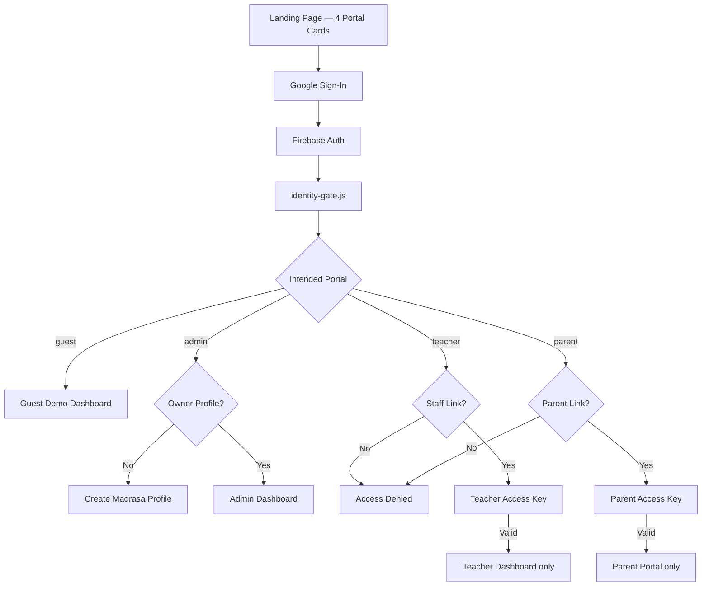

# Enterprise Login System — Phase 1 Technical Report

**Project:** Advanced EMS (Madrasa Management)  
**Date:** 2026-06-19  
**Scope:** Landing Page, Login Architecture, Identity Verification, Role Detection, Dashboard Routing, Guest Demo, Basic Security

---

## 1. Executive Summary

Phase 1 delivers an **Enterprise Grade entry flow** with four portal cards (Guest, Administration, Teachers, Parents). Google Sign-In is the primary authentication method. **No dashboard opens on Google login alone** — each portal requires **Identity Verification** (and Access Keys for Teacher/Parent) before routing.

---

## 2. Architecture Overview



### Security Chain (Phase 1)

```
Google Authentication
  → Identity Verification (Firestore links / profile)
    → Role Verification (portal vs resolved tenant role)
      → Access Key (Teacher / Parent)
        → Dashboard Routing
```

---

## 3. New Files

| File | Purpose |
|------|---------|
| `access-keys.js` | Generate, hash (SHA-256), store, verify Teacher/Parent keys |
| `identity-gate.js` | Portal-aware identity pipeline, Access Denied, Key prompts |
| `guest-demo.js` | Isolated demo data + session overlay CRUD |
| `docs/ENTERPRISE-LOGIN-PHASE1.md` | This report |

---

## 4. Landing Page (4 Cards)

| Card | Portal ID | Login | Post-Auth |
|------|-----------|-------|-----------|
| مہمان / Demo | `guest` | Google only | Guest Demo Dashboard |
| انتظامیہ | `admin` | Google only | Profile setup (new) or Admin Dashboard |
| اساتذہ | `teacher` | Google + Staff Link + Teacher Key | Teacher Dashboard only |
| والدین | `parent` | Google + Parent Link + Parent Key | Parent Portal only |

**UI:** `index.html` + `landing.js` + `landing.css` — responsive grid, RTL/LTR i18n (ur/en/ar).

---

## 5. Identity & Role Storage

| Data | Location |
|------|----------|
| Intended portal | `sessionStorage.ems_intended_portal` |
| Identity verified session | `sessionStorage.ems_identity_verified_{uid}` |
| Tenant role | `CURRENT_USER_TENANT_ROLE` — `owner` / `staff` / `parent` / `guest` |
| Staff link | `All_Madrasas/{id}/Staff_Links/{uid}` |
| Parent link | `All_Madrasas/{id}/Parent_Links/{uid}` |
| Teacher key hash | `All_Madrasas/{id}/StaffPermissions/{staffId}.accessKeyHash` |
| Parent key hash | `All_Madrasas/{id}/ParentAccessKeys/{studentId}.accessKeyHash` |
| Admin profile | `All_Madrasas/{uid}` — name, city, country, phone, type, subdomain |
| Guest overlay (temp) | `sessionStorage.ems_guest_demo_overlay` |

---

## 6. Dashboard Routing

| Role | Route Target | Module ID |
|------|--------------|-----------|
| Guest | `#module-guest-demo` | `guest-demo` |
| Admin | `#module-dashboard` | `dashboard` (+ full ribbon) |
| Teacher | `#module-dashboard` | `dashboard` **only** |
| Parent | `#module-parent-portal` | `parent-portal` |

**Guards:** `navigateToModule()` in `auth.js` + `emsRoleAllowsModule()` in `portal-access.js`

- Guest: blocked from all modules except `guest-demo`
- Teacher: blocked from all except `dashboard`
- Parent: blocked from all except `parent-portal`
- Wrong portal at login → `#ems-access-denied-panel`

---

## 7. Guest Demo Environment

### Canonical data (Firestore — Super Admin write only)

- `Demo_Students`, `Demo_Attendance`, `Demo_Fees`, `Demo_Exams`, `Demo_Reports`
- `Demo_Meta/published` — version metadata

### Session overlay

- Guest CRUD writes to `sessionStorage` only
- **Refresh / Logout** clears overlay via `emsGuestClearOverlay()`
- Canonical Firestore dataset unchanged

### Super Admin

- **Publish Demo Dataset** button in SA Dashboard (`saPublishDemoDataset` → `emsPublishDemoDataset`)

---

## 8. Access Keys (Admin Panel)

| Action | Location |
|--------|----------|
| Generate/Reset Teacher Key | Admin Panel → Staff modal → Teacher Access Key |
| Generate/Reset Parent Key | Admin Panel → Parent modal → Parent Access Key |

Plain key shown **once** to admin; only SHA-256 hash stored in Firestore.

---

## 9. Firestore Rules Updates

- `ParentAccessKeys/{studentId}` — admin write; parent read for linked student
- `Demo_*` collections — read: any signed-in user; write: Super Admin only

---

## 10. Modified Files

- `index.html` — guest card, modals, guest module, profile fields, scripts
- `landing.js` / `landing.css` — 4th card, Google-only login, guest/identity styles
- `auth.js` — identity integration, routing guards, enhanced profile save
- `portal-access.js` — guest portal type, teacher-only modules, routing
- `admin-panel.js` — key generate/reset UI
- `firestore.rules` — demo + parent keys
- `sa/sa-dashboard.js` — Publish Demo Dataset

---

## 11. Phase 2 (Not in Scope)

- Module-level RBAC / StaffPermissions enforcement
- Server-side Access Key verification (Cloud Function)
- Key expiry rules
- Email/password removal from legacy paths
- Full app data-layer swap for guest (currently dedicated demo module)

---

## 12. Deployment Checklist

1. `firebase deploy --only firestore:rules`
2. `npm run build:hosting` (or `node scripts/prepare-hosting.js`)
3. `firebase deploy --only hosting`
4. Super Admin: open SA Dashboard → **Publish Demo Dataset**
5. Admin: create Teacher/Parent links + issue Access Keys
6. Smoke test all four portals

---

## 13. Test Scenarios

| # | Steps | Expected |
|---|-------|----------|
| 1 | Guest card → Google | Demo dashboard, CRUD temp, refresh clears changes |
| 2 | Admin card → Google (new) | Profile setup → Admin dashboard |
| 3 | Admin card → Google (existing owner) | Direct Admin dashboard |
| 4 | Teacher card → unlinked Gmail | Access Denied |
| 5 | Teacher card → linked + valid key | Teacher dashboard only |
| 6 | Parent card → linked + valid key | Parent portal only |
| 7 | Teacher tries admin ribbon | Blocked alert |

---

*End of Phase 1 Report*
