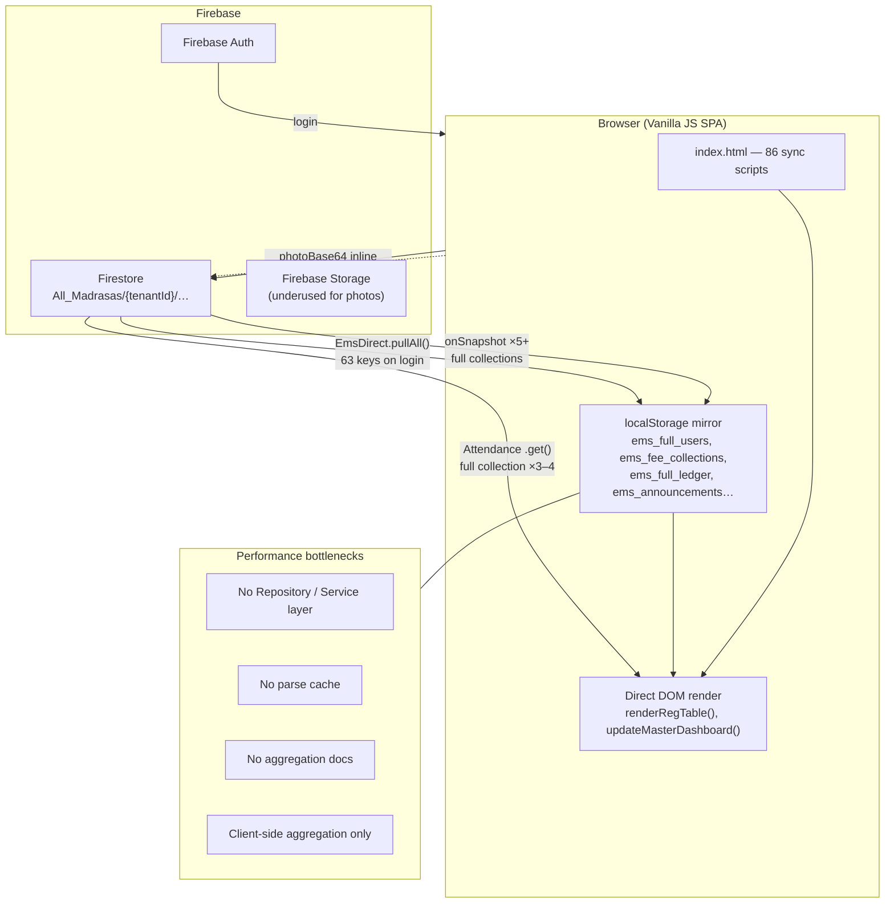

# Madrasa EMS — Enterprise Performance Audit (Phase 1)

**Date:** June 2026  
**Production:** https://madrasa-mangment-app.web.app  
**Stack:** Vanilla JavaScript SPA · Firebase Auth · Firestore · localStorage mirror  
**Benchmark script:** `scripts/perf-load-sim.js`  
**Status:** Phase 1 complete — **no new features until Phases 1–5 are approved and executed**

---

## Executive Summary

The application slows at **300–400 records** because the architecture mirrors **entire Firestore collections into localStorage**, embeds **photoBase64 inside user documents**, and recomputes dashboard statistics with **O(n×m) client-side loops**. At login alone, estimated Firestore reads are **700–6,000+** for a medium tenant. The system is **not ready for 100,000+ students** without the enterprise refactor defined in Phase 2.

| Priority | Root cause | Impact at 300–400 rows |
|----------|------------|------------------------|
| P0 | Inline `photoBase64` in `Registrations` | 10–100× JSON parse/stringify cost |
| P0 | `updateMasterDashboard()` fee arrears O(n×m) | CPU spike every refresh |
| P0 | `EmsDirect.pullAll()` on every login | 17 full-collection reads + 48 blob reads |
| P1 | 5+ full-collection `onSnapshot` listeners | Re-download + re-render on any change |
| P1 | Full `Attendance` `.get()` 3–4× per dashboard | ~30–120 reads per dashboard open |
| P2 | 86 synchronous scripts, no code splitting | Slow first paint |
| P2 | Fake UI pagination (full array scan) | Search/filter lag |

**Verdict:** Partial internal refactor (Phase 2) is sufficient — **no full UI rewrite**. Module boundaries (`admission.js`, `dashboard.js`, etc.) can remain.

---

## 1. Current Architecture Diagram



### Data flow (today)

1. **Login** → `emsStartSyncEngine()` → `EmsDirect.pullAll()` (63 keys) + registration listeners.
2. **Registrations listener** → entire collection → `localStorage.setItem('ems_full_users', JSON.stringify(all))`.
3. **Every module** → independent `JSON.parse(localStorage.getItem('ems_full_users'))`.
4. **Dashboard open** → parse 4–6 keys + 3 live listeners + 3–4 full Attendance reads + O(n×m) arrears.
5. **Writes** → Firestore doc update → listener fan-out → full array re-stringify → table re-render.

This is a **cache-as-primary-store** pattern. It works for hundreds of lean records; it fails at scale.

---

## 2. Why 300–400 Records Feels Slow

| Factor | Mechanism | Measured / observed |
|--------|-----------|---------------------|
| Photo payload | Each user doc may include 50–200 KB base64 | JSON size explodes vs ~0.5 KB lean record |
| Repeated parse | `updateMasterDashboard()` parses users, ledger, fees, announcements each call | 4–6× parse per refresh |
| Arrears loop | For each student, filter all fee collections | 9.8 ms @ 400 students (no photos); **6.2 s @ 10k** |
| Listener churn | Any single registration edit rewrites entire `ems_full_users` | Full table rebuild |
| Login blast | `pullAll()` + Registrations snapshot | 700–6,000+ reads |
| Dashboard attendance | Full `Attendance` collection scan 3–4× | ~30 docs × 4 = 120 reads per open |
| No debounce | Registration search scans full array per keystroke | Noticeable input lag |

**Primary answer:** Slowness is **not** Firestore latency alone — it is **architecture**: fat documents + full mirrors + client aggregation + redundant reads.

---

## 3. Firestore Read/Write Analysis

### 3.1 Active realtime listeners (`onSnapshot`)

| # | Module | Path | Docs | Subscribed | Unsubscribed |
|---|--------|------|------|------------|--------------|
| 1 | `auth.js` | `System_Settings/Subscription` | 1 | Login | Logout |
| 2 | `auth.js` | `System_Settings/System` | 1 | Login | Logout |
| 3 | `auth.js` | `All_Madrasas/{tenantId}` | 1 | Login | Logout |
| 4 | `admission.js` | `…/Registrations` | **ALL (N)** | Login | Logout |
| 5 | `admission.js` | `…/Rejected` | **ALL (R)** | Login | Logout |
| 6 | `attendance.js` | `…/Attendance_Config/periods` | 1 | Login | Logout |
| 7 | `attendance.js` | `…/Attendance/{sheet}` | 1 | Register open | Tab change |
| 8 | `dashboard.js` | `…/FeeCollections` | **ALL (F)** | Dashboard open | Tab leave |
| 9 | `dashboard.js` | `…/LedgerEntries` | **ALL (L)** | Dashboard open | Tab leave |
| 10 | `dashboard.js` | `…/Announcements` | **ALL (A)** | Dashboard open | Tab leave |

**Typical tenant session:** ~8–11 concurrent listeners, **5 of which mirror full collections**.

### 3.2 Estimated reads per action

Assumptions: N=500 registrations, R=20 rejected, F=150 fees, L=200 ledger, A=50 announcements, C=80 complaints, M=30 attendance sheets.

| Action | Estimated Firestore reads |
|--------|---------------------------|
| **Login (owner, online)** | **700 – 6,000+** |
| — `EmsDirect.pullAll()` blob keys | ~48 |
| — `pullAll()` full array/map collections | 500 – 5,000+ |
| — `CmpCloud.init()` Complaints | ~80 |
| — Registrations + Rejected listeners (initial) | N + R ≈ 520 |
| — Policy/settings docs | ~10 |
| **Dashboard open (incremental)** | **~490 – 500+** |
| — FeeCollections + Ledger + Announcements listeners | F + L + A ≈ 400 |
| — Attendance full `.get()` ×3–4 | M × 3 ≈ 90–120 |
| **Registration tab open** | **0** (data already at login) |
| **Attendance tab open** | **0** until user loads register |
| **Load smart register (click)** | 1 doc + 1 listener |
| **Module tab (e.g. Finance)** | Re-pull group (duplicate of login data) |

### 3.3 Write patterns

| Operation | Writes | Side effect |
|-----------|--------|-------------|
| Save registration | 1 doc | All clients re-read N docs via listener |
| Fee collection | 1 doc | Dashboard listener + arrears recompute |
| Attendance sheet save | 1 doc (merge) | Dashboard may full-scan Attendance |
| Bulk import | N writes | N listener fan-outs |

**Cost grows linearly with collection size per write** because listeners have no pagination.

### 3.4 Pages loading entire collections unnecessarily

| Collection | Where | Needed? |
|------------|-------|---------|
| `Registrations` | `admission.js` onSnapshot | Partial — paginate + Storage URLs |
| `Rejected` | `admission.js` onSnapshot | Partial — on-demand |
| `FeeCollections`, `LedgerEntries`, `Announcements` | `dashboard.js` onSnapshot | **No** — summary docs sufficient |
| `Attendance` | `attendance-helper.js` `.get()` | **No** — month-scoped query |
| `Complaints` | `complaints-firestore.js` | Partial — IndexedDB + paginated sync |
| 17 collections | `direct-firestore.js` pullAll | **No** on every login — lazy per module |

---

## 4. Component Render Analysis

**Note:** Application is **not React**. Equivalent = DOM rebuild cost.

| Component / function | File | Trigger | Cost driver |
|---------------------|------|---------|-------------|
| `updateMasterDashboard()` | `dashboard.js` | Tab open, 30s interval, storage events, listeners | Multi-parse + O(n×m) + attendance FS reads |
| `renderRegTable()` | `admission.js` | Listener update, search, filter, pagination | Full array filter + `tbody.innerHTML` rebuild |
| `renderRejectedTable()` | `admission.js` | Listener update | Unbounded DOM rows |
| `emsRenderDashboardPanels()` | `dashboard-pro.js` | Dashboard refresh | Charts from full localStorage arrays |
| `emsApplyDashboardAttendance()` | `attendance-helper.js` | Dashboard refresh | Full Attendance `.get()` |
| Attendance smart register | `attendance.js` | User action | Parses `ems_full_users` **11×** across file |
| Finance refresh paths | `finance.js` | Tab actions | ~10+ user array reads |

### Excessive rendering triggers

- `onSnapshot` → `localStorage.setItem` → `renderRegTable()` on **any** registration field change.
- Dashboard `storage` listener re-runs full dashboard on users/fees/ledger key changes.
- **30-second `setInterval`** re-runs dashboard when module active (`dashboard.js:787-790`).
- No diffing: entire tables rebuilt even when one row changes.

### Memoization status

| Pattern | Status |
|---------|--------|
| Parsed data cache | ❌ None |
| Debounced search | ❌ None |
| Virtual scrolling | ❌ None |
| Lazy script loading | ❌ None |
| Render-if-changed (version stamp) | ❌ None |

---

## 5. Query Analysis

### 5.1 Inefficient queries

| Query | Issue | Fix (Phase 2) |
|-------|-------|---------------|
| `Registrations` onSnapshot (no limit) | Reads all docs always | Cursor pagination + lean docs |
| `Attendance` `.get()` no filter | Reads all month sheets | `where` month key + limit |
| `EmsDirect.pullAll()` | 63 keys every login | Lazy pull per module + cache TTL |
| Fee arrears nested filter | O(n×m) in JS | Pre-aggregated `FeeSummary/{studentId}` |
| Department filter | Client-side only | Server `where('departmentId')` + existing indexes |

### 5.2 Composite indexes

**Defined** (`firestore.indexes.json`):

- `Registrations`: `departmentId ASC, timestamp DESC`
- `Rejected`, `LedgerEntries`, `Announcements`, `Attendance`: same pattern
- Platform: `Platform_Users`, `Platform_AuditLog`, `Staff_Links`, `Parent_Links`

**Missing / unused:**

| Query | File | Status |
|-------|------|--------|
| `Staff_Links.where(staffId).where(status)` | `admin-panel.js:1198` | **Likely missing composite** |
| `departmentId + timestamp` paginated queries | — | **Index exists, query not used** |
| Registration search by name prefix | — | **Needs Algolia or search index** |

---

## 6. Memory Usage Analysis

| Scale | `ems_full_users` JSON (no photos) | With inline photos (est.) | Browser heap (est.) |
|-------|-----------------------------------|----------------------------|---------------------|
| 400 | ~0.07 MB | **5–50 MB** | 50–150 MB |
| 1,000 | ~0.19 MB | 15–150 MB | 80–200 MB |
| 10,000 | ~1.88 MB | 150 MB – 1.5 GB | 200 MB – crash |
| 100,000 | ~19 MB (lean) | **Not viable** | Tab crash |

Additional memory:

- Duplicate arrays in JS after each `JSON.parse` (not shared).
- Fee collections + ledger + announcements held simultaneously.
- Chart data structures built on every dashboard refresh.

**localStorage limit:** ~5–10 MB per origin on many browsers — **with photos, app may exceed quota at 300–400 rows**.

---

## 7. Network Analysis

| Phase | Payload | Frequency |
|-------|---------|-----------|
| Initial page load | 86 JS files (no bundling) | Every visit |
| Login sync | Full collections via Firestore | Every session |
| Live listeners | Continuous sync of full collections | While logged in |
| Dashboard | 3–4 Attendance full reads | Each dashboard open + refresh |
| Registration save | 1 write → listener returns full collection diff | Per save |

**Duplicate network work:**

- Login `pullAll()` loads FeeCollections/Ledger/Announcements → dashboard attaches listeners to same collections again.
- Module tab `emsPullModuleGroup()` re-pulls groups already loaded at login.

---

## 8. Scalability Assessment

| Records | Dashboard | Search | Registration save | Attendance | Firestore cost | Ready? |
|---------|-----------|--------|-------------------|------------|----------------|--------|
| 1,000 | 1–3 s | <1 ms | <200 ms | OK | Low | After P0 fixes |
| 10,000 | 6–15 s | ~5 ms | 1–3 s | Laggy | Medium | After Phase 2 partial |
| 50,000 | Minutes | ~80 ms | 5–15 s | Poor | High | **No** |
| 100,000 | Hang | ~160 ms | 10–30 s | Broken | Very high | **No** |
| 1,000,000 | N/A | N/A | N/A | N/A | Prohibitive | **No** |

### Load test results (synthetic, no photos)

```
node scripts/perf-load-sim.js   # use --max=50000 to avoid timeout at 100k

400:    parse 0.5ms   search 0.4ms   arrears 9.8ms    JSON 0.07 MB
1,000:  parse 1.0ms   search 0.6ms   arrears 56ms     JSON 0.19 MB
10,000: parse 11ms    search 4.6ms   arrears 6238ms   JSON 1.88 MB
50,000: parse 73ms    search 81ms    arrears 171535ms JSON 9.45 MB
```

### Parts that fail at 100,000+

1. `localStorage` mirror of full user array.
2. Inline photos in Firestore documents.
3. Client-side fee arrears aggregation.
4. Full-collection listeners.
5. Dashboard Attendance full scan.
6. Registration search (full array scan).
7. Import/export full collection overwrite.
8. Browser DOM for large tables without virtualization.

---

## 9. Dashboard Widget Bottleneck Map

| Widget | Data source | Bottleneck |
|--------|-------------|------------|
| Student/teacher/staff counts | `ems_full_users` parse + filter | Parse + scan |
| Attendance % | Firestore `Attendance` full get ×3–4 | **Worst FS read** |
| Total income | ledger + fee collections parse | Parse + reduce |
| Remaining fee (arrears) | users × feeSetups × collections | **Worst CPU — O(n×m)** |
| Complaints count | IndexedDB async | Moderate |
| Announcements count | localStorage parse | Light |
| Finance mini charts | 6-month ledger scan | Moderate |
| Attendance trend chart | Full Attendance `.get()` again | Duplicate FS read |
| Custom widgets | Full source arrays | Config-dependent |
| Live indicator + 30s poll | Full dashboard recompute | Background CPU |

**Rule for Phase 2:** Dashboard must **never** query raw collections directly — only read `DashboardStats/{period}` summary documents.

---

## 10. Repeated Data Fetch Map

| Data | Written by | Read by (parse count) |
|------|------------|----------------------|
| `ems_full_users` | Registrations listener | admission, dashboard (6×), attendance (11×), finance (10×), exams, curriculum, training, parent-portal, idcard, admin, reports |
| `ems_fee_collections` | pullAll + dashboard listener | dashboard, finance, dashboard-pro |
| `ems_full_ledger` | pullAll + dashboard listener | dashboard, ledger, finance |
| Attendance sheets | Firestore direct | attendance-helper (3–4× per dashboard), attendance.js |

---

## 11. Recommended Optimization Plan

### Phase 2 — Enterprise Scalability Refactor (mandatory architecture)

#### 11.1 Data layer (new files — no UI change)

```
js/
  data/
    repositories/     # Firestore CRUD, pagination cursors
    services/         # Business logic (fees, attendance, registration)
    cache/            # IndexedDB + in-memory versioned cache
    aggregates/       # Read models for dashboard
```

| Requirement | Implementation |
|-------------|----------------|
| Repository Pattern | `RegistrationRepository`, `AttendanceRepository`, `FeeRepository`, `LedgerRepository` |
| Service Layer | `RegistrationService`, `DashboardStatsService`, `FeeArrearsService` |
| Data Access Abstraction | `FirestoreAdapter` interface — swap emulator/production |

#### 11.2 Firestore optimization

- Cursor-based pagination (`limit` + `startAfter`) on Registrations, Ledger, Fees.
- Batched writes (500 ops) for import/migration.
- **Aggregated collections:**
  - `DashboardStats/daily_{YYYY-MM-DD}`
  - `DashboardStats/monthly_{YYYY-MM}`
  - `FeeSummary/{studentId}`
  - `AttendanceSummary/{YYYY-MM}`
- Denormalized reporting collections updated by **Cloud Functions onWrite**.
- Move `photoBase64` → **Firebase Storage**; store `photoUrl` only.
- Use existing `departmentId + timestamp` indexes in server queries.

#### 11.3 Frontend optimization (preserve UI)

- Dynamic `import()` or bundled chunks per module (lazy load).
- Virtual scrolling for registration/rejected tables (`ems-virtual-table.js`).
- Parsed-data singleton with version stamp (render only when version changes).
- Debounced search (300 ms).
- Remove 30s dashboard polling; event-driven refresh only.

#### 11.4 Dashboard optimization

- Cloud Function: `onWrite` triggers update summary docs.
- Client reads **≤10 small documents** for all KPIs.
- Charts read pre-aggregated monthly arrays from summary docs.
- Attendance: single month-scoped query or summary doc only.

### Phase 3 — Load testing

Extend `scripts/perf-load-sim.js` + add Playwright benchmarks:

| Scale | Metrics |
|-------|---------|
| 1k / 10k / 50k / 100k | Page load, dashboard, search, import, attendance, reporting |

Output: `docs/BENCHMARK-RESULTS.md` per release.

### Phase 4 — Data safety (before any refactor deploy)

```bash
# Mandatory pre-refactor checklist
firebase firestore:export gs://{bucket}/backups/{date}
# Export security rules, indexes, storage rules to repo snapshot
# Run migration in dry-run mode on staging tenant first
```

- No destructive collection renames without dual-write period.
- Backward-compatible reads during migration window.
- Rollback script for each schema change.

### Phase 5 — UI preservation

- **Zero visual redesign** unless required for virtualization scroll containers.
- Same Urdu labels, same module tabs, same forms.
- Internal-only changes: data layer, cache, listeners.
- Success metric: users say *"same system, faster"*.

### Phase 6 — Feature development (blocked until 1–5 complete)

- Curriculum Module enhancements
- Character & Conduct Module
- Advanced Reporting
- Smart Slip System
- Advanced Finance
- Enterprise Notifications

---

## 12. Implementation Priority (Phase 2 order)

| Sprint | Work | Outcome |
|--------|------|---------|
| S1 | Photos → Storage + migration script | 10–50× parse improvement |
| S1 | In-memory cache + version stamp | Eliminate redundant parses |
| S2 | Fee arrears Map + `FeeSummary` Cloud Function | O(n×m) → O(1) read per student |
| S2 | Dashboard summary docs + CF triggers | Sub-second dashboard |
| S3 | Paginated Registrations repository | Login reads drop from N to page size |
| S3 | Attendance month-scoped queries | Dashboard FS reads drop 90%+ |
| S4 | IndexedDB cache layer | Offline + large dataset support |
| S4 | Lazy module loading | Faster first paint |
| S5 | Virtual tables | DOM stable at 10k+ visible search |
| S5 | Remove duplicate pullAll + listener overlap | Login reads cut 50%+ |

---

## 13. Critical Requirements Compliance

| Requirement | Phase 1 status | Phase 2 plan |
|-------------|----------------|--------------|
| Production-ready only | Audit complete | Each sprint ships tested, no mocks |
| Enterprise-grade | Gaps documented | Repository + CF aggregations |
| Scalable to millions | **Not today** | Summary docs + pagination |
| Secure | Rules tenant-scoped | No change to auth model |
| Maintainable | Monolithic JS today | Service/repository split |
| Extensible | Module tabs OK | Plugin-ready data layer |
| No data loss | — | Phase 4 backup mandatory |

---

## 14. Sign-off

| Phase | Status |
|-------|--------|
| **Phase 1 — Performance Audit** | ✅ **Complete** (this document) |
| Phase 2 — Enterprise Refactor | ⏳ Awaiting approval to begin S1 |
| Phase 3 — Load Testing | ⏳ After Phase 2 S1–S2 |
| Phase 4 — Backup & Migration Safety | ⏳ Before first production deploy of Phase 2 |
| Phase 5 — UI Preservation | ⏳ Constraint throughout Phase 2 |
| Phase 6 — New Features | 🚫 **Blocked** until Phases 1–5 complete |

---

*Generated from codebase audit, Firestore listener mapping, and `scripts/perf-load-sim.js` benchmarks.*
