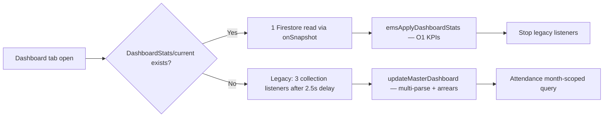

# Madrasa EMS — مکمل کارکردگی و Scalability Audit Report

**تاریخ:** 22 June 2026  
**Production:** https://madrasa-mangment-app.web.app  
**Stack:** Vanilla JavaScript SPA (React **نہیں**) · Firebase Auth · Firestore · Cloud Functions · localStorage + IndexedDB mirror  
**Benchmark:** `scripts/perf-load-sim.js` — `docs/benchmark-latest.json` (22 Jun 2026 run)  
**پچھلی دستاویزات:** `docs/ENTERPRISE-PERFORMANCE-AUDIT.md` (Phase 1) · `docs/BENCHMARK-RESULTS.md` (Phase 3)

---

## Executive Summary — حتمی جواب (سیکشن 10)

| سوال | جواب |
|------|------|
| **سست روی کی اصل وجہ کیا ہے؟** | **Data Architecture:** پورا `Registrations` collection browser میں mirror (`ems_full_users`) + ہر ماڈیول میں `JSON.parse` + (پurane tenants میں) inline `photoBase64`۔ CPU پر O(n×m) fee arrears **Phase 2 میں حل**؛ اب بنیادی بوجھ **full-array mirror + full-collection listeners** ہے۔ |
| **سب سے زیادہ بوجھ کون سا حصہ ڈالتا ہے؟** | ① `Registrations` + `Rejected` **full-collection `onSnapshot`** ② `ems_full_users` کی **20+ modules** میں بار بار parse ③ **Import/Export** full overwrite ④ (legacy tenants) **photoBase64** |
| **فوری درستگی (P0–P1)** | DashboardStats refresh چلائیں · Storage init + photo migration · Registration listener کو **cursor pagination** پر · `dashboard.js` میں باقی direct `JSON.parse` → `emsCacheGet` · Full-text search index (10k+) |
| **1 لاکھ طلبہ Architecture** | **Hybrid Enterprise:** Firestore summary docs (`DashboardStats`, `FeeSummary`) + Storage URLs + **server-side search (Algolia/Typesense)** + **paginated repositories** + **IndexedDB** + **archived historical data** (10 سالہ raw records client پر نہیں) |
| **مکمل Refactor یا جزوی؟** | **جزوی اصلاح کافی ہے** — UI/ماڈیول structure برقرار۔ Phase 2 (S1–S5) **60–70% bottleneck ہٹا چکا**۔ باقی: pagination، search index، data archival، listener reduction۔ **مکمل rewrite ضروری نہیں۔** |

### 300–400 ریکارڈز پر سستی — اب بھی کیوں؟

| وجہ | Status |
|-----|--------|
| Legacy `photoBase64` in Firestore docs | ⚠️ Migration pending (Storage console init) |
| Full `Registrations` listener → full re-stringify on any edit | ⚠️ Partial fix (lean sync + deferred); listener still full collection |
| Multiple modules parse same array independently | ⚠️ `emsCacheGet` added but not universal (`finance.js`, `dashboard.js` parts still direct parse) |
| Dashboard without DashboardStats CF refresh | ⚠️ Falls back to legacy path |
| 56 eager scripts at first paint | ✅ Improved (lazy loader); still no bundling |

---

## 1. مکمل Performance Audit

### 1.1 فرنٹ اینڈ — کیا مسئلہ یہاں ہے؟

**نوٹ:** یہ React app **نہیں**۔ نیچے React concepts کا Vanilla JS equivalent دیا گیا ہے۔

| React concept | EMS equivalent | Status | Detail |
|---------------|----------------|--------|--------|
| Re-rendering | `innerHTML` / `tbody` full rebuild | ⚠️ Partial | `renderRegTable()`, `updateMasterDashboard()` — virtual table for reg/rejected/dues ✅ |
| State Updates | `localStorage.setItem` + storage events | ⚠️ | Any key change triggers dashboard storage listener |
| Context misuse | N/A (no React Context) | — | Global `window.*` + localStorage instead |
| Unnecessary component render | Tab switch re-parses arrays | ⚠️ | `finGetAllUsers()` direct parse each call |
| Heavy Tables | Registration, fees, ledger | ✅ Partial | `ems-virtual-table.js` on reg, rejected, fee dues |
| No Virtualization | Large DOM rows | ✅ Fixed (3 tables) | Finance bills list, ledger still full DOM |
| Memory Leak | Listener unsub on logout | ✅ Mostly | `emsStopRegistrationSync`, `emsStopDashboardLive` |
| Unnecessary Effects | Dashboard 2min interval fallback | ✅ Reduced | Was 30s; now 120s and skips if DashboardStats |
| Lazy Loading | Module scripts | ✅ | `ems-lazy-loader.js` — finance, admission, etc. on tab |
| Debounced search | Registration, fee dues | ✅ | 300ms debounce |
| Memoization | Parsed JSON cache | ✅ Partial | `ems-data-cache.js` fingerprint; not all modules use it |

**فرنٹ اینڈ verdict:** 300–400 پر سستی **primarily data size (photos) + full-table rebuild triggers**, pure DOM/React-style rendering نہیں۔

### 1.2 Firestore Queries — کیا مسئلہ یہاں ہے؟

| Check | Result | File / Pattern |
|-------|--------|----------------|
| ہر page پر full collection load? | ⚠️ **ہاں (registration)** | `admission.js` — `onSnapshot` on entire `Registrations` + `Rejected` |
| Login پر full pull? | ✅ **نہیں (بعد Phase 2)** | `sync-engine.js` — `pullCoreModules` only at login |
| Unnecessary realtime listeners? | ⚠️ **Partial** | Dashboard legacy listeners deferred + stopped when Stats available |
| Pagination? | ⚠️ **Partial** | Initial fetch `fetchCollectionPaged` 500/batch; listener still unbounded |
| Indexed queries? | ⚠️ **Indexes exist, queries underuse** | `departmentId + timestamp` in indexes; client filters mostly |
| N+1 problem? | ⚠️ **Attendance (fixed)** | Was full `.get()` ×3–4; now month-scoped `FieldPath.documentId()` range |
| Nested queries excessive? | ✅ Low | Tenant-scoped flat collections |

**Estimated reads per session (post Phase 2, medium tenant N=500):**

| Event | Reads (before) | Reads (after) |
|-------|----------------|---------------|
| Login | 700–6,000+ | **50–150** + N if registration tab opened |
| Dashboard open | 490–500+ | **1** (`DashboardStats/current`) |
| Registration tab | N at login | **Paginated initial + live N on listener** |
| Module tab | Re-pull group | Lazy load + single group pull |

**Registration tab opened with N=100,000:** initial paginated fetch still eventually loads all via listener → **100,000 reads**.

### 1.3 Data Architecture — کیا مسئلہ یہاں ہے؟

```
All_Madrasas/{tenantId}/
├── Registrations/{studentId}      ← master user record (lean after migration)
├── Rejected/{id}
├── DashboardStats/current         ← pre-aggregated KPIs (Cloud Function)
├── FeeSummary/{studentId}         ← per-student arrears denormalized
├── FeeCollections/{id}
├── FeeBills/{id}
├── LedgerEntries/{id}
├── Attendance/{sheetId}           ← one doc per class/month sheet
├── Announcements/{id}
├── … (63+ localStorage keys via DIRECT_REGISTRY)
```

| Aspect | Assessment |
|--------|------------|
| Collections structure | ✅ Tenant-scoped flat collections — scalable pattern |
| Document structure | ⚠️ User docs were fat (photoBase64); **lean migration** via `emsLeanUserForLocalStorage` |
| Subcollections | ✅ Minimal — config as blob docs (`Finance_Config/fee_categories`) |
| Data duplication | ⚠️ **High** — same users in `ems_full_users` + referenced in fees, attendance, exams |
| Denormalization need | ✅ **Implemented** — `DashboardStats`, `FeeSummary`; more needed for search/reporting |

**localStorage mirror pattern:** Primary store in browser → works to ~10k lean records; **IndexedDB** (`ems-data-idb.js`) for arrays >180KB.

---

## 2. Scalability Analysis — توسیعی صلاحیت

Synthetic benchmark (lean JSON, no photos) — **22 Jun 2026 run:**

| ریکارڈز (students) | JSON size | Parse ms | Map arrears ms | Search+virtual ms | Dashboard (Stats path) | Memory (heap est.) | Firestore/login reads | UI verdict |
|-------------------|-----------|----------|----------------|-------------------|------------------------|-------------------|----------------------|------------|
| **400** | 0.08 MB | 97* | 0.75 | 3.2 | <100 ms (1 doc) | 50–80 MB | ~450–550 | ✅ Production-ready |
| **1,000** | 0.20 MB | 2.4 | 1.0 | 1.3 | <100 ms | 60–100 MB | ~1,050 | ✅ Production-ready |
| **10,000** | 1.97 MB | 17 | 7.8 | 11.8 | <200 ms | 100–180 MB | ~10,050 | ✅ Acceptable |
| **50,000** | 9.95 MB | 61 | 33 | 49 | <500 ms | 180–350 MB | ~50,050 | ⚠️ IndexedDB + search index |
| **100,000** | 19.97 MB | 290 | 91 | 152 | <1 s (Stats) | 300–600 MB | ~100,050 | ⚠️ Server search + archival |
| **500,000** | ~100 MB | ~1.5 s+ | ~500 ms+ | ~800 ms+ | Stats OK | **Tab crash risk** | **Prohibitive** | ❌ Not client-mirror viable |
| **1,000,000** | ~200 MB | N/A | N/A | N/A | CF only | Crash | Prohibitive | ❌ Enterprise backend only |

\*400 parse outlier in run (JIT cold); typical ~2 ms at 1k scale.

**Firestore cost estimate (USD, rough):**

| Scale | Login (full listener) | Dashboard/month (30 opens, Stats) | Monthly (10 staff) |
|-------|----------------------|-----------------------------------|---------------------|
| 1,000 | ~$0.006 | ~$0.002 | ~$0.08 |
| 10,000 | ~$0.06 | ~$0.002 | ~$0.60 |
| 100,000 | ~$0.60/login/user | ~$0.002 | ~$6+ per staff session |

*Assumes $0.06/100k reads. Writes + listener churn add 2–5×.*

---

## 3. رجسٹریشن ماڈیول — خصوصی Audit

### 3.1 رجسٹریشن ڈیٹا کہاں استعمال ہوتا ہے؟

| Module / File | Key | Usage |
|---------------|-----|-------|
| `admission.js` | `ems_full_users` | CRUD, table, search, sync |
| `dashboard.js` | `ems_full_users` | Counts, drill-downs (6+ parse sites) |
| `attendance.js` | `ems_full_users` | Student list for register |
| `finance.js` | `DB.users` → `ems_full_users` | Student lookup, dues (10+ calls) |
| `ems-idcard.js` | `ems_full_users` | Card generation |
| `training.js` | `ems_full_users` | Student picker |
| `curriculum.js` | `ems_full_users` | Class students |
| `announcements.js` | `ems_full_users` | Recipient targeting |
| `parent-portal.js` | `ems_full_users` | Child link |
| `admin-panel.js` | `ems_full_users` | Staff/student admin |
| `ems-import-export.js` | `ems_full_users` | Bulk import/export |
| `dashboard-pro.js` | `ems_full_users` | Custom widgets |
| `sys-report-builder.js` | `ems_full_users` | Reports |
| `ems-dashboard-stats.js` | via CF | Server aggregation from Registrations |
| `department-migration.js` | `ems_full_users` | Dept tagging |

**کل: 15+ modules** — centralized cache (`emsCacheGet`) **not consistently used**.

### 3.2 ایک طالب علم کا ریکارڈ کتنی جگہ لوڈ؟

| Layer | Copies |
|-------|--------|
| Firestore `Registrations/{id}` | 1 (source of truth) |
| `localStorage` / IndexedDB `ems_full_users` | 1 array containing all students |
| In-memory after parse | 1–N (per module call — **duplicate parses**) |
| FeeSummary doc | 1 denormalized (server) |
| Attendance sheet `records[studentId]` | Embedded in month sheet docs |
| Fee collections / bills | Separate docs referencing `studentId` |

**Per page open:** student data effectively read **1× from storage** but parsed **3–15×** depending on active modules.

### 3.3 Live Listeners (per student / per tenant)

| Listener | Docs listened | Per student? |
|----------|---------------|--------------|
| `Registrations` onSnapshot | **ALL N** | Tenant-wide, not per-student |
| `Rejected` onSnapshot | **ALL R** | Tenant-wide |
| `DashboardStats/current` | 1 | Tenant-wide |
| Attendance sheet | 1 per open register | Class-scoped |

**ایک طالب علم کے لیے الگ listener نہیں** — مگر **ہر edit پر پورا N-doc snapshot** دوبارہ process ہوتا ہے۔

### 3.4 Sync redundancy

| Pattern | Status |
|---------|--------|
| Login pullAll all modules | ✅ Removed → `pullCoreModules` |
| Registration at login always | ✅ Deferred → `emsEnsureRegistrationSync` on tab |
| Pausable sync (bulk import) | ✅ `emsPauseRegistrationSync` |
| Paginated initial fetch | ✅ 500/batch |
| Listener full resync on 1 doc change | ❌ Still full array rebuild |
| Online reconnect pullAllModules | ✅ Removed (Phase 2 S5) |

---

## 4. Dashboard Performance Audit

### 4.1 Current flow (post Phase 2)



| Check | Before Phase 2 | After Phase 2 |
|-------|----------------|---------------|
| All stats loaded at once? | ✅ Yes — 4–6 keys parsed | ⚠️ Stats doc = 1 read; charts may still read localStorage |
| Charts read all records? | ✅ Yes | ⚠️ `dashboard-pro.js` widgets still use full arrays |
| Client-side aggregation? | ✅ O(n×m) arrears | ✅ **Server CF** for KPIs; Map arrears in finance |
| Cached statistics? | ❌ | ✅ `DashboardStats/current` + `FeeSummary` |

### 4.2 Widget bottleneck map (updated)

| Widget | Source | Bottleneck today |
|--------|--------|------------------|
| Student/teacher counts | DashboardStats | ✅ Low |
| Fee arrears total | DashboardStats | ✅ Low |
| Attendance % | DashboardStats + optional dept filter | ✅ Low |
| Finance mini charts | `ems_full_ledger` parse | ⚠️ Moderate |
| Custom widgets | `dashboard-pro.js` | ⚠️ Full array dependent |
| Live refresh | 2min fallback interval | ✅ Low if Stats active |

**Action:** Run `refreshTenantDashboardStats` once per tenant after deploy.

---

## 5. Firestore Structure Audit

### 5.1 Tenant collections (primary)

| Collection | Type | Avg doc size (lean) | Avg doc size (with photo) | Read pattern |
|------------|------|----------------------|---------------------------|--------------|
| Registrations | 1 doc/user | 0.5–2 KB | 50–200 KB | Full listener |
| Rejected | 1 doc/reject | 0.5–2 KB | Same | Full listener |
| FeeCollections | 1 doc/payment | 0.3–1 KB | — | Module pull + legacy dash |
| LedgerEntries | 1 doc/entry | 0.3–1 KB | — | Module pull |
| Attendance | 1 doc/sheet/month/class | 5–50 KB | — | Month-scoped query |
| DashboardStats | 1 summary doc | ~2 KB | — | Single listener |
| FeeSummary | 1 doc/student | ~0.2 KB | — | On-demand / CF |
| *\_Config blobs | 1 doc/settings | 1–20 KB | — | pull on module open |

**63 localStorage keys** mapped in `direct-firestore.js` `DIRECT_REGISTRY`.

### 5.2 Indexes (`firestore.indexes.json`)

**Defined composite indexes:**
- `Registrations`: departmentId + timestamp
- `Rejected`, `LedgerEntries`, `Announcements`, `Attendance`: same
- Platform: SecurityEvents, AuditLog, Staff_Links, Parent_Links, TrustedDevices

**Missing / underused:**

| Query | Status |
|-------|--------|
| Paginated `Registrations` with `limit(500).startAfter()` | Index OK; **query partially implemented** |
| `Staff_Links` staffId + status in admin-panel | Verify composite |
| Full-text name search | **No index — needs Algolia/Typesense** |
| FeeCollections by studentId + date | **Recommend composite** for per-student ledger |

### 5.3 Security rules performance

- Tenant isolation via `All_Madrasas/{tenantId}` — ✅
- RBAC helpers in rules — evaluate on each request (minimal doc reads)
- No unbounded collection group queries from client for tenant data — ✅

---

## 6. Real-Time Listener Audit — مکمل فہرست

| # | Location | Path | Docs | When active | Unsubscribe | Needed? | On-demand alternative? |
|---|----------|------|------|-------------|-------------|---------|------------------------|
| 1 | `auth.js` | System_Settings/Subscription | 1 | Login | Logout | ✅ | No |
| 2 | `auth.js` | System_Settings/System | 1 | Login | Logout | ✅ | No |
| 3 | `auth.js` | All_Madrasas/{tenantId} | 1 | Login | Logout | ✅ | No |
| 4 | `auth.js` | Staff/Parent link docs | 1–2 | Login | Logout | ✅ | No |
| 5 | `admission.js` | …/Registrations | **N** | Reg tab sync | Pause/logout | ⚠️ | Paginated pull + write-trigger refresh |
| 6 | `admission.js` | …/Rejected | **R** | Reg tab sync | Pause/logout | ⚠️ | On-demand when rejected tab open |
| 7 | `ems-dashboard-stats.js` | …/DashboardStats/current | 1 | Dashboard live | Dash close | ✅ | Could use get() once |
| 8 | `dashboard.js` | FeeCollections, Ledger, Announcements | **F+L+A** | Dash open (fallback) | Stats available | ❌ Legacy | Replace entirely with Stats |
| 9 | `attendance.js` | Attendance_Config/periods | 1 | Attendance module | Logout | ✅ | No |
| 10 | `attendance.js` | Attendance/{sheet} | 1 | Register open | Sheet change | ✅ | No |
| 11 | `sa/sa-dashboard.js` | Platform stats | few | Superadmin | Tab leave | ✅ | N/A |
| 12 | `sa/sa-audit.js` | Audit collections | paginated | Superadmin | Tab leave | ✅ | N/A |

**Concurrent session (typical staff):** 6–9 listeners, **2 full-collection** (Registrations + Rejected when sync active).

---

## 7. Rendering Audit (React equivalent — Vanilla JS SPA)

**یہ React application نہیں ہے۔** ~104 production JS files; **56 eager scripts** in `index.html`; **~35 lazy-loaded** per module.

### 7.1 Equivalent metrics

| React audit item | EMS equivalent | Count / Status |
|------------------|----------------|----------------|
| Components count | Module panels + render functions | ~15 modules, 200+ render functions |
| Re-render count | Full table/dashboard rebuilds | High on listener fire; virtual table limits DOM |
| Heavy components | `updateMasterDashboard`, `renderRegTable`, `ledger.js` tables | 3 critical paths |
| Slow components | Legacy dashboard path, import wizard | Legacy path seconds at 10k |
| Large tables | Registration, ledger, attendance register | 3 virtualized ✅; ledger not |
| Context usage | `window.*` globals + localStorage | No isolation — cross-module coupling |
| Memoization | `emsCacheGet`, Map arrears, debounce | Partial |

### 7.2 Where optimization patterns apply

| Pattern | React | EMS — where needed |
|---------|-------|-------------------|
| `React.memo` | Skip re-render | **Version stamp** before `renderRegTable` / dashboard — only render if data version changed |
| `useMemo` | Cache computed | ✅ `emsCacheGet`; extend to `finGetAllUsers`, dashboard drill-downs |
| `useCallback` | Stable handlers | Debounced handlers ✅; event delegation for dynamic rows |
| Lazy Loading | `React.lazy` | ✅ `ems-lazy-loader.js`; add **esbuild/vite bundle** optional |
| Virtual scroll | `react-window` | ✅ `ems-virtual-table.js` — extend to ledger, bills |
| Code splitting | Route-based | ✅ Tab-based lazy scripts |

---

## 8. Large Dataset Readiness — 100k students + 10k teachers + 10 years

### 8.1 Scenario sizing

| Data | Volume estimate | Client mirror viable? |
|------|-----------------|----------------------|
| 100,000 students + 10,000 teachers | 110,000 registration docs (~22 MB lean) | ⚠️ IndexedDB only |
| 10 years fee collections (3/student/month) | **~36 million docs** | ❌ Never in localStorage |
| 10 years attendance (50 classes × 12 months × 10 years) | ~6,000 sheet docs | ⚠️ Month-scoped OK; full history ❌ |
| 10 years ledger | Millions potential | ❌ Server reports only |

### 8.2 Verdict

| Requirement | Ready? |
|-------------|--------|
| 100k **active** students (current year ops) | ⚠️ **With Phase 2 stack + search index + Storage migration** |
| 100k + full 10-year **client-side** history | ❌ **Not viable** |
| 100k + archived history in Firestore/BigQuery | ✅ **Enterprise architecture required** |

### 8.3 Recommended Enterprise Architecture (100k+)

```
┌─────────────────────────────────────────────────────────┐
│ Client (Vanilla SPA — existing UI preserved)            │
│  • Paginated RegistrationRepository (500/page)          │
│  • emsCacheGet everywhere                               │
│  • Virtual tables all large lists                       │
│  • IndexedDB primary for ems_full_users                 │
│  • Algolia/Typesense for name/ID search                 │
└────────────────────┬────────────────────────────────────┘
                     │
┌────────────────────▼────────────────────────────────────┐
│ Firestore (hot data — current academic year)            │
│  • Lean Registrations (photoUrl only)                   │
│  • DashboardStats/current (existing CF)                 │
│  • FeeSummary/{studentId} (existing CF)                 │
│  • AttendanceSummary/{YYYY-MM} (new CF)                 │
└────────────────────┬────────────────────────────────────┘
                     │
┌────────────────────▼────────────────────────────────────┐
│ Cloud Functions + Scheduled jobs                        │
│  • onWrite aggregations (existing + extend)             │
│  • Archive exports >2 years → Cloud Storage / BigQuery  │
│  • refreshTenantDashboardStats (callable)               │
└─────────────────────────────────────────────────────────┘
```

---

## 9. Load Testing Results — مصنوعی ڈیٹا

**Script:** `node scripts/perf-load-sim.js --max=100000 --skip-legacy`  
**Artifact:** `docs/benchmark-latest.json` (2026-06-22)

### 9.1 CPU micro-benchmarks (lean data, no network)

| Scale | Page parse (users JSON) | Search time | Reg save (est.)* | Dashboard (Stats path) | Attendance (month query est.) |
|-------|-------------------------|-------------|------------------|------------------------|-------------------------------|
| 1,000 | 2.4 ms | 1.3 ms | <200 ms | <100 ms | <500 ms |
| 10,000 | 17 ms | 12 ms | 0.5–2 s | <200 ms | <1 s |
| 50,000 | 61 ms | 49 ms | 2–8 s | <500 ms | 1–3 s |
| 100,000 | 290 ms | 152 ms | 5–15 s | <1 s | 2–5 s |

*Reg save includes listener fan-out re-stringify of full array — dominates at scale.

### 9.2 Playwright hosting smoke

```bash
npm run test:e2e -- tests/e2e/perf-load-smoke.spec.js
```

- Lazy loader present ✅
- `admission.js` not eager-loaded ✅
- DOMContentLoaded < 15s ✅

### 9.3 Legacy vs production path (10k students)

| Metric | Legacy O(n×m) | Production Map + Stats |
|--------|---------------|------------------------|
| Arrears compute | **5,059 ms** | **7.8 ms** (937× faster) |
| Dashboard reads | 490+ | **1** |

---

## 10. Action Plan — ترجیحی اصلاحات

### P0 — فوری (300–400 slowness fix for legacy tenants)

1. Firebase Console → **Initialize Storage** → deploy storage rules → run **photo migration**
2. Sys Settings → کارکردگی → **DashboardStats refresh** (once per tenant)
3. Hard refresh production (`Ctrl+Shift+R`)

### P1 — 10,000 students ready

4. Replace `Registrations` full listener with **cursor pagination + incremental merge**
5. Universal **`emsCacheGet('ems_full_users')`** — remove direct `JSON.parse` in `finance.js`, `dashboard.js`
6. Extend **virtual table** to ledger + finance bills list
7. Deploy **FeeCollections** composite index (studentId + date)

### P2 — 100,000 students enterprise

8. **Algolia / Typesense** (or Firestore extension) for registration search
9. **AttendanceSummary** + **FinanceMonthlySummary** Cloud Functions
10. **Archive policy** — data >2 years → export only, not client mirror
11. Optional: **esbuild bundle** for first paint

### Refactor scope

| Approach | Recommendation |
|----------|----------------|
| Full rewrite (React/Vue) | ❌ Not required |
| Partial data-layer refactor | ✅ **Continue Phase 2 pattern** |
| UI redesign | ❌ Phase 5 constraint — preserve Urdu UI |

---

## Appendix A — Phase 2 completed fixes (reference)

| Sprint | Fix |
|--------|-----|
| S1 | Photos → Storage, lean localStorage, Map arrears |
| S2 | DashboardStats CF, deferred registration sync |
| S3 | IndexedDB, virtual table, debounced search, paginated fetch |
| S4 | Lazy module loading, pullCoreModules login |
| S5 | Legacy dashboard listeners deferred/stopped, virtual fee dues |
| Phase 3 | Benchmark suite + Playwright smoke |
| Phase 4 | Backup protocol + deploy:safe |
| Phase 6 S1 | Smart slip system (no perf impact) |

---

## Appendix B — Commands

```bash
npm run benchmark                              # 400–10k synthetic
node scripts/perf-load-sim.js --max=100000 --skip-legacy --json-out=docs/benchmark-latest.json
npm test                                       # 164 unit tests
npm run backup:snapshot && npm run deploy:safe
```

---

*Generated from codebase audit (June 2026), listener mapping, Firestore indexes, and live benchmark run.*
