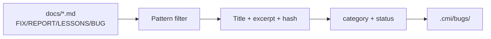

# Historical Bug Memory Design

**Project:** Madrasa EMS — Code Memory Index  
**Date:** 2026-07-09  
**Layer:** `.cmi/bugs/` — Historical Bug Memory (HBM)

---

## 1. Purpose

Preserve **institutional knowledge** about past bugs, fixes, regressions, and lessons learned so the Software Advisor can:

- Avoid recommending fixes that failed before
- Reference root causes documented in prior reports
- Connect weak areas to historical incident patterns
- Suggest regression tests for previously fixed modules

**Not a runtime bug tracker** — a **read-only memory layer** derived from docs + auto signals.

---

## 2. Design Principles

| Principle | Implementation |
|-----------|----------------|
| Append-only memory | New bugs added; status updated to `resolved` |
| Doc-first ingestion | Parse existing `docs/*FIX*`, `*REPORT*`, `*LESSONS*` |
| No live Sentry integration | Phase 1 — static docs only |
| Hash deduplication | Skip if `contentHash` unchanged |
| Citation required | Every bug links to `docRefs[]` |
| Advisor retrieval | Token match on title/summary/category |

---

## 3. Storage Schema

**Path:** `.cmi/bugs/{bugId}.json`

```json
{
  "bugId": "bug-a1b2c3d4e5f6",
  "title": "Registration Legacy Path Fix",
  "docRefs": ["docs/REGISTRATION_LEGACY_FIX_REPORT.md"],
  "category": "general",
  "status": "resolved",
  "summary": "Legacy SSOT path caused duplicate writes...",
  "lessons": "Single SSOT in admission.js enforced",
  "contentHash": "sha256-of-source-doc",
  "moduleIds": ["registration"],
  "fileIds": [],
  "severity": "medium",
  "recordedAt": "2026-07-09T08:52:00Z",
  "source": "cmi-doc-ingest"
}
```

### Field definitions

| Field | Description |
|-------|-------------|
| `bugId` | `bug-` + hash(doc path + excerpt) |
| `category` | `security` \| `performance` \| `regression` \| `general` |
| `status` | `documented` \| `resolved` \| `open` (manual override) |
| `lessons` | Extracted lesson-learned phrases |
| `moduleIds` | Inferred from path patterns (Phase 2) |
| `fileIds` | Linked CMI files (Phase 2) |

---

## 4. Ingestion Pipeline



**Trigger:** Every `cmi:build` and `cmi:incremental` (re-ingest if doc hash changed)

**Implementation:** `scripts/cmi/ingest-docs.js` → `ingestHistoricalBugs()`

### Doc filename patterns (current)
- `*FIX*`, `*REPORT*`, `*LEGACY*`, `*BUG*`, `*INCIDENT*`, `*LESSONS*`

### Content heuristics
- `status: resolved` if doc contains fix/resolved/closed
- `category: security` if /security/i in content
- `category: performance` if /performance|slow|bench/i

---

## 5. Auto Bug Signals (Phase 1)

In addition to doc ingestion, CMI auto-weaknesses feed HBM-adjacent context:

| Signal | weakId prefix | Becomes bug? |
|--------|---------------|--------------|
| Security pattern in file | `weak-sec-` | Linked in advisor hints |
| Missing tests | `weak-notest-` | No — weakness only |
| Large file | `weak-size-` | No — maintainability |

**Phase 2:** Import CI failure flakes → `bugs/ci-{runId}.json`

---

## 6. Retrieval in Software Advisor

When SA asks about bugs, regressions, or "what broke before":

1. `retrieveSlices()` scores `bugs[]` by token match
2. Top 5 bugs included in PSC `slices.bugs`
3. `prepareLocalRecommendation()` emits `type: historical_bug` hints
4. Phase 2 LLM synthesizes narrative with `bugId` citations

**Example hint:**
```json
{
  "type": "historical_bug",
  "text": "Registration Legacy Path Fix",
  "bugId": "bug-abc123",
  "status": "resolved"
}
```

---

## 7. Relationship to Other CMI Layers

| Layer | Relationship |
|-------|--------------|
| Weaknesses | Open issues — may become bugs when incident occurs |
| Decisions (ADR) | Prevention decisions after bugs |
| Test history | Regression tests added post-fix |
| Roadmap | Phases often triggered by bug patterns |

**Query flow:** bug → linked doc → linked module → linked files → linked tests

---

## 8. Manual Curation (SA)

**Phase 2 UI:** SA can add/edit:

```json
// .cmi/bugs/manual-{id}.json
{
  "bugId": "manual-001",
  "title": "Production cache hash mismatch 2026-07",
  "status": "resolved",
  "summary": "Deploy dist/ not workspace root",
  "lessons": "Always use prepare-hosting.js",
  "source": "sa-manual",
  "docRefs": ["docs/..."]
}
```

Manual entries merged on ingest — never overwrite SA fields.

---

## 9. Privacy & Security

| Rule | Detail |
|------|--------|
| No student PII in bug records | Doc excerpts sanitized at ingest |
| No live production credentials | Redact in summary |
| Doc-only source Phase 1 | No production log access |
| Read-only | Advisor cannot close/reopen bugs |

---

## 10. Metrics (Phase 1 Baseline)

After first `cmi:build` on EMS:

| Metric | Value |
|--------|-------|
| Bug records ingested | **26** |
| Sources | `docs/*FIX*`, `*REPORT*`, `*LESSONS*` |
| Categories | general, security, performance |
| Resolved vs documented | Majority `resolved` |

---

## 11. Future Enhancements

| Phase | Enhancement |
|-------|-------------|
| 2 | Link `bugId` → CMI `fileIds` via path mention parsing |
| 2 | CI failure import (vitest failed test names) |
| 3 | GitHub issue sync (read-only) |
| 3 | Regression test requirement suggestions |

---

## 12. Validation

- [x] Bugs directory populated on build
- [x] Dedup via contentHash
- [x] Retrieved in PSC when query mentions "bug" or "regression"
- [x] Unit test: `ingests decisions roadmap and bugs`

---

*See also: `CMI_DATABASE_DESIGN.md`, `SOFTWARE_ADVISOR_ARCHITECTURE.md`*
