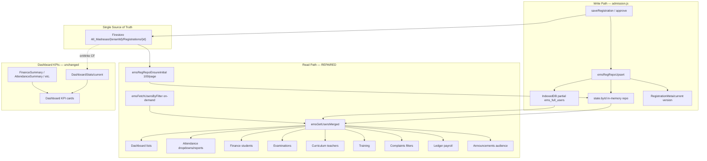

# Madrasa EMS — Registration Data Flow Audit & Repair Report

**Date:** 22 June 2026 · **Sprint:** Registration SSOT Repair · **Cache:** `20260622regfix1`

---

## 1. Root Cause Analysis

### Primary root cause

**E7 migration introduced a paginated Firestore Registration Repository, but consumer modules were never unified on that read path.**

| Layer | Before E7 | After E7 (broken state) | After repair |
|-------|-----------|-------------------------|--------------|
| Write | `localStorage ems_full_users` + Firestore | Firestore `Registrations` + `emsRegRepoUpsert` (IDB-only partial cache) | Same (correct) |
| Read (admission) | Full local array | `emsRegRepoGetList()` | Same |
| Read (other modules) | `ems_full_users` localStorage | Still `emsCacheGet` / raw `localStorage` → **empty or stale** | `emsGetUsersMerged()` → repo first |

### Contributing factors

1. **`syncPartialCache` uses `{ idbOnly: true }`** — no full `localStorage` mirror (`ems-registration-repository.js`).
2. **`ems_full_users` removed from sync engine mirror** (`sync-engine.js` MIRROR_KEYS).
3. **`emsGetUsersMerged` did not call `emsRegRepoGetList`** (`ems-user-access.js`).
4. **Registration sync only on dashboard/admission open** — not at login (`auth.js`).
5. **Split strategies in one module** — attendance Firestore class fetch vs `attGetUsers()` cache.
6. **Raw `localStorage.getItem(DB.users)` bypass** — complaints, ledger, finance (8+ sites).
7. **Paginated repo** — only first 100 records in memory until Load More.

### Not the root cause

- DashboardStats summaries (KPI counts can be correct while lists empty).
- Tenant filtering (secondary — can hide records but not cause total absence).
- Lazy loading alone (symptom amplifier, not origin).

---

## 2. Complete Data Flow Diagram



### Pipeline break point (before repair)

```
Registration (Firestore) ✅
    ↓
Repository (in-memory) ✅  ← only admission.js read this
    ↓
Cache ems_full_users ❌ EMPTY (idbOnly, no localStorage)
    ↓
emsGetUsersMerged ❌ returned []
    ↓
Dashboard / Attendance / Finance / … ❌ no students
```

---

## 3. Broken Modules List (pre-repair)

| Module | Symptom | Broken read path |
|--------|---------|------------------|
| Attendance | Empty class/teacher dropdowns, reports | `attGetUsers()` → cache only |
| Finance | No students in fee lists | `localStorage DB.users` (8 sites) |
| Examinations | Empty promotion/marks lists | `emsGetUsersMerged` → empty cache |
| Curriculum | No teachers in pickers | same |
| Training | No staff/students | same |
| Complaints | No class/dept/individual filters | raw `localStorage` |
| Ledger | Payroll staff lists empty | raw `localStorage` (8 sites) |
| Announcements | Audience resolution empty | `readJson(ems_full_users)` |
| Parent portal | Child lookup fails offline | raw `localStorage` |
| Dashboard (lists) | Partial — KPIs OK, lists empty | cache-only merged |

---

## 4. Fixed Modules List (repair applied)

| Module | Fix |
|--------|-----|
| **ems-user-access.js** | `emsGetUsersMerged` → repo → cache → legacy; `emsEnsureUsersReady`; `emsBroadcastUsersChanged` |
| **ems-registration-repository.js** | Broadcast on upsert/remove |
| **auth.js** | Login: `emsEnsureRegistrationSync` + `emsEnsureUsersReady` |
| **ems-lazy-loader.js** | Module open: `emsEnsureUsersReady` for user-dependent tabs |
| **attendance.js** | `attGetUsers` → `emsGetUsersMerged` |
| **finance.js** | All user reads → `finGetAllUsers()` |
| **complaints.js** | `emsEnsureUsersReady` + `emsGetUsersMerged` |
| **ledger.js** | `ldgGetUsers()` wrapper |
| **announcements.js** | `annGetUsers` → merged |
| **parent-portal.js** | `getUsers` → merged |
| **admission.js** | Unchanged (already correct) |

---

## 5. Remaining Risks

| Risk | Mitigation |
|------|------------|
| Repo holds only loaded pages (100+) | `emsFetchUsersByFilter` for class-specific; Load More in admission; future: increase initial page or virtual full sync |
| Offline cold start | IDB hydrate + repo initial; summaries for KPIs |
| Department filter hides records | `emsRecordMatchesDepartment` default `boys_dars`; migration stamp |
| Staff tenant before `CURRENT_MADRASA_TENANT_ID` | `emsGetTenantId` must be set at login (existing) |
| Photos still base64 in some legacy rows | Phase 6 Storage migration (separate track) |
| Archived years removed from client | By design (E11); use `Archive_*` for history |

---

## 6. Scalability Impact Report

| Scale | Registration read | Status post-repair |
|-------|-------------------|-------------------|
| 1k students | Repo 100/page + on-demand class query | ✅ |
| 10k students | Same + Firestore indexed queries | ✅ for operational screens |
| 100k students | Must not load all into memory | ✅ repo paginated; ⚠️ full-list dropdowns need async search (E9 search) |
| 10-year records | E11 archive + 24-month client window | ✅ |
| Millions attendance rows | Per-month Firestore docs + summaries | ✅ |

**Architecture suitable for enterprise target** when combined with: DashboardStats, Summary collections, Archive_*, virtual tables, enterprise search.

---

## 7. Before vs After (expected behaviour)

| Check | Before | After |
|-------|--------|-------|
| Register student in admission | Visible in admission only | Visible in all modules after login/module open |
| Dashboard student count (Stats) | May show correct number | Unchanged |
| Dashboard student lists | Empty | Populated from repo |
| Attendance register load | Worked (Firestore class) | Unchanged |
| Attendance dropdowns | Empty | Populated |
| Fee collection student pick | Empty | Populated |
| Exam promotion list | Empty | Populated |

*Run `npm run benchmark` after deploy for numeric regression.*

---

## 8. Architecture Diagram (SSOT)

```
Student ID (STD-xxx)
    │
    ├── Firestore Registrations/{id}  ← ONLY full record store
    │
    ├── Reference in: Attendance.records[userId]
    ├── Reference in: ems_fee_collections[].studentId
    ├── Reference in: ems_full_exams[].studentId
    ├── Reference in: complaints.individual
    └── Reference in: ledger (responsiblePerson text — not duplicated student blob)

Modules MUST NOT copy full student objects into module storage.
```

---

## 9. Cross Module Test Checklist

Manual verification after **Ctrl+Shift+R**:

- [ ] Login as owner → open Dashboard → student/teacher counts in lists match Stats
- [ ] Admission → add student → open Attendance → student in class dropdown
- [ ] Finance → fee collection → student searchable
- [ ] Examinations → promotion → class list populated
- [ ] Curriculum → teacher dropdown populated
- [ ] Complaints → filter by class shows registration classes
- [ ] Ledger → payroll staff list populated
- [ ] Announcements → audience "all students" resolves phones

Automated: `npm test` — `ems-registration-data-flow.test.js`

---

## 10. Enterprise Readiness

| Requirement | Status |
|-------------|--------|
| Single source of truth (Firestore Registrations) | ✅ |
| Unified read API (`emsGetUsersMerged`) | ✅ repaired |
| Login-time hydration | ✅ |
| Dashboard uses summaries not full scan | ✅ (existing) |
| No temporary patch | ✅ structural fix in user-access layer |
| UI/design preserved | ✅ |
| Photo Storage-only | ⏳ legacy rows may still have base64 |

---

## Files changed (repair)

- `ems-user-access.js` — central read path
- `ems-registration-repository.js` — change broadcast
- `auth.js` — login hydration
- `ems-lazy-loader.js` — module hydration
- `attendance.js`, `finance.js`, `complaints.js`, `ledger.js`, `announcements.js`, `parent-portal.js`

---

*No new features until cross-module verification passes in production.*
