# Registration Department — Architecture Report

**Audit Date:** 9 July 2026  
**Scope:** Registration / Admission department only  
**Mode:** Read-only analysis — no code changes  
**Project:** Madrasa EMS (`stackblitz-starters-nbktzqft`)

---

## Executive Summary

The Registration department is a mature, offline-first subsystem built around `ems-registration-repository.js` as the in-memory + IndexedDB mirror SSOT, with Firestore as the cross-device authoritative backup. It spans **30 canonical source artifacts** (15 root JS, 5 cloud JS, 2 Cloud Functions, 8 tests) and integrates with **8+ downstream modules** via `emsGetUsersMerged` and direct `emsRegRepo*` APIs.

The architecture is **production-capable for single-tenant madrasas up to ~100k records on desktop**, with known scale ceilings in browser RAM, list API caps, and cold index build time.

---

## Part 1 — System Understanding

### Q1 — What files belong to the Registration department?

#### Core UI & Controller

| File | Purpose |
|------|---------|
| `admission.js` | Main module: tabs, forms, save/reject, list/rejected tables, ID card/letter modals, class management |
| `registration-ui.js` | Enterprise layout: accordions, open-registration flow, hydration listeners |
| `index.html` (L481–L1000+) | Registration HTML shell: ribbon tabs, forms, list panel, import panel |

#### Data Layer & Boot

| File | Purpose |
|------|---------|
| `ems-registration-repository.js` | Paginated SSOT repo: IDB mirror, Firestore hydrate, search, rejected list, disaster recovery |
| `ems-registration-bootstrap.js` | Offline-first boot: IDB hydrate, lite login, sync lifecycle |
| `ems-user-access.js` | Universal read API: Firestore → Repository → IDB cache |
| `ems-user-service.js` | `emsGetUsersMerged` / `emsGetUsersSync` facade for cross-module reads |
| `ems-offline-write.js` | `emsOfflinePersistRegistration` — local persist + cloud mutation queue |
| `ems-repository.js` | IndexedDB `collections` abstraction (`{tenantId}__registrations`) |
| `ems-idb-engine.js` | IDB engine, search index stores, leader lock integration |
| `ems-tenant-storage.js` | Tenant-scoped cache keys, legacy purge on tenant switch |

#### Import / Export Subsystem

| File | Purpose |
|------|---------|
| `ems-import-export.js` | Core engine: parse, map, validate, commit, history, snapshots |
| `ems-import-wizard.js` | 7-step import wizard UI + data panel |
| `ems-import-queue.js` | Chunked batch import jobs (500-record chunks) |
| `ems-import-merge.js` | Duplicate detection + Cloud Function bulk import bridge |
| `ems-import-templates.js` | Preset column-mapping templates |
| `ems-import-smart.js` | Mapping profiles + pre-import snapshots |
| `ems-import-legacy.js` | One-screen backward-compatible quick import |

#### ID Cards & Output

| File | Purpose |
|------|---------|
| `ems-idcard.js` | PVC ID card system: templates, modal, print/PDF, designer |

#### Cloud Layer

| File | Purpose |
|------|---------|
| `cloud/ems-registration-live-sync.js` | Write-trigger sync via `RegistrationMeta` (no `Registrations` onSnapshot) |
| `cloud/ems-registration-sync.js` | Session-persistent sync coordinator (pause/resume) |
| `cloud/ems-enterprise-search.js` | Client wrapper for CF `searchTenantRegistrations` |
| `cloud/ems-photo-storage.js` | Registration photo upload/fetch + lean user docs |
| `cloud/ems-cloud-manifest.js` | Cloud stack loader manifest |

#### Cloud Functions

| File | Purpose |
|------|---------|
| `functions/lib/bulk-import-registrations.js` | Server-side chunked Firestore writes (max 2000 records) |
| `functions/lib/tenant-registration-search.js` | Search index sync + callable search (Firestore/Typesense) |

#### Supporting Infrastructure (Registration-adjacent)

| File | Purpose |
|------|---------|
| `ems-search-index.js` / `ems-search-index-bg.js` | Local prefix search index (v3 row-doc) |
| `ems-search-index-lock.js` | Multi-tab search index leader lock |
| `ems-storage-quota.js` | Storage quota warnings and safe failure |
| `ems-lazy-loader.js` | Lazy-loads admission bundle including import stack |
| `auth.js` | Module open, registration boot orchestration |

#### Tests

| File | Purpose |
|------|---------|
| `tests/unit/ems-registration-a4.test.js` | Write-trigger sync, no `Registrations` onSnapshot |
| `tests/unit/ems-registration-b1b2.test.js` | Desktop unlimited cache, IDB-only boot |
| `tests/unit/ems-registration-data-flow.test.js` | Manifest load order, cloud sync wiring |
| `tests/unit/ems-registration-e7.test.js` | Paginated repo API, admission.js cleanup |
| `tests/unit/ems-import-queue-e10.test.js` | Import queue chunking + large-commit routing |
| `tests/unit/ems-idcard-syntax.test.js` | ID card JS syntax + photoSrc helper |
| `tests/unit/import-export.test.js` | Import/export public API backward compatibility |
| `functions/test/tenant-registration-search.test.js` | `buildIndexDoc` helper |
| `tests/e2e/ems-reg-incremental-mirror.spec.js` | Incremental mirror E2E |
| `tests/e2e/ems-reg-page-live.spec.js` | Live page E2E |

#### Prior Audit Docs (reference)

- `docs/REGISTRATION-DATA-FLOW-AUDIT.md`
- `docs/REGISTRATION-INTEGRATION-REPORT.md`
- `docs/ENTERPRISE-REGISTRATION-DIAGNOSTIC-REPORT.md`

**Total canonical source files:** 30 registration-department artifacts (excluding `dist/`, `android/` build duplicates).

---

### Q2 — What sub-modules exist inside Registration?

#### Ribbon Tabs (Primary Navigation)

| Sub-module | Panel ID | Description |
|------------|----------|-------------|
| **New Admission — Students** | `reg-student-panel` | Student registration form (approve/reject) |
| **New Admission — Teachers** | `reg-teacher-panel` | Teacher registration form |
| **New Admission — Staff** | `reg-staff-panel` | Staff registration form |
| **Branding & Signatures** | `reg-branding-panel` | Institution branding, letterhead, signatures |
| **Saved Records** | `reg-list-panel` | Approved records list + search + pager + infinite scroll |
| **Rejected Applications** | `reg-rejected-panel` | Rejected history table + restore |
| **Import / Export** | `reg-data-panel` | 7-step import wizard, export, history, snapshots |

#### Functional Sub-modules (by feature area)

| Sub-module | Key Functions | File |
|------------|---------------|------|
| **Tab Switcher** | `switchRegTab` | `admission.js` L16–83 |
| **Auto ID Generation** | `generateAutoID`, `generateAutoIDAsync` | `admission.js` L88–123 |
| **Form Management** | `resetRegForm`, `handleImageUpload` | `admission.js` L126–238 |
| **Save / Approve / Reject** | `processRegistration` | `admission.js` L345–605 |
| **Class Management** | `loadClassesList`, `addNewClassBtn`, `deleteClassBtn` | `admission.js` L608–662 |
| **Saved Records Table** | `renderRegTable`, `renderRegTableViaRepo`, `renderRegTableLegacy` | `admission.js` L665–1316 |
| **Search & Filter** | `regListSearch`, `regListGoPage`, `regListApplyPager` | `admission.js` L796–834 |
| **Infinite Scroll / Paging** | `regRepoLoadMore`, `regInfiniteBuildPageOpts` | `admission.js` L279–289, L1058–1312 |
| **Rejected Table** | `renderRejectedTable`, `viewRejectedInfo`, `clearRejectedHistory` | `admission.js` L1349–1514 |
| **Edit Student/Staff** | `editRegistration` | `admission.js` L1519–1570 |
| **Delete Registration** | `deleteRegistration` | `admission.js` L1519–1733 |
| **Terms Templates** | `lockTerms`, `editTerms`, `deleteTerms` | `admission.js` L1866–1911 |
| **ID Cards** | `openIDCardModal`, `emsPrintIDCard`, `emsDownloadIDCardPDF`, `openCardDesigner` | `ems-idcard.js`, `admission.js` L1914–1974 |
| **Official Letters** | `openLetterModal` (acceptance letter + QR) | `admission.js` L1977–2053 |
| **Print** | `printElement`, `closeModal` | `admission.js` L2056–2086 |
| **Accordion UX** | `emsBuildRegAccordions`, `emsRegAccordionAll` | `registration-ui.js` |
| **Open Registration Flow** | `emsOpenRegistration` | `registration-ui.js` L86–142 |
| **Bulk Import** | `openImportWizard`, `emsImportQueueProcess`, `emsBulkImportViaCf` | `ems-import-wizard.js`, `ems-import-queue.js`, `ems-import-merge.js` |
| **Duplicate Detection** | `emsImportAnalyzeDuplicates` | `ems-import-merge.js` |
| **Import Templates** | `EmsImportTemplates`, `emsImportApplyTemplate` | `ems-import-templates.js` |
| **Smart Import Profiles** | `emsSmartSaveProfile`, `emsSmartRestoreSnapshot` | `ems-import-smart.js` |
| **Legacy Quick Import** | `emsLegacyQuickImport` | `ems-import-legacy.js` |
| **Export** | `emsDoExport`, `EmsImportExport.exportData` | `ems-import-wizard.js`, `ems-import-export.js` |
| **Import History** | `emsRenderImportHistory`, `EmsImportExport.getHistory` | `ems-import-wizard.js` |
| **Snapshots / Restore** | `createSnapshot`, `restoreSnapshot` | `ems-import-export.js` |
| **Cloud Sync** | `emsStartRegistrationWriteSync`, `emsEnsureRegistrationSync` | `cloud/ems-registration-live-sync.js` |
| **Photo Storage** | `emsUploadRegistrationPhoto`, `emsGetUserPhotoSrc` | `cloud/ems-photo-storage.js` |
| **Enterprise Search** | `emsEnterpriseSearchRegistrations` | `cloud/ems-enterprise-search.js` |
| **Disaster Recovery** | `emsForceCloudDisasterRecoverySync`, `regRepoRebuildCache` | `ems-registration-repository.js` |
| **Archive (internal)** | `ARCHIVE_KEY`, `enforceMemoryCap`, `mergeArchiveFromIdb` | `ems-registration-repository.js` L13, L428–445 |
| **Boot / Hydration** | `emsBootLiteLogin`, `emsBootRegistrationModule` | `ems-registration-bootstrap.js` |
| **Module Init/Destroy** | `RegistrationModule.init/destroy` | `admission.js` L1811–1823 |

#### Notable Gaps

- **No dedicated Archive UI** — archive storage exists in repository but has no user-facing screen.
- **No dedicated Reports tab** — reporting is distributed across dashboard and other modules.
- **No dedicated History/Audit tab** — import history exists; per-record change history does not.
- **`emsLoadRegistrationListForUI`** referenced in `registration-ui.js` L122 but **not defined** anywhere.

---

### Q3 — Dependency Diagram

#### Modules that depend on Registration

```mermaid
flowchart TB
    subgraph Registration["Registration Department"]
        UI["admission.js + registration-ui.js"]
        Repo["ems-registration-repository.js"]
        Boot["ems-registration-bootstrap.js"]
        Import["ems-import-*.js"]
        Search["ems-search-index + enterprise-search"]
        Cloud["cloud/ems-registration-*.js"]
    end

    subgraph Storage
        IDB["IndexedDB: {tenantId}__registrations"]
        FS["Firestore: All_Madrasas/{tid}/Registrations"]
        Meta["Firestore: RegistrationMeta/current"]
        Photos["Firebase Storage: registrations/{tid}/"]
        Legacy["localStorage legacy blobs"]
    end

    subgraph Consumers["Downstream Consumers"]
        Att["attendance.js — roster, classes"]
        Fin["finance.js — student billing"]
        Exm["exams.js — student lists"]
        Cur["curriculum.js — teacher lists"]
        Trn["training.js — participant lists"]
        Cmp["complaints.js — dept dropdowns"]
        Ldg["ledger.js — payroll staff"]
        Ann["announcements.js — audience"]
        Dash["dashboard.js — stats + quick-view"]
        Parent["parent-portal.js — linked students"]
        Auth["auth.js — boot + module open"]
    end

    Boot --> Repo
    UI --> Repo
    Import --> Repo
    Repo --> IDB
    Repo --> FS
    Cloud --> Meta
    Cloud --> FS
    Search --> IDB

    Repo -->|"emsRegRepoForEach, FetchClassRoster"| Att
    Repo -->|"emsRegRepoGetList (quick-view)"| Dash
    Repo -->|"emsRegRepoForEach"| Cmp
    Repo -->|"emsRegRepoUpsert"| Parent

    Repo --> UserSvc["ems-user-service.js"]
    UserSvc -->|"emsGetUsersMerged/Sync"| Fin
    UserSvc --> Exm
    UserSvc --> Cur
    UserSvc --> Trn
    UserSvc --> Ldg
    UserSvc --> Ann
    UserSvc --> Dash
    UserSvc --> Parent
    UserSvc --> Att

    Auth -->|"emsBootLiteLogin, RegistrationModule.init"| Boot
    Auth --> UI
```



#### Data-Access Tiers

| Tier | Pattern | Consumers |
|------|---------|-----------|
| **Tier 1 — Direct repo** | `emsRegRepo*` | admission, attendance, complaints, parent-portal (write), dashboard (quick-view) |
| **Tier 2 — User service** | `emsGetUsersMerged` / `emsGetUsersSync` | finance, dashboard (stats), parent-portal (read), attendance (fallback), exams, curriculum, training, ledger, announcements |
| **Tier 3 — Legacy** | `localStorage` / `emsCacheGet` | ID card modal, letter modal (stale-data risk) |

#### Files that call Registration functions

| Caller | Registration APIs Used |
|--------|----------------------|
| `admission.js` | All `emsRegRepo*` APIs, `emsEnterpriseSearchRegistrations`, `emsRepo.page('registrations')` |
| `registration-ui.js` | `emsRegRepoGetCount`, `emsRegRepoGetList`, event bus listeners |
| `ems-registration-bootstrap.js` | `emsRegRepoInit`, `HydrateFullFromIdb`, `EnsureHydratedFromIdb`, `BulkHydrate` |
| `ems-user-service.js` | `emsRegRepoGetList`, `GetListAsync`, `HydrateFullFromIdb` |
| `ems-user-access.js` | `emsRegRepoGetList`, `GetById`, `Upsert`, `GetRejectedList` |
| `attendance.js` | `emsRegRepoForEach`, `GetCount`, `FetchClassRoster`, `CollectClasses` |
| `complaints.js` | `emsRegRepoForEach` |
| `parent-portal.js` | `emsRegRepoUpsert` |
| `dashboard.js` | `emsRegRepoGetList` |
| `ems-offline-write.js` | `emsRegRepoPersistRegistration`, `Upsert` |
| `auth.js` | `emsBootLiteLogin`, `RegistrationModule.init`, `emsOpenRegistration` |

---

## Part 2 — Data Architecture Review

### Q4 — Registration Data Structures

#### 4.1 In-Memory Repository (`state`)

| Field | Type | Purpose |
|-------|------|---------|
| `tenantId` | string | Active madrasa |
| `byId` | `Object` (id → record) | Approved registrations map |
| `order` | `string[]` | Insertion/pagination order |
| `rejectedById` / `rejectedOrder` | map + array | Rejected applications |
| `lastDoc`, `hasMore`, `loading` | pagination | Server load-more cursor |
| `searchActive`, `searchResults` | overlay | Local/cloud prefix search |
| `metaUnsub`, `_metaVersion` | sync meta | `RegistrationMeta/current` listener |
| `_listCacheVersion`, `_listCacheArr` | cache | Avoid re-mapping `order→byId` |

#### 4.2 Registration Record Shape

Records are **schemaless Firestore documents** normalized at read time:

- **Canonical key:** `id` (required; missing → skipped)
- **Alias IDs:** `id`, `regId`, `uid`, `docId`
- **Common fields:** `type`, `class`, `name`, `cnic`, `phone`, `status`, `timestamp`, `designation`, `position`, `fname`, `rollNo`, `grade`, `section`
- **Photo fields:** `photoUrl`, `hasPhoto`; `photoBase64` stripped on lean
- **ID format:** `STD-*`, `TCH-*`, `STF-*`

#### 4.3 Permanent IDB Collection

`REPO_MIRROR_COLLECTION = 'registrations'` → scoped as `{tenantId}__registrations` in IDB `collections` store.

#### 4.4 Auxiliary Structures

| Structure | Key/Path | Purpose |
|-----------|----------|---------|
| Rejected cache | `ems_repo_{tenantId}_rejected` | Rejected list side-store |
| Archive overflow | `ems_cache_{tenantId}_archive` | RAM cap eviction |
| Migration flag | `ems_reg_mirror_migrated_v1_{tenantId}` | One-time legacy migration |
| Query cache | `tenant\|type\|class\|limit` (120s TTL) | Filter query results |
| Firestore meta | `RegistrationMeta/current` | Write-trigger sync version |
| Search index | IDB `search_tokens` store (v3 row-doc) | Prefix search |

---

### Q5 — Where is Data Stored?

| Layer | Path / Key | Role |
|-------|-----------|------|
| **IndexedDB (SSOT local)** | `{tenantId}__registrations` in `collections` store | Primary durable local store |
| **IndexedDB KV (legacy)** | `ems_reg_full_v2_{tenantId}`, `ems_repo_{tenantId}` | One-time migration source |
| **localStorage (legacy)** | `ems_full_users`, `ems_rejected_users` | Purged on tenant activate; fallback only |
| **localStorage (tenant)** | `ems_persisted_tenant_id_v1` | Boot tenant resolution |
| **Durable archive** | `ems_cache_{tenantId}_archive` | Overflow from RAM cap |
| **Rejected side-store** | `ems_repo_{tenantId}_rejected` | Rejected partition |
| **Cloud Firestore** | `All_Madrasas/{tid}/Registrations/{id}` | Cross-device authoritative backup |
| | `All_Madrasas/{tid}/Rejected/{id}` | Rejected partition |
| | `All_Madrasas/{tid}/RegistrationMeta/current` | Sync meta |
| **RAM (session)** | `state.byId` / `state.order` | Hot working set |
| **Temporary cache** | `QUERY_CACHE` (120s) | Filter query results |
| **Firebase Storage** | `registrations/{tenantId}/{type}/{id}.jpg` | Photo assets |

---

### Q6 — Single Source of Truth

**Tiered / context-dependent SSOT:**

| Context | SSOT | Evidence |
|---------|------|----------|
| Normal UI reads (offline-first) | Local IDB mirror → hydrated RAM | `EMS_REGISTRATION_SSOT_OFFLINE=true`, `EMS_OFFLINE_FIRST_SSOT=true` |
| Writes (admission) | IDB/repo first, then async cloud queue | `emsRegRepoPersistRegistration` |
| Cross-device backup | Firestore `Registrations` | Disaster recovery path |
| First boot, empty IDB | One-shot cloud bootstrap (if allowed) | `EMS_ALLOW_FIRST_LOGIN_CLOUD_FETCH` |
| Manual recovery | Firestore overwrites local | `emsForceCloudDisasterRecoverySync` |

**Override flags:**

| Flag | Effect |
|------|--------|
| `EMS_REGISTRATION_SSOT_OFFLINE=false` | Reverts to Firestore-first |
| `EMS_REGISTRATION_IDB_ONLY_BOOT=true` | IDB-only boot, no server fetch |
| `EMS_FORCE_CLOUD_RECOVERY_SYNC` | Full server pull |
| `EMS_REGISTRATION_ALLOW_SERVER_FETCH` | Temporary server access for load-more |

---

### Q7 — Duplicate Storage Paths

**Yes — intentional + legacy duplicates exist:**

1. **RAM `state.byId` + IDB mirror** — hot cache over durable store (by design)
2. **Approved + Rejected partitions** — separate RAM maps and Firestore collections
3. **Archive tier** — evicted RAM records remain in IDB + archive key
4. **Legacy blobs** — `ems_reg_full_v2_{tenantId}` AND `ems_repo_{tenantId}` during migration
5. **Unscoped `ems_full_users`** — legacy fallback, purged on tenant switch
6. **`QUERY_CACHE`** — 120s ephemeral copy of filter results
7. **List cache** — `_listCacheArr` mirrors `order.map(byId)`

**Risk:** `repoMirrorPut` failures are best-effort (swallowed). RAM and IDB can diverge silently.

---

### Q8 — Hidden Synchronization Risks

| Risk | Mechanism | Severity |
|------|-----------|----------|
| Lite login never auto-fetches cloud | IDB hydrate only at login | Medium |
| Loose hydration match | `matched` true if both counts > 0 even when unequal | High |
| Meta-only sync (no collection listener) | Targeted `getById` on meta change | Low (by design) |
| IDB-only boot ignores `refresh` | Single-record changes only | Medium |
| Filter fetch upserts only page (≤50) | Partial tenant in RAM | Medium |
| Limited refresh replaces RAM with page 1 | Older RAM records dropped | High |
| Mirror put failures swallowed | Best-effort, pipeline not blocked | High |
| `emsGetUsersMerged` capped at 1000 | Downstream modules see truncated lists | High |
| `emsRegRepoGetList` caps at 500 (non-unlimited) | UI list APIs truncated on web | Medium |
| ID card/letter modals read legacy localStorage | Stale data under SSOT | High |
| Tenant switch race | Repo reset but legacy purge is global keys only | Medium |

---

### Q9 — Possible Corruption Scenarios

#### Detected / Surfaced

1. IDB persist verify mismatch → rejected
2. Boot hydration mismatch → UI blocked, alert shown
3. Bulk hydrate merge stuck → `bulk_server_stuck` error
4. Disaster recovery mismatch → logged
5. Module boot hydration failed → user alert

#### Silent / Partial

6. Mirror put/remove best-effort → IDB missing record while RAM has it
7. Limited-mode meta `refresh` → replaces in-memory set with first page only
8. Legacy blob partial migration → legacy blob + partial mirror coexist
9. Records without `id` → silently dropped
10. Archive merge failure → duplicate or lost archive
11. Rejected cache divergence from `rejectedById`
12. Concurrent tenant IDs → `LEGACY_GLOBAL_CACHE` flag if unscoped keys exist

#### Recovery Paths

- `emsRegRepoRebuildLocalCacheFromServer` — full server → RAM → `repoMirrorReset`
- `emsForceCloudDisasterRecoverySync` — explicit DR with probe
- `migrateLegacyRegistrationBlob` — one-time legacy → IDB

---

### Q10 — Scale Support (100k / 200k / 500k)

| Scale | Verdict | Reasoning |
|-------|---------|-----------|
| **100k** | **PARTIALLY VERIFIED** | Desktop: feasible via full IDB mirror + paginated UI. Web: durable IDB OK, but RAM/UI APIs capped at 500–1000. Search ~4.4s. Index cold-build ~32 min. |
| **200k** | **PARTIALLY VERIFIED — web risky** | Bulk hydrate hits `BULK_HYDRATE_MAX_PAGES` cap (500×500 = 250k theoretical). IDB `loadAll` snapshot cache may cause memory pressure. |
| **500k** | **NOT VERIFIED** | No server-side-only UI path for all workflows. Sync search/load-more/local scan assumptions break. Desktop + SQLite migration is stated target, not current browser bundle. |

#### Hard Limits

| Limit | Value | Impact |
|-------|-------|--------|
| RAM window (web) | `EMS_CACHE_RECORD_CAP` / `getMemoryCap()` | Overflow → archive |
| `emsGetUsersMerged` default | 1000 records | Modules see ≤1000 |
| `emsRegRepoGetList` (non-unlimited) | 500 | UI list APIs truncated |
| `emsFetchUsersByFilter` | 50/page default | Class queries partial |
| IDB `loadAll` cache | Full collection into RAM | Risk at 200k+ |
| Local prefix search | Scans in-memory subset | Incomplete if RAM capped |
| Firestore `CLOUD_QUERY_LIMIT` | 500 | Server pagination ceiling |
| Bulk import CF | 2000 records/call | Large imports need chunking |
| Import queue | 500 records/chunk | Multi-chunk for large files |

---

## Architecture Diagram — Full Data Flow

```
Login (EMS_LITE_LOGIN)
  └─ emsBootLiteLogin
       ├─ emsRegRepoInit + emsStartRegistrationWriteSync
       ├─ emsRegRepoEnsureHydratedFromIdb
       │    ├─ migrateLegacyBlob → idbGetRepoPage (500/batch) → state.byId
       │    └─ verifyHydrationMatch
       ├─ emsOfflineModuleStoreHydrateAll
       └─ EMS_REPOSITORY_BOOT_COMPLETE

Module Open (admission)
  └─ emsBootRegistrationModule / emsOpenRegistration
       ├─ IDB hydrate first (skip sync if count > 0)
       ├─ RegistrationModule.init()
       └─ switchRegTab → render tables

Write Path
  └─ processRegistration → emsRegRepoPersistRegistration
       ├─ emsRegRepoUpsert → state + repoMirrorPut (IDB)
       └─ emsOfflinePersistRegistration → cloud mutation queue

Cross-Tab Sync
  └─ emsStartRegistrationWriteSync
       ├─ RegistrationMeta/current onSnapshot
       └─ applyRemoteChange → getById(forceRefresh) + persistRepoToIdb

Read Path (other modules)
  └─ emsGetUsersMerged → emsRegRepoGetList (≤1000) → filter by type
```

---

*End of Architecture Report*
