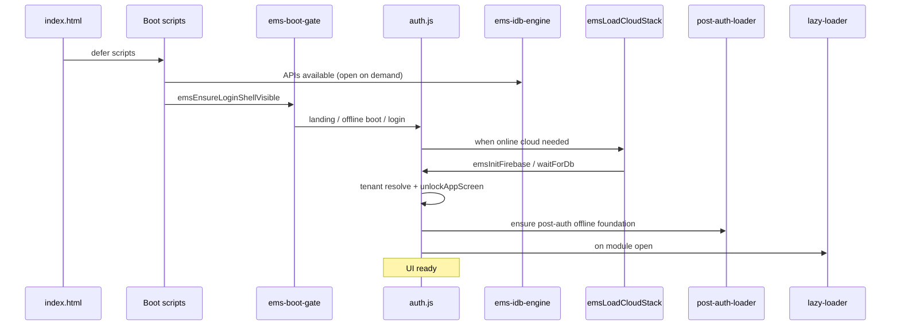

# Runtime boot sequence — Madrasa EMS

> Exact as-built boot path. **Do not reorder without approval.**  
> Audited: 2026-07-18.

---

## Overview

```text
index.html
  → boot / platform scripts (defer)
  → IndexedDB engine open-capable
  → core shell + landing
  → auth + boot gate
  → [login success]
  → waitForDb / tenant resolve / unlockAppScreen
  → ems-post-auth-loader (offline foundation)
  → optional emsLoadCloudStack (Firebase vendor + init)
  → ems-lazy-loader (modules on demand)
  → UI ready (shell unlocked, splash dismissed)
```

---

## Stage 0 — Document parse (`index.html`)

| Item | Detail |
|------|--------|
| File | `index.html` (~6,283 lines) |
| Role | Static shell, landing markup, module panels, modals, styles |
| Scripts | Trailing `<script defer src="…">` chain (order preserved) |
| CDN | `qrcode.min.js` (earlier in page) |

No module code runs until defer scripts execute after parse.

---

## Stage 1 — Boot / platform scripts

Exact defer order (from `index.html`):

| # | File | Key APIs / role |
|---|------|-----------------|
| 1 | `ems-runtime-mode.js` | Native vs web; offline-first flags |
| 2 | `ems-native-app-boot.js` | Capacitor splash / native instant boot helpers (`emsTryNativeInstantBoot`, `emsFinalizeNativeInstantBootMode`, …) |
| 3 | `ems-status-bar.js` | `emsApplyStatusBar` |
| 4 | `ems-mobile-shell.js` | Phone shell / More menu |
| 5–8 | `ems-search-index*.js`, `ems-idb-engine.js`, `ems-storage-quota.js` | Local DB ready APIs (`emsIdbReady`, `openDb` → `ems_durable_v1`) |
| 9–11 | `ems-query-utils.js`, `ems-repository.js`, `ems-online-mode.js` | Query / repo / online mode |
| 12–13 | `cloud/ems-cloud-manifest.js`, `cloud/ems-cloud-loader.js` | `EmsCloudManifest`, `emsLoadCloudStack` (not executed yet) |
| 14–16 | `ems-deferred-libs.js`, `ems-utils.js`, `ems-sync-cursor-idb.js` | Utils (`EmsUtils`), cursors DB |
| 17–25 | `cache-policy.js` … `department-context.js` | Branding, i18n, tenant, **paths**, cloud-pull helpers |
| 26 | `ems-sw-update.js` | Service worker update UX |
| 27 | **`core.js`** | App shell / module switching |
| 28–29 | `portal-access.js`, `landing.js` | Access gate, landing UI (`emsShowLanding`, blank recovery) |
| 30–32 | Offline session / policy / native Google | Session cache, offline policy, native Google bridge |
| 33 | **`auth.js`** | Login, `waitForDb`, `unlockAppScreen`, `emsRunGoogleSignIn` |
| 34 | **`ems-boot-gate.js`** | Splash / login shell visibility (`emsEnsureLoginShellVisible`, `emsRecoverBlankBootUi`) |
| 35 | **`ems-post-auth-loader.js`** | Defines `emsEnsurePostAuthScripts` batches (runs later) |
| 36 | `ems-lazy-loader.js` | `emsLazyLoadModule(modId)` |
| 37–40 | Offline mode / device / **`ems-global-sync.js`** | Sync orchestration hooks |

**UI not ready yet** — typically still locked (`ems-locked`) with splash or landing.

---

## Stage 2 — Boot gate (pre-auth UI)

| Function | File | Behavior |
|----------|------|----------|
| `emsEnsureLoginShellVisible` | `ems-boot-gate.js` | Show landing or attempt native/desktop offline boot |
| `emsRecoverBlankBootUi` | `ems-boot-gate.js` | If landing hidden incorrectly, restore |
| `emsShowLanding` / `emsHideLanding` | `landing.js` / related | Landing visibility |
| `emsDismissBootSplash` | `ems-boot-gate.js` | Hide splash when safe |
| `emsTryNativeInstantBoot` | `ems-native-app-boot.js` | Cached offline session → unlock path |

---

## Stage 3 — Firebase init (cloud stack — on demand)

Firebase is **not** fully initialized in the early defer list. It loads when cloud is enabled:

```text
emsLoadCloudStack()  [cloud/ems-cloud-loader.js]
  → vendor/firebasejs/9.22.0/firebase-*-compat.js
  → ems-firebase-init.js → emsInitFirebase()
  → security / identity boot scripts
  → cloud/sync-engine.js, cloud/direct-firestore.js
  → cloud core (backup, registration sync, …)
```

| Function | File | Behavior |
|----------|------|----------|
| `emsInitFirebase` | `ems-firebase-init.js` | `firebase.initializeApp(EMS_FIREBASE_CONFIG)`, sets `EMS_FIRESTORE_DB`, auth persistence LOCAL |
| `emsIsFirebaseReady` | `ems-firebase-init.js` | Ready flag |
| `getDbOrNull` / `emsFirestoreGetDb` | auth / paths | Firestore handle for `waitForDb` |

Project: `madrasa-mangment-app` (see `EMS_FIREBASE_CONFIG`).

Offline-only / native paths may skip or defer this stage.

---

## Stage 4 — Authentication

| Path | Entry | Notes |
|------|-------|-------|
| Web Google / email | `auth.js` | Firebase Auth |
| Native Google | `ems-native-google-auth.js` → `emsRunGoogleSignIn` in `auth.js` | Capacitor SocialLogin → `signInWithCredential` |
| Offline local session | offline session cache + boot helpers | May unlock without live network |

Critical flags (must not flip early):

- `EMS_OFFLINE_ONLY`
- `EMS_PENDING_NATIVE_GOOGLE_SUCCESS`
- Finalize offline-first only inside **`unlockAppScreen()`** after tenant ready

---

## Stage 5 — DB open (local + optional Firestore wait)

### Local IndexedDB (early)

| API | File | DB |
|-----|------|-----|
| `openDb` / `emsIdbReady` | `ems-idb-engine.js` | `ems_durable_v1` (version 4) |
| Cursor DB | `ems-sync-cursor-idb.js` | `ems_sync_cursors_v1` |

### Firestore readiness (online login)

| API | File | Behavior |
|-----|------|----------|
| `waitForDb(callback, onFailure)` | `auth.js` | Polls `getDbOrNull()`; respects offline-only + pending native Google exception |
| Tenant doc | `All_Madrasas/{uid}` | e.g. `verifySubStatusFromServer` |

**Invariant:** never rename `ems_durable_v1` or its stores.

---

## Stage 6 — Offline recovery / tenant alignment

| Function | File | Role |
|----------|------|------|
| `emsReadPersistedBootTenantId` / `ems_persisted_tenant_id_v1` | tenant storage / paths | Restore tenant id |
| `emsResolveFirestoreTenantId` | `ems-firestore-paths.js` | Canonical tenant id |
| `emsFirestoreAlignSessionTenant` | `ems-firestore-paths.js` | Sets `CURRENT_MADRASA_TENANT_ID`, activates storage, `emsRegRepoInit` |
| `emsIdbRestoreTenantId` | IDB helpers | Offline restore |
| `finishMadrasaLoginOfflineFast` | `auth.js` | Offline unlock path |
| Cache restore | `emsCacheRestoreFromIdb` (`ems-data-cache.js`) | Hydrate from durable KV |

---

## Stage 7 — Unlock → UI shell ready

| Function | File | Role |
|----------|------|------|
| **`unlockAppScreen()`** | `auth.js` | Dismiss login/splash, show shell, route after login, finalize native offline mode, clear pending Google flag |
| `emsDismissLoginUi` | auth/landing | Hide login chrome |
| `applyModuleAccessUI` | auth/core | RBAC ribbon |
| `emsRouteAfterLogin` | portal routing | Portal destination |
| `emsUpdateGlobalSyncButton` | sync UI | Sync control |

After this, the main app chrome is visible → **UI ready** for module use.

---

## Stage 8 — Post-auth module loading

| Function | File | Batches |
|----------|------|---------|
| `emsEnsurePostAuthScripts` (and loader internals) | `ems-post-auth-loader.js` | `OFFLINE_FOUNDATION` → `OFFLINE_CORE` → `dashboard.js` → AI stack → deferred `sys-*` |

Offline foundation includes: `ems-outbox-lock.js`, `ems-offline-write.js` (`EMS_OfflineWriteDB`), `ems-cloud-mutation.js`, …

---

## Stage 9 — Lazy feature modules

| Function | File |
|----------|------|
| `emsLazyLoadModule(modId)` | `ems-lazy-loader.js` |

Examples: `admission` → `RegistrationModule.init()`; `attendance`; `ledger`; …

Cloud extras via `emsCloudLazyScripts(modId)` when cloud enabled.

---

## Stage 10 — Sync / pull (user or auto)

| Function | File |
|----------|------|
| `emsCloudPullExecute` / UI bind | `ems-cloud-pull.js` |
| `emsCloudEmitMutation` / flush | `ems-cloud-mutation.js` → `emsOfflineFlushAll` |
| `ems-global-sync.js` | Global sync button / orchestration |

---

## Sequence diagram



---

## Forbidden during migration

Do not move or reorder: `index.html` defer list, `auth.js`, `ems-boot-gate.js`, `ems-idb-engine.js`, `ems-post-auth-loader.js`, `ems-firebase-init.js`, sync/offline-write, registration/attendance/ledger, `ems-mobile-shell.js`.
