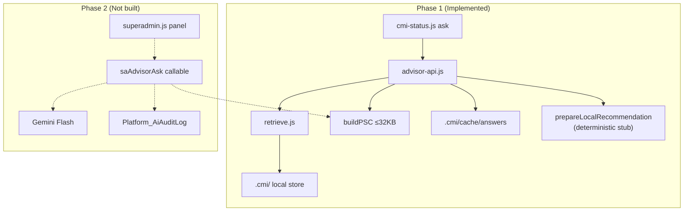

# Software Advisor Architecture

**Project:** Madrasa EMS — Phase 1 Read-Only Software Advisor  
**Date:** 2026-07-09  
**Scope:** Architecture + internal APIs only — **no LLM gateway, no SA UI**

---

## 1. Purpose

Provide a **read-only Software Advisor** that answers questions about EMS software quality using the **Code Memory Index (CMI)** — without modifying code, deploying, or touching databases.

Phase 1 delivers **internal APIs + local recommendation stub**. Phase 2 attaches cloud LLM synthesis.

---

## 2. Advisor Capabilities (Target)

| Domain | Phase 1 | Phase 2 |
|--------|---------|---------|
| Weak areas | ✅ via CMI weaknesses + bugs | + LLM narrative |
| UI/UX improvements | ✅ retrieve UI modules | + LLM suggestions |
| Missing features | ✅ feature map + roadmap | + LLM priorities |
| Security improvements | ✅ security hints + weaknesses | + LLM review |
| Performance improvements | ✅ bench docs + large files | + LLM analysis |
| Testing improvements | ✅ missing test detection | + LLM test plan |
| Roadmap priorities | ✅ roadmap snapshots + ADRs | + LLM ranking |

---

## 3. Architecture Diagram



---

## 4. Internal API Surface (`scripts/cmi/advisor-api.js`)

### 4.1 Read-only charter

```javascript
READ_ONLY_CHARTER = {
  allowCodeMutation: false,
  allowDeploy: false,
  allowDatabaseMutation: false,
  allowPermissionMutation: false,
  allowMigration: false,
  piiDefault: false,
  financeDetailDefault: false
}
```

### 4.2 Exported functions

| Function | Purpose |
|----------|---------|
| `assertReadOnlyCharter()` | Returns frozen charter object |
| `getMemoryStatus()` | CMI version, git SHA, refresh dates |
| `prepareContext(question, opts)` | Retrieve slices + build PSC |
| `prepareLocalRecommendation(question, opts)` | Phase 1 stub hints (no LLM) |
| `classifyAdviceDomain(question)` | ui/security/testing/performance/roadmap |
| `getCachedAnswer` / `setCachedAnswer` | Local answer cache |

### 4.3 Retrieval API (`scripts/cmi/retrieve.js`)

| Function | Purpose |
|----------|---------|
| `retrieveSlices(query, opts)` | Rank files/modules/weaknesses/bugs |
| `buildPSC(query, slices)` | Pack Platform SCP ≤ 32 KB |

---

## 5. Query Pipeline (Phase 1)

```
Question
   ↓
classifyAdviceDomain()
   ↓
retrieveSlices() — token match, no LLM
   ↓
buildPSC() — enforce 32 KB cap
   ↓
prepareLocalRecommendation()
   ↓
{ hints[], domains[], pscBytes, cmiVersion, readOnly: true }
```

**Phase 2 addition:** Same PSC → `saAdvisorAsk` → LLM Urdu/EN answer → audit.

---

## 6. PSC Schema (Platform Structured Context Pack)

```json
{
  "pscVersion": 1,
  "intent": "software_advice",
  "cmiVersion": "1.1.0",
  "gitSha": "abc123",
  "question": "...",
  "slices": {
    "files": [{ "fileId", "path", "summaryShort", "exports", "linkedTests" }],
    "modules": [{ "moduleId", "labelUr", "fileCount", "summary" }],
    "features": [{ "featureId", "label", "status" }],
    "weaknesses": [{ "weakId", "severity", "title" }],
    "decisions": [{ "decisionId", "title", "docRefs" }],
    "roadmap": [{ "snapshotId", "title", "phases" }],
    "bugs": [{ "bugId", "title", "status" }],
    "tests": []
  },
  "bytes": 18432,
  "withinLimit": true
}
```

**Hard limit:** 32 KB serialized — truncates lowest-ranked files first.

---

## 7. Isolation from Tenant AI

| | Tenant `aiAsk` | Software Advisor |
|---|----------------|------------------|
| User | Owner/staff | Super Admin (Phase 2) |
| Data | Student/institution SCP | Platform PSC from CMI |
| Storage | Firestore tenant | `.cmi/` local / Platform_CodeMemory |
| PII | Student summaries | None |
| Module | `cloud/ems-ai-*` | `scripts/cmi/*` |

**No shared callable in Phase 1.**

---

## 8. Advice Domain Classification

| Domain | Trigger keywords | CMI sources |
|--------|------------------|-------------|
| `ui` | ui, ux, rtl, mobile | index.html, style.css, registration-ui |
| `security` | security, auth, rules | firestore.rules, security-*, weaknesses |
| `testing` | test, coverage, vitest | tests/, missing test weaknesses |
| `performance` | slow, bench, perf | benchmark docs, large files |
| `roadmap` | roadmap, phase, feature | roadmap snapshots, features |
| `weakness` | weak, bug, debt | weaknesses, bugs |

---

## 9. Phase 1 Limitations (Explicit)

- No LLM — stub hints only
- No Super Admin UI — CLI `npm run cmi:ask`
- No cloud audit log
- No Institution Advisor / OMP
- Local summaries (not LLM-enriched file summaries)
- Git SHA `unknown` if not a git repo

---

## 10. Phase 2 Gateway Sketch (Not Implemented)

```
saAdvisorAsk({ question, intent, moduleId? })
  → assertSuperAdmin()
  → prepareContext() // reuse Phase 1 API
  → check Platform answer cache
  → resolveProviderKey(Secret Manager)
  → LLM synthesize
  → write Platform_AiAuditLog
  → return { answer, citations, pscBytes }
```

---

## 11. Usage Examples (Phase 1 CLI)

```bash
npm run cmi:status
npm run cmi:ask "registration module security weaknesses"
npm run cmi:ask "missing tests for AI assistant"
npm run cmi:ask "roadmap priorities Phase B"
```

---

## 12. Files Reference

| File | Role |
|------|------|
| `scripts/cmi/advisor-api.js` | Public internal API |
| `scripts/cmi/retrieve.js` | Retrieval + PSC |
| `scripts/cmi/build-index.js` | CMI builder |
| `scripts/cmi/storage.js` | Persistence layer |
| `scripts/cmi-status.js` | CLI entry |

---

*See also: `SOFTWARE_ADVISOR_SECURITY_PLAN.md`, `SUPER_ADMIN_AI_PHASE1_ROADMAP.md`*
