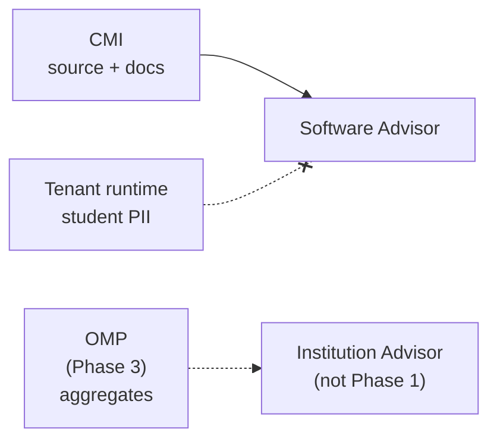

# Software Advisor Security Plan

**Project:** Madrasa EMS — Phase 1  
**Date:** 2026-07-09

---

## 1. Security Objectives

1. **Super Admin only** (Phase 2 gateway) — Phase 1 CLI is dev/ops local tool
2. **Separate from tenant AI** — no shared `aiAsk` path
3. **Platform Secret Manager** for LLM keys (Phase 2)
4. **Audit every AI question** (Phase 2) — Phase 1: local cache only
5. **No student PII by default**
6. **No finance details by default**
7. **Read-only** — no code/deploy/DB/permission changes

---

## 2. Phase 1 Security Posture

| Control | Status |
|---------|--------|
| Read-only charter in code | ✅ `READ_ONLY_CHARTER` frozen object |
| No mutation APIs exported | ✅ advisor-api.js read-only |
| CMI excludes tenant runtime data | ✅ source/docs only |
| `.cmi/` gitignored | ✅ not committed |
| API key patterns flagged in index | ✅ securityHints |
| PSC size cap | ✅ 32 KB |
| Local answer cache | ✅ no cloud leakage |
| SA auth on CLI | ⚠️ Phase 1 — trusted local machine |
| Audit log | ❌ Phase 2 |
| Secret Manager | ❌ Phase 2 (no LLM yet) |

---

## 3. Read-Only Enforcement

### Prohibited operations (never exposed)

| Operation | Phase 1 | Phase 2 |
|-----------|---------|---------|
| Write/edit source files | Blocked | Blocked |
| `firebase deploy` | Blocked | Blocked |
| Firestore tenant writes | Blocked | Blocked |
| RBAC/permission changes | Blocked | Blocked |
| DB migrations | Blocked | Blocked |
| Git push/commit | Blocked | Blocked |

**Enforcement:** API surface contains **zero** write functions. Phase 2 gateway returns text only.

---

## 4. Data Separation



Phase 1 Software Advisor reads **only CMI** — no Firestore tenant queries.

---

## 5. PII & Finance Defaults

| Data type | Software Advisor Phase 1 |
|-----------|--------------------------|
| Student names | ❌ Not in CMI |
| CNIC | ❌ |
| Phone | ❌ |
| Fee receipts | ❌ |
| Staff salaries | ❌ |
| Source code | ✅ summaries only |
| docs/ audit reports | ✅ excerpts |
| API key literals in code | ⚠️ flagged, not echoed in answers |

---

## 6. CMI Indexing Security

| Risk | Control |
|------|---------|
| Secrets committed to repo | `securityHints` + weakness auto-flag |
| Indexer executes untrusted code | Static file read only — no `require()` of indexed files |
| Malicious doc content in ADR | Ingest excerpt length capped |
| `.cmi` tampering | Regenerate from `cmi:build`; compare contentHash |

---

## 7. Phase 2 Gateway Security (Planned)

### Authentication
- `assertSuperAdmin()` via `functions/lib/sa-access.js`
- Reject all other roles before retrieval

### API key
- `projects/{id}/secrets/platform-gemini-advisor-key`
- Never in Firestore tenant docs
- Never in client bundle

### Audit (`Platform_AiAuditLog`)
```json
{
  "action": "sa.advisor.ask",
  "actorUid": "...",
  "intent": "software_advice",
  "questionPreview": "...",
  "cmiVersion": "1.1.0",
  "pscBytes": 12000,
  "cacheHit": false,
  "provider": "gemini",
  "ok": true
}
```

### Rate limits
- 30 queries/admin/day
- 100 platform-wide/day

### Output sanitization
- Redact `AIza*`, `sk-*` patterns (reuse tenant guardrails)

---

## 8. Cache Security

| Aspect | Phase 1 local cache |
|--------|---------------------|
| Location | `.cmi/cache/answers/` |
| Key | SHA-256(question + cmiVersion) |
| TTL | 24h default |
| Sensitive content | Questions may contain tenant names — SA responsibility |
| Clear | Delete `.cmi/cache/` on security review |

---

## 9. Threat Model

| Threat | Phase 1 | Phase 2 mitigation |
|--------|---------|-------------------|
| Non-SA uses advisor | Local CLI trust | SA auth |
| Prompt injection via CMI | Low — static index | CI-only index writes |
| Leak secrets in LLM answer | N/A | Output sanitization |
| Cost abuse | N/A | Rate limits |
| Cross-tenant bleed | N/A — no tenant data | OMP aggregate-only |

---

## 10. Compliance Checklist (Phase 2 Launch)

- [ ] Super Admin MFA encouraged
- [ ] Platform Gemini DPA signed
- [ ] `Platform_AiAuditLog` retention policy (24 months)
- [ ] Secret Manager key rotation quarterly
- [ ] PSC never includes raw student records
- [ ] Pen test on `saAdvisorAsk`
- [ ] SA training: recommendations are advisory only

---

## 11. Security Score

| Dimension | Phase 1 | Target Phase 2 |
|-----------|---------|----------------|
| Access control | 40 (local CLI) | 90 |
| Data minimization | 85 | 90 |
| Audit | 20 | 85 |
| Key management | N/A | 90 |
| Read-only guarantee | 95 | 95 |
| **Overall** | **60** | **88** |

---

*See also: `AI_SECURITY_AND_PRIVACY_PLAN.md` (platform-wide audit)*
