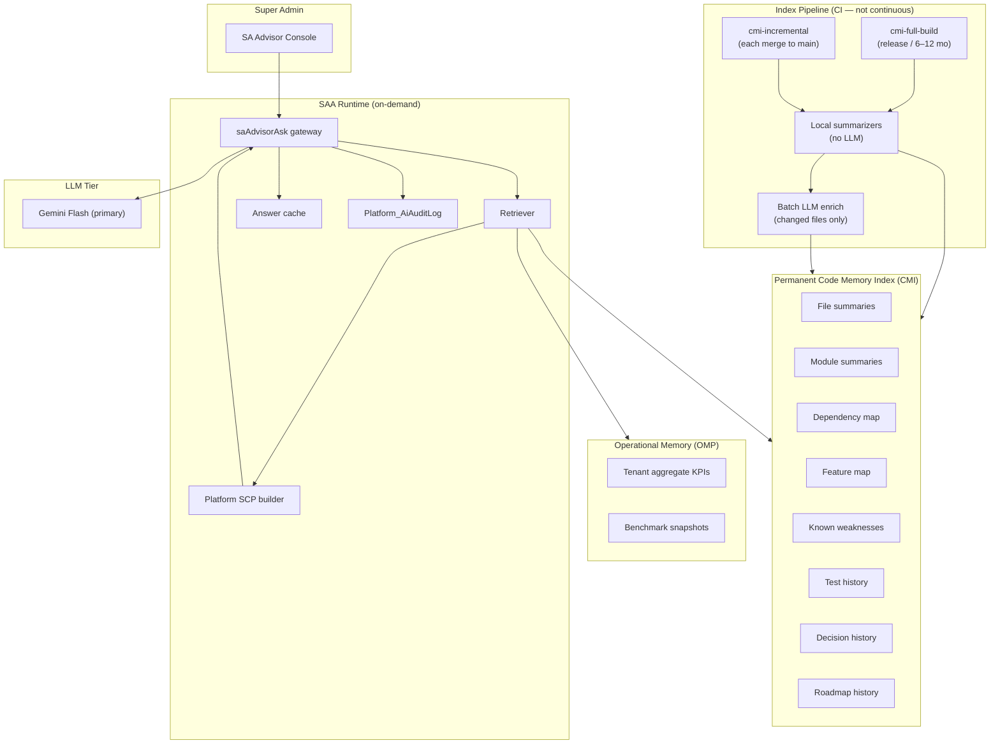
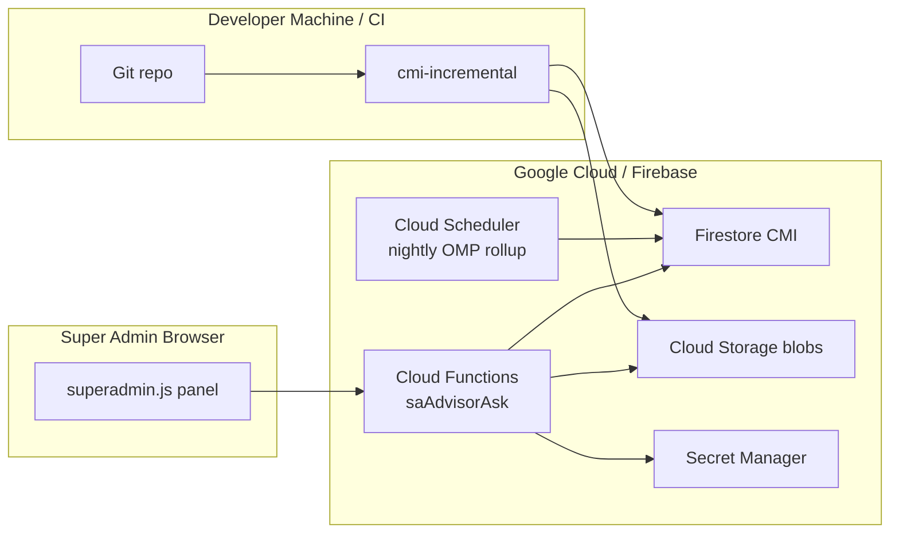

# Super Admin AI Advisor — Architecture

**Project:** Madrasa EMS  
**Document type:** Feasibility & architecture proposal  
**Date:** 2026-07-09  
**Status:** Proposal only — no implementation

---

## 1. Executive Summary

The **Super Admin AI Advisor (SAA)** is a read-only intelligence layer for platform operators. It answers two classes of questions:

| Domain | Primary memory source | LLM role |
|--------|----------------------|----------|
| **A. Software improvement** | Permanent **Code Memory Index (CMI)** | Synthesize retrieved summaries into advice |
| **B. Institution improvement** | Tenant **Operational Memory Pack (OMP)** — aggregates only | Interpret KPI patterns; no raw student dumps |

**Core cost principle:** The full codebase is processed **once** at index build time. After that, only **changed files** are re-indexed. Queries retrieve **small, relevant memory slices** — never the whole repository.

**Feasibility:** **High.** EMS already has gateway, SCP, audit, and guardrail patterns (`functions/lib/ai/`). SAA reuses those patterns with a **separate callable**, **separate storage**, and **separate context schema**.

---

## 2. Design Goals

| # | Requirement | Architectural response |
|---|-------------|------------------------|
| 1 | Read codebase once | CI `cmi-full-build` job on release tag |
| 2 | Update changed files only | Git SHA + per-file hash diff → `cmi-incremental` |
| 3 | Never send whole codebase to LLM | Retrieval over CMI; max PSC 32 KB per query |
| 4 | Permanent memory layers | Firestore + Cloud Storage structured store |
| 5 | Answer from stored memory | RAG retrieval → PSC assembly → single LLM call |
| 6 | Read-only | No write/deploy/DB/permission APIs in SAA surface |
| 7 | Software + institution advice | Dual intent router with isolated data paths |
| 8 | Cost control | Local summarization first; cache; rate limits |
| 9 | Security | SA-only auth; tenant/code separation; audit all queries |
| 10 | Compare cloud/local/hybrid | See Section 8 — **Hybrid recommended** |

---

## 3. System Context



---

## 4. Component Architecture

### 4.1 SAA Console (Super Admin UI)

**Location (proposed):** New panel in `superadmin.js` — "Platform Advisor"

| UI element | Function |
|------------|----------|
| Mode toggle | Software / Institution / Combined |
| Question input | Urdu or English |
| Scope picker | Module, tenant (institution), date range |
| Source citations | Links to CMI file IDs + doc paths |
| Report export | Markdown/PDF download |
| Memory status | CMI version, last incremental, next full refresh |
| Usage meter | Queries remaining today |

**No auto-actions:** All outputs labeled *"Recommendation — human verification required"*.

---

### 4.2 Index Pipeline (CI/CD — not runtime)

Two jobs, triggered by events — **never continuous polling**:

| Job | Trigger | LLM usage |
|-----|---------|-----------|
| `cmi-full-build` | Release tag; or scheduled every **6 months** (configurable 12) | Batch summarize all indexable files (one-time per cycle) |
| `cmi-incremental` | Push to `main` with changed paths | Summarize **changed files only** |

**Indexable scope (excludes):**
- `node_modules/`, `dist/`, `android/build/`, `.git/`, backups
- Binary assets (images, fonts) — metadata only
- Files > 500 KB — chunk + summarize per chunk

**Local-first processing (no LLM):**
- File hash (SHA-256)
- Line count, exports, global function names (AST-lite regex)
- Import/require graph edges
- Test file association (`tests/**/*.{test,spec}.js`)
- Doc cross-links from `docs/`
- Manifest membership (`ems-cloud-manifest.js`, loaders)

**LLM enrichment (changed files only):**
- 150–300 token file summary
- Module role classification
- Weakness hints (complexity, missing tests nearby)

---

### 4.3 Code Memory Index (CMI) — Storage Layout

**Primary store:** Firestore (queryable metadata) + Cloud Storage (large JSON blobs)

```
Platform_CodeMemory/
  meta/
    currentVersion          — { version, gitSha, builtAt, fileCount, nextFullRefreshDue }
  files/{fileId}            — per-file record
  modules/{moduleId}        — rolled-up module summary
  features/{featureId}      — feature map entry
  dependencies/
    graph.json              — stored in GCS
  weaknesses/{weakId}       — known issues (manual + auto)
  tests/
    history/{runId}         — vitest/playwright summary snapshots
  decisions/{decisionId}    — ADR-style entries (from docs + manual SA input)
  roadmap/
    snapshots/{snapshotId}  — parsed roadmap doc state
  cache/
    answers/{hash}          — optional cached LLM responses
```

See **`AI_CODE_MEMORY_DESIGN.md`** for schema detail.

---

### 4.4 Retrieval & Query Runtime

**Query flow (every SA question):**

1. **Auth:** `assertSuperAdmin()` — reuse `functions/lib/sa-access.js`
2. **Intent classify:** `software` | `institution` | `combined`
3. **Retrieve:** Top-K CMI slices by keyword + module tag + feature tag (local, no LLM)
4. **Assemble PSC:** Platform Structured Context Pack ≤ 32 KB
5. **Cache check:** Hash(question + intent + cmiVersion + scope) → return if hit
6. **LLM call:** Single `saAdvisorAsk` with Urdu/English system prompt
7. **Audit:** Write `Platform_AiAuditLog`
8. **Cache store:** TTL 24h–7d depending on query type

**Never in query path:** Full repo read, git clone, or unbounded file scan.

---

### 4.5 Dual Advisor Paths

#### Path A — Software improvement

| Input | CMI retrieval |
|-------|---------------|
| "Registration module security gaps?" | `modules/registration/*`, `weaknesses/*`, `tests/history`, `firestore.rules` summary |
| "Missing tests for AI stack?" | `features/ai-assistant`, test coverage map |
| "Performance bottlenecks?" | `docs/benchmark-latest.json` snapshot, loader order, IDB modules |

#### Path B — Institution improvement

| Input | OMP retrieval |
|-------|---------------|
| "How can madrasa X improve admissions?" | Tenant aggregate: enrollment counts, duplicate rate, draft recovery stats — **no names/CNIC** |
| "Finance collection patterns?" | Aggregated arrears by class band, collection rate trends |
| "Parent communication gaps?" | Message volume, response SLA aggregates |

**OMP is built separately** from tenant operational data (scheduled nightly aggregate job), **not** from codebase. SA must explicitly select tenant + confirm no PII mode.

See **`AI_INSTITUTION_ADVISOR_PLAN.md`**.

---

### 4.6 Gateway Isolation

| Aspect | Tenant AI (`aiAsk`) | SAA (`saAdvisorAsk`) |
|--------|---------------------|----------------------|
| Auth | Owner/staff | Super Admin only |
| Context | Student/institution SCP | Platform PSC / OMP |
| API key | Per-tenant Firestore | Platform Secret Manager |
| Audit collection | `AiAuditLog` | `Platform_AiAuditLog` |
| Rate limit | Per staff (future) | Per SA user, strict |
| PII | Student summaries | Aggregates only by default |

**Do not extend `aiAsk`** — prevents scope bleed and accidental student data in platform queries.

---

## 5. Relationship to Existing EMS AI

| Reuse | New |
|-------|-----|
| Gateway pattern (`gateway.js`) | `sa-advisor-gateway.js` |
| Provider router (`router.js`) | Platform key in Secret Manager only |
| Output sanitization (`guardrails.js`) | SA-specific domain guards |
| Audit pattern (`audit.js`) | `Platform_AiAuditLog` |
| SCP validation concept | Platform PSC schema (separate) |
| — | CMI index pipeline |
| — | Retrieval engine |
| — | OMP aggregate builder |

---

## 6. Deployment Topology



**No indexer runs inside the madrasa client app.** Indexing is platform-side only.

---

## 7. Read-Only Enforcement

| Surface | Allowed | Blocked |
|---------|---------|---------|
| SAA callable | Read CMI, read OMP, LLM synthesis | Any mutation API |
| CI indexer | Write CMI only | App code, Firestore tenant data, rules |
| SA UI | Display, export reports | Deploy buttons, git push, rule editor |
| OMP builder | Write aggregate stats | Student names, CNIC, photos |

**Implementation guard (future):** SAA Cloud Function exports **only** `saAdvisorAsk`, `saAdvisorGetMemoryStatus`, `saAdvisorListReports` — no admin mutation functions in same module.

---

## 8. AI Deployment Options Comparison

| Criterion | Cloud AI | Local AI | Hybrid (recommended) |
|-----------|----------|----------|----------------------|
| Index summarization | Batch via Gemini Flash | Local model (Qwen/Llama) | **Local parse + cloud enrich changed files** |
| Query answering | Gemini/Claude | Ollama on SA server | **Retrieve local → synthesize cloud** |
| Urdu quality | Excellent | Variable | Cloud for final answer |
| Setup complexity | Low | High (GPU/CPU ops) | Medium |
| Data leaves platform | Summary text only | Never | Minimized — only PSC slices |
| Cost at low volume | ~$5–30/mo | Hardware + electricity | **~$8–35/mo** |
| Cost at high volume | Scales with tokens | Fixed hardware | Best balance |
| Offline SA console | No | Possible (degraded) | Cached reports offline; new queries need cloud |
| Code understanding depth | Strong | Moderate | Strong |

**Recommendation:** **Hybrid**
- **Local (deterministic):** hashing, AST-lite parsing, dependency graph, retrieval, caching, test result ingestion
- **Cloud (LLM):** file summary enrichment on change; final answer synthesis on query
- **Not recommended:** Full local LLM for Urdu institutional + code advice at MVP quality

Detail: **`AI_COST_CONTROL_PLAN.md`**, **`AI_SECURITY_AND_PRIVACY_PLAN.md`**.

---

## 9. Non-Functional Requirements

| NFR | Target |
|-----|--------|
| Query latency (cache miss) | < 8 s P95 |
| Query latency (cache hit) | < 500 ms |
| CMI incremental job | < 5 min for ≤ 20 changed files |
| CMI full rebuild | < 45 min (190 deploy files + source) |
| PSC max size | 32 KB |
| SA queries per day | 30 default (configurable) |
| CMI availability | 99.5% (Firestore SLA) |
| Answer cache hit rate | > 40% after month 1 |

---

## 10. Risks & Mitigations

| Risk | Mitigation |
|------|------------|
| Stale CMI misleads SA | Surface `cmiVersion` + `gitSha` in every answer |
| Index drift from uncommitted local edits | Index only from CI git checkout |
| LLM hallucinated file references | Require citation IDs from retrieved CMI records |
| Institution path PII leak | OMP schema: aggregates only; explicit opt-in for named reports |
| Cost spike | Rate limits + cache + local retrieval |
| CMI write corruption | Versioned snapshots; rollback to previous `meta/currentVersion` |

---

## 11. Recommended Architecture (Final)

**Name:** **EMS Platform Advisor** with **Code Memory Index (CMI)** + **Operational Memory Pack (OMP)**

**Stack:**
- CI indexer (Node.js scripts in `scripts/cmi-*` — future)
- Firestore + GCS memory store
- Retrieval engine (keyword + tag, no vector required at MVP)
- Isolated `saAdvisorAsk` Cloud Function
- Gemini 2.5 Flash (platform Secret Manager key)
- SA console panel in superadmin

**Not in MVP:** Vector embeddings, live git access from runtime, auto-remediation, parent/staff access.

---

## 12. What to Build First

| Order | Component | Rationale |
|-------|-----------|-----------|
| 1 | CMI schema + local indexer (no LLM) | Foundation; zero marginal AI cost |
| 2 | `saAdvisorAsk` + SA auth + audit | Safe query path |
| 3 | Software-mode retrieval + PSC | Immediate SA value |
| 4 | Incremental hash diff job | Ongoing cost control |
| 5 | Answer cache + rate limits | Cost hardening |
| 6 | Batch LLM enrich (changed files) | Richer summaries |
| 7 | OMP aggregates + institution mode | Second advisor domain |
| 8 | Scheduled 6-month full refresh | Long-term accuracy |

Detail: **`AI_IMPLEMENTATION_ROADMAP.md`**.

---

## 13. Estimated Cost (Platform-Level)

| Item | Monthly (indicative) |
|------|----------------------|
| LLM — incremental indexing (~50 files/mo) | $1 – $3 |
| LLM — SA queries (~200/mo) | $4 – $15 |
| Firestore CMI storage | $1 – $3 |
| Cloud Storage blobs | < $1 |
| Cloud Functions invocations | < $2 |
| Secret Manager | < $1 |
| **Total** | **~$8 – $25 / month** |

Assumes Hybrid architecture and rate limits. See **`AI_COST_CONTROL_PLAN.md`**.

---

## 14. Document Index

| Report | Purpose |
|--------|---------|
| `AI_CODE_MEMORY_DESIGN.md` | CMI schema, incremental update, memory layers |
| `AI_COST_CONTROL_PLAN.md` | Cost controls, caching, refresh schedule |
| `AI_SECURITY_AND_PRIVACY_PLAN.md` | Auth, separation, audit, keys |
| `AI_INSTITUTION_ADVISOR_PLAN.md` | OMP, institution advice domain |
| `AI_IMPLEMENTATION_ROADMAP.md` | Phases, timeline, priorities |

---

## 15. Conclusion

The Super Admin AI Advisor is **architecturally feasible and cost-controllable** when built as a **memory-first hybrid system**: index once, update diffs only, retrieve small context packs, cache answers, and isolate from tenant AI.

The recommended path is **not** "send codebase to ChatGPT on every question" — it is a **permanent Code Memory Index** with **incremental maintenance** and **on-demand synthesis**.

---

*Proposal only — no code implemented.*
