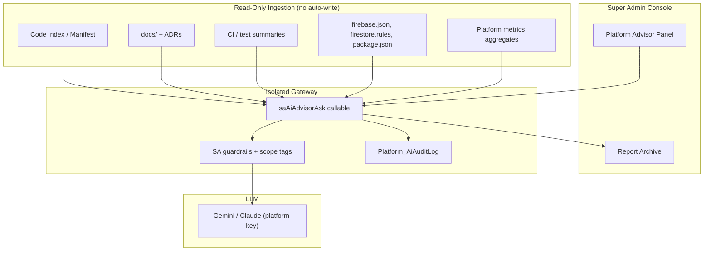

# Super Admin AI Advisor Proposal

**Project:** Madrasa EMS  
**Audit type:** Read-only study & recommendation  
**Date:** 2026-07-09  
**Constraint:** Read-only advisor — **no automatic code changes**

---

## 1. Purpose

Evaluate whether a **Super Admin AI Advisor** can be built for the Madrasa EMS platform that:

- Reads the **codebase and architecture** (not live student PII by default)
- Does **not** modify code automatically
- Audits architecture, finds weak areas, suggests improvements
- Proposes missing global features, performance, security, and UI enhancements
- Generates reports for Super Admin review

---

## 2. Feasibility Verdict

**Yes — highly feasible** as a **separate advisory product layer**, distinct from the existing tenant-facing Gemini assistant.

The current `aiAsk` pipeline is optimized for **tenant operational analytics** (student KPIs). A Super Admin Advisor requires a **different context source** (repository metadata, architecture docs, CI results, Firestore rules, dependency graphs) and **stricter read-only guardrails**.

**Recommendation:** Build as **"Platform Advisor"** — not an extension of tenant FAB chat.

---

## 3. Proposed Architecture



---

## 4. Core Design Principles

| Principle | Implementation |
|-----------|----------------|
| **Read-only** | No file write APIs; no deploy hooks; no git push |
| **No tenant PII by default** | Separate intent namespace from tenant `aiAsk` |
| **Human-in-the-loop** | All outputs labeled "recommendation" — SA approves actions manually |
| **Scoped context packs** | Platform SCP (PSC) — max size, schema version, source citations |
| **Audit everything** | `Platform_AiAuditLog` with SA uid, scope, token estimate |
| **Cost caps** | Platform-level daily budget; SA role required |

---

## 5. Advisor Capabilities (Recommended)

### 5.1 Architecture audit

- Module dependency map (registration, finance, cloud, functions)
- Loader order and lazy-load coverage
- Offline-first compliance per module
- SSOT vs legacy path detection
- Duplicate logic patterns (e.g., fee index builders)

### 5.2 Security audit

- Firestore rules diff summaries
- Callable function auth coverage
- AI SCP leakage patterns (reuse existing audit learnings)
- Secret storage review (Firestore plaintext keys flag)
- RBAC permission vs enforcement gaps

### 5.3 Performance audit

- Bundle size / lazy load opportunities
- IDB vs Firestore hot paths
- Benchmark doc trends (`docs/benchmark-latest.json`)
- Cloud function cold start inventory

### 5.4 Feature gap analysis

- Cross-reference roadmap docs vs codebase (grep manifest)
- Global comparison scores (registration, AI, mobile)
- Missing tests per critical module

### 5.5 UI/UX review

- Mobile usability patterns
- RTL consistency
- Module discoverability (ribbon tab audit)

### 5.6 Report generation

Structured markdown reports:
- `SA_ADVISOR_WEEKLY_HEALTH.md`
- `SA_ADVISOR_SECURITY_DELTA.md`
- `SA_ADVISOR_RELEASE_READINESS.md`

---

## 6. What It Must NOT Do

| Prohibited | Reason |
|------------|--------|
| Auto-commit / auto-deploy | User requirement |
| Read live student CNIC/photos | Privacy |
| Cross-tenant operational queries via tenant `aiAsk` | Scope bleed |
| Store SA questions with tenant data mixed | Compliance |
| Execute shell commands on production | Safety |

---

## 7. Permissions Model

| Actor | Access |
|-------|--------|
| Super Admin | Full Platform Advisor |
| Platform support (future) | Read-only reports, no new queries |
| Tenant owner | **No access** — separate product |
| Tenant staff | **No access** |

**Auth:** Existing `isSuperAdmin()` + dedicated callable `saAiAdvisorAsk` using `sa-access.js` patterns.

**Firestore:**
```
Platform_Config/ai_advisor_config  — platform Gemini key (Secret Manager)
Platform_AiAuditLog/{id}           — SA only read
Platform_AiReports/{id}            — generated report storage
```

---

## 8. Context Strategy (Codebase-Only)

### Phase A — Static index (recommended start)

Pre-build index on release (CI job, no runtime git access):

| Source | Indexed content |
|--------|-----------------|
| `scripts/prepare-hosting.js` manifest | Deployed file list |
| `package.json` | Dependencies |
| `firestore.rules` | Rule structure |
| `functions/index.js` | Export catalog |
| `docs/*.md` | Roadmap, audits, scores |
| `tests/` | Test file inventory + pass counts |
| Module grep map | `ems-*` file roles (generated) |

**Platform SCP example:**
```json
{
  "pscVersion": 1,
  "scope": "architecture_audit",
  "summary": {
    "moduleCount": 42,
    "aiModules": ["cloud/ems-ai-*.js", "functions/lib/ai/"],
    "testCount": 530,
    "knownGaps": ["registration AI", "rate limits"],
    "sourceRefs": ["docs/AI_SYSTEM_ARCHITECTURE_REPORT.md"]
  }
}
```

### Phase B — Live repo connector (optional, dev-only)

- GitHub read-only token in Secret Manager
- Index specific branches on demand
- **Never** on production tenant devices

---

## 9. Offline Strategy

| Mode | Behavior |
|------|----------|
| SA console online | Full advisor via cloud LLM |
| SA console offline | **Cached last reports only** — no new LLM calls |
| Local model (optional) | Small model for index search only — not full audit quality |

Platform Advisor is **inherently cloud** — acceptable because SA operations are online-admin workflows, unlike madrasa field staff offline registration.

---

## 10. Privacy Protections

1. **Separate callable** from tenant `aiAsk` — no shared prompt path
2. **No student SCP builders** in SA advisor
3. **Redact secrets** in indexed config (API key patterns)
4. **Tenant-aggregated metrics only** if platform stats needed (counts, not names)
5. **Report watermark:** "AI-generated — verify before action"
6. **Retention:** 90-day audit purge

---

## 11. Cost Analysis

### Assumptions
- Gemini 2.5 Flash ~$0.075 / 1M input tokens (indicative; verify current pricing)
- Average Platform SCP: 8–15 KB (~2–4K tokens)
- Average response: 1–2K tokens
- ~20 SA queries/day platform-wide

### Estimated monthly cost
| Item | Estimate |
|------|----------|
| LLM tokens (600 queries) | **$5 – $25 / month** |
| Firestore audit storage | **< $1** |
| Index rebuild (CI) | **$0** (existing runner) |
| Secret Manager | **< $1** |

**Conclusion:** Cost is **negligible vs platform value** if rate-limited.

### Cost controls
- Per-SA daily query cap (e.g., 30)
- Max PSC size 32 KB (smaller than tenant SCP)
- Cache identical architecture reports 24h

---

## 12. Model Selection

| Option | Pros | Cons | Recommendation |
|--------|------|------|----------------|
| **Cloud Gemini Flash** | Already integrated; cheap; fast | Google processor | **Default** |
| **Cloud Claude Sonnet** | Strong code reasoning | Second integration | **Optional premium tier** |
| **Local Ollama (CodeLlama/Qwen)** | No data leaves server | Weak on Urdu reports; ops burden | Dev-only index assist |
| **Hybrid** | Local retrieval + cloud synthesis | Complexity | **Phase B** |

**Verdict:** **Cloud Gemini Flash for MVP**; add Claude for deep security audits if budget allows. **Local AI not recommended** for full advisor quality — use only for offline doc search.

---

## 13. Implementation Phases (Proposal Only)

| Phase | Deliverable | Effort |
|-------|-------------|--------|
| **SA-A1** | `saAiAdvisorAsk` callable + SA guardrails | 1 week |
| **SA-A2** | CI-generated platform index + PSC builder | 1 week |
| **SA-A3** | Super Admin UI panel + report archive | 1 week |
| **SA-A4** | Pre-built audit templates (security, architecture, release) | 1 week |
| **SA-A5** | Rate limits, cost dashboard, tests | 1 week |

**Total:** ~5 weeks (1 developer), no auto-code-change scope.

---

## 14. Relationship to Existing Tenant AI

| Aspect | Tenant AI (current) | SA Platform Advisor (proposed) |
|--------|---------------------|--------------------------------|
| User | Owner/staff | Super Admin only |
| Data | Student/institution SCP | Codebase/platform PSC |
| Callable | `aiAsk` | `saAiAdvisorAsk` (new) |
| API key | Per-tenant Firestore | Platform Secret Manager |
| Offline | Blocked | Blocked (reports cached) |
| Auto actions | None | **None (by design)** |

**Do not merge** into one chat — prevents scope creep and PII leakage.

---

## 15. Success Criteria

- [ ] SA can generate architecture report without reading student records
- [ ] Zero automatic git/deploy actions
- [ ] All queries audited with SA uid
- [ ] Reports cite source files/docs
- [ ] Rate limit prevents >$50/mo surprise bill
- [ ] Urdu + English report output option

---

## 16. Final Recommendation

**Build the Super Admin AI Advisor** as a **platform-scoped, read-only, cloud-LLM advisory service** with CI-generated codebase index. Reuse EMS AI **patterns** (gateway, SCP, audit, guardrails) but **not** the tenant data pipeline.

**Priority:** After P0 AI security fixes (Secret Manager, rate limits) on tenant AI — SA advisor can share hardened gateway infrastructure.

**Confidence:** **High** — aligns with existing architecture and explicit user constraints.

---

*End of Super Admin AI Advisor Proposal*
