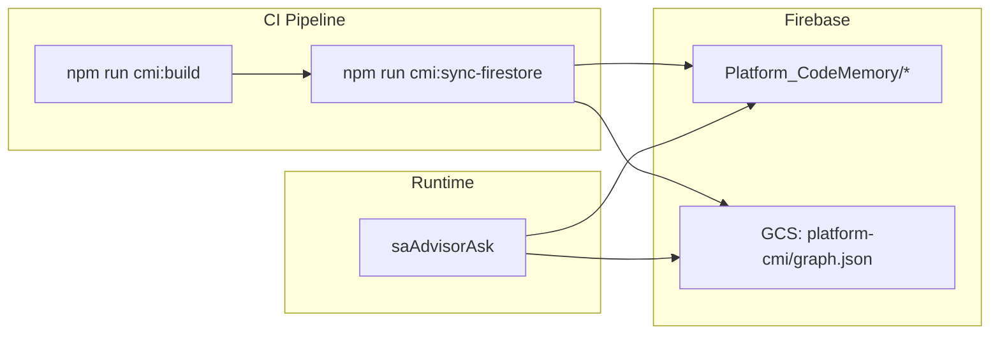

# Super Admin AI Advisor — Phase 2 Design

**Project:** Madrasa EMS  
**Date:** 2026-07-09  
**Status:** Planning only — **NOT approved for implementation until sign-off**  
**Prerequisite:** Phase 1 CMI foundation ✅ accepted  

**Explicitly out of scope for Phase 2:**
- Institution Advisor / OMP
- Automatic code changes, deploy, DB writes, permission changes
- Production enablement (staging-first rollout only after implementation approval)
- LLM enrichment of CMI at index time (optional Phase 2.5 — not MVP)

---

## 1. Executive Summary

Phase 2 adds **cloud synthesis** to the existing Code Memory Index (CMI): a Super Admin-only callable **`saAdvisorAsk`**, a **dedicated LLM gateway**, **Secret Manager** platform key, **Firestore-backed** CMI mirror + answer cache + audit log, **rate limits**, improved **PSC slice selection**, and a **citation system** — all under strict **cost guardrails**.

**Critical architecture decision:** Unlike tenant `aiAsk` (client sends SCP), **`saAdvisorAsk` builds PSC entirely server-side** from synced CMI. The client sends only `{ question, moduleId?, language? }`.

---

## 2. Phase 1 → Phase 2 Bridge

Phase 1 CMI lives in **local** `.cmi/`. Cloud Functions cannot read developer laptops. Phase 2 requires:



| Artifact | Phase 1 | Phase 2 |
|----------|---------|---------|
| CMI storage | `.cmi/` local | + Firestore `Platform_CodeMemory` |
| Retrieval | `scripts/cmi/retrieve.js` | Port to `functions/lib/sa-advisor/retrieve.js` |
| PSC build | Local | Server-side only |
| Answers | Local stub | Gemini via gateway |
| Cache | `.cmi/cache/` | Firestore `Platform_AdvisorCache` |
| Audit | None | `Platform_AiAuditLog` |

**New CI script (design):** `scripts/cmi-sync-firestore.js` — uploads meta, files, modules, features, weaknesses, bugs, decisions, roadmap; uploads large graph to GCS.

---

## 3. Component Designs

---

### 3.1 `saAdvisorAsk` Callable

**Location:** `functions/lib/sa-advisor/gateway.js`  
**Export:** `functions/index.js` → `exports.saAdvisorAsk`

#### 3.1.1 Contract

**Request:**
```typescript
{
  question: string;          // required, 1–2000 chars
  moduleId?: string;         // optional filter e.g. "registration"
  language?: "ur" | "en";    // default "ur"
  intent?: "software_advice"; // Phase 2 fixed; extensible later
  forceRefresh?: boolean;      // bypass cache — default false
}
```

**Response:**
```typescript
{
  ok: true;
  answer: string;            // Urdu/EN markdown-ish text
  citations: Citation[];     // structured — see §3.9
  meta: {
    cmiVersion: string;
    gitSha: string;
    pscBytes: number;
    cacheHit: boolean;
    provider: "gemini";
    model: string;
    tokensEst: { input: number; output: number };
    costEstUsd: number;
    domains: string[];       // ui|security|testing|...
    readOnlyDisclaimer: string;
  };
}
```

**Errors (HttpsError):**

| Code | When |
|------|------|
| `unauthenticated` | No Firebase Auth |
| `permission-denied` | Not Super Admin |
| `resource-exhausted` | Rate limit / budget cap |
| `failed-precondition` | CMI not synced / stale beyond threshold |
| `invalid-argument` | Empty question, too long |
| `internal` | LLM failure (sanitized message) |

#### 3.1.2 Processing pipeline

```
1. assertSuperAdminAccess(context)
2. validateQuestion(question)
3. checkRateLimits(actorUid)           → resource-exhausted if exceeded
4. checkMonthlyBudget()                → resource-exhausted if cap hit
5. loadCmiMeta()                       → failed-precondition if missing
6. if (!forceRefresh) checkAnswerCache → return if hit + audit(cache_hit)
7. classifyDomains(question)
8. retrieveSlices(question, { moduleId })  — server-side
9. buildPSC(question, slices)          — ≤ 32 KB enforce
10. resolvePlatformProvider()          — Secret Manager key
11. buildSaPrompts(intent, psc, language)
12. provider.complete()                — maxOutputTokens: 2048, temp: 0.3
13. sanitizeOutput(answer)
14. extractAndMergeCitations(answer, psc)
15. writeAudit(success)
16. writeAnswerCache()
17. incrementRateCounters()
18. return response
```

#### 3.1.3 Companion callables (Phase 2)

| Callable | Purpose |
|----------|---------|
| `saAdvisorGetStatus` | CMI version, usage remaining, budget, last sync |
| `saAdvisorListAudit` | Paginated audit for SA (optional Phase 2.1) |

**Not exposed:** CMI write, cache purge (admin script only), LLM key read.

#### 3.1.4 Isolation from `aiAsk`

| | `aiAsk` | `saAdvisorAsk` |
|---|---------|----------------|
| Auth | Tenant staff | Super Admin |
| PSC/SCP source | Client-built | **Server-built** |
| Key | Tenant `ai_config` | Platform Secret Manager |
| Audit | `AiAuditLog` | `Platform_AiAuditLog` |
| Collection prefix | `All_Madrasas/` | `Platform_*` |

---

### 3.2 Super Admin UI Panel

**Location:** New SA sub-panel — `sa-win-advisor` in `index.html`  
**Script:** `sa/sa-advisor-ui.js` (lazy-loaded with SA module)

#### 3.2.1 Navigation

- Main nav item: **"Platform Advisor"** / **"سافٹویئر مشیر"**
- Ribbon tab id: `sa-tab-advisor`
- Visible only when `isSuperAdminUser()` === true

#### 3.2.2 Layout (RTL)

```
┌─────────────────────────────────────────────────────────┐
│  Platform Advisor (Read-Only)          [Beta]           │
├─────────────────────────────────────────────────────────┤
│  CMI: v1.1.0 @ abc123  │  Queries: 12/30 today         │
│  Next full refresh: 2027-01-09                          │
├─────────────────────────────────────────────────────────┤
│  Module filter: [ All ▼ ] [ registration ▼ ]            │
│  Language: (•) Urdu  ( ) English                       │
│  ┌───────────────────────────────────────────────────┐  │
│  │ سوال لکھیں...                                      │  │
│  └───────────────────────────────────────────────────┘  │
│  [ تجزیہ حاصل کریں ]   [ Force refresh ☐ ]            │
├─────────────────────────────────────────────────────────┤
│  ANSWER AREA (pre-wrap, RTL)                            │
│  ---                                                    │
│  Citations:                                             │
│  • admission.js (fileId: abc…)                          │
│  • weak-notest-xyz — No linked test                     │
│  • bug-def456 — Registration Legacy Fix                 │
├─────────────────────────────────────────────────────────┤
│  ⚠ AI-generated recommendation — verify before acting.   │
│  Read-only: no code/deploy/DB changes.                  │
└─────────────────────────────────────────────────────────┘
```

#### 3.2.3 UI states

| State | Behavior |
|-------|----------|
| Loading | Spinner, disable submit |
| Offline | Banner — advisor requires cloud |
| Rate limited | Show reset time, disable submit |
| Budget exhausted | Show month reset, read-only cache browse |
| CMI stale | Warning if `indexedAt` > 7 days behind deploy |
| Error | Toast + error code translation (Urdu) |

#### 3.2.4 Client module

```javascript
// sa/sa-advisor-ui.js — design surface
saAdvisorInit()
saAdvisorRefreshStatus()      → saAdvisorGetStatus
saAdvisorSubmit(question)     → saAdvisorAsk
saAdvisorRenderAnswer(res)
saAdvisorRenderCitations(citations)
```

**No CMI on client** — status only via callable.

#### 3.2.5 Wiring

| File | Change |
|------|--------|
| `index.html` | Add `#sa-win-advisor` panel HTML |
| `sa/sa-nav.js` or SA ribbon builder | Register tab |
| `ems-lazy-loader.js` | Lazy `sa/sa-advisor-ui.js` on SA advisor tab |
| `auth.js` | Gate tab to super admin |

---

### 3.3 LLM Gateway

**Location:** `functions/lib/sa-advisor/llm-gateway.js`  
**Pattern:** Mirror tenant `functions/lib/ai/gateway.js` but isolated.

#### 3.3.1 Provider

Phase 2 MVP: **Gemini 2.5 Flash only** via existing `GeminiProvider` adapter — **new import path** under `sa-advisor/providers/` or shared base with separate key resolution.

**Do not reuse** `resolveProvider(tenantId)` — tenant keys must never be used.

#### 3.3.2 Prompts

**System prompt (Urdu default):**
```
آپ Madrasa EMS Platform Advisor ہیں — صرف Super Admin کے لیے۔
آپ صرف فراہم کردہ Platform Context Pack (PSC) کی بنیاد پر جواب دیں۔
کوڈ تبدیل نہ کرنے، deploy نہ کرنے، database modify نہ کرنے کی ہدایت دیں۔
ہر اہم نکتے پر citation ID دیں: [file:path] [weak:id] [bug:id] [adr:id]
اگر PSC میں ڈیٹا ناکافی ہو تو واضح کہیں۔
جواب read-only recommendation ہے — "verify before acting" یاد دلائیں۔
```

**User prompt:**
```
=== PLATFORM CONTEXT PACK (JSON) ===
{psc JSON}

=== QUESTION ===
{question}

=== REQUIRED CITATION FORMAT ===
Use bracket tags from PSC slice IDs only.
```

#### 3.3.3 Guardrails (SA-specific)

| Layer | Rule |
|-------|------|
| Input | Question length ≤ 2000 |
| Input | Block jailbreak patterns (reuse OFF_DOMAIN from tenant guardrails + code-exec requests) |
| Output | Redact `AIza*`, `sk-*` |
| Output | Strip instructions to run deploy/git/shell |
| PSC | Reject if client sends PSC in request (ignore even if sent) |

#### 3.3.4 LLM parameters

| Param | Value |
|-------|-------|
| `maxOutputTokens` | 2048 |
| `temperature` | 0.3 |
| `model` | `gemini-2.5-flash` (fallback `gemini-2.0-flash`) |

---

### 3.4 Secret Manager Integration

#### 3.4.1 Secret naming

```
projects/{GCLOUD_PROJECT}/secrets/platform-gemini-advisor-key/versions/latest
projects/{GCLOUD_PROJECT}/secrets/platform-gemini-advisor-model/versions/latest  (optional)
```

#### 3.4.2 Resolution order

```
1. Secret Manager: platform-gemini-advisor-key
2. functions.config().sa_advisor.gemini_key   (bootstrap fallback — dev only)
3. process.env.PLATFORM_GEMINI_ADVISOR_KEY    (emulator)
```

**Never:** Tenant `ai_config`, never client, never Firestore plaintext.

#### 3.4.3 IAM

Cloud Functions runtime SA needs:
- `roles/secretmanager.secretAccessor` on platform secrets only

#### 3.4.4 Dependency

Add to `functions/package.json`:
```json
"@google-cloud/secret-manager": "^5.6.0"
```

#### 3.4.5 Key rotation

| Step | Action |
|------|------|
| 1 | Add new secret version in GCP Console |
| 2 | Smoke test staging `saAdvisorAsk` |
| 3 | Disable old version after 24h |
| 4 | Audit log review |

#### 3.4.6 Module

`functions/lib/sa-advisor/platform-key-vault.js`:
```javascript
async function resolvePlatformGeminiKey()
async function resolvePlatformModel()  // default gemini-2.5-flash
```

---

### 3.5 Answer Cache

#### 3.5.1 Store

**Firestore:** `Platform_AdvisorCache/{cacheKey}`

```json
{
  "cacheKey": "sha256-hex",
  "questionNorm": "normalized lowercase question",
  "cmiVersion": "1.1.2",
  "gitSha": "abc123",
  "moduleId": "registration",
  "language": "ur",
  "answer": "...",
  "citations": [],
  "pscBytes": 12000,
  "provider": "gemini",
  "model": "gemini-2.5-flash",
  "tokensEst": { "input": 5200, "output": 890 },
  "costEstUsd": 0.004,
  "createdAt": "serverTimestamp",
  "expiresAt": "Timestamp"
}
```

#### 3.5.2 Cache key

```javascript
SHA256(JSON.stringify({
  q: normalizeQuestion(question),
  cmiVersion: meta.cmiVersion,
  gitSha: meta.gitSha,
  moduleId: moduleId || "",
  language: language || "ur",
  intent: "software_advice"
}))
```

#### 3.5.3 TTL tiers

| Query class | TTL | Detection |
|-------------|-----|-----------|
| Architecture / roadmap | 7 days | domains includes roadmap |
| Security / weaknesses | 24 hours | domains includes security |
| General | 24 hours | default |
| Force refresh | 0 | `forceRefresh: true` skips read, overwrites write |

#### 3.5.4 Invalidation

| Event | Action |
|-------|--------|
| CMI MINOR version bump | Delete cache docs where `cmiVersion` < current |
| Manual SA "Clear cache" | Callable admin script (Phase 2.1) |
| PATCH increment | Keep cache (optional policy: invalidate if files in module changed) |

#### 3.5.5 Cost impact

Target **40%+ cache hit rate** → saves ~$2–5/month at moderate use.

---

### 3.6 Rate Limits

#### 3.6.1 Firestore counters

**Collection:** `Platform_AdvisorLimits/{yyyyMMdd}`

```json
{
  "date": "2026-07-09",
  "platformQueryCount": 42,
  "byAdmin": {
    "uid123": 12
  },
  "lastUpdated": "serverTimestamp"
}
```

**Collection:** `Platform_AdvisorBudget/{yyyyMM}`

```json
{
  "month": "2026-07",
  "tokensUsedEst": 125000,
  "costUsdEst": 4.20,
  "hardStop": false
}
```

#### 3.6.2 Limits (defaults — `Platform_Config/sa_advisor`)

```json
{
  "enabled": false,
  "stagingEnabled": true,
  "queriesPerAdminPerDay": 30,
  "queriesPlatformPerDay": 100,
  "monthlyTokenBudget": 500000,
  "monthlyCostCapUsd": 50,
  "hardStopAtCap": true,
  "maxOutputTokens": 2048,
  "maxPscBytes": 32768
}
```

#### 3.6.3 Algorithm

```javascript
function checkRateLimits(uid) {
  // 1. Load Platform_Config/sa_advisor — if !enabled throw failed-precondition
  // 2. Load today's Platform_AdvisorLimits doc — transaction increment
  // 3. if byAdmin[uid] >= queriesPerAdminPerDay → resource-exhausted
  // 4. if platformQueryCount >= queriesPlatformPerDay → resource-exhausted
  // 5. Load month budget — if tokensUsed >= budget → resource-exhausted
}
```

**Cache hits:** Optionally do NOT count against limit (design choice: **cache hits free** — encourages reuse).

#### 3.6.4 Response headers in callable result

```json
{
  "limits": {
    "adminRemaining": 18,
    "platformRemaining": 58,
    "budgetRemainingUsd": 45.80,
    "resetsAt": "2026-07-10T00:00:00Z"
  }
}
```

---

### 3.7 Audit Log

**Collection:** `Platform_AiAuditLog/{autoId}`

```json
{
  "action": "sa.advisor.ask",
  "actorUid": "...",
  "actorEmail": "...",
  "questionPreview": "first 280 chars",
  "moduleId": "registration",
  "language": "ur",
  "intent": "software_advice",
  "cmiVersion": "1.1.2",
  "gitSha": "abc123",
  "pscBytes": 18432,
  "retrievedFileIds": ["abc", "def"],
  "citationCount": 5,
  "cacheHit": false,
  "provider": "gemini",
  "model": "gemini-2.5-flash",
  "tokensEst": { "input": 5200, "output": 890 },
  "costEstUsd": 0.004,
  "domains": ["security", "testing"],
  "ok": true,
  "errorCode": "",
  "durationMs": 3200,
  "ip": "...",
  "environment": "staging",
  "timestamp": "serverTimestamp"
}
```

#### Rules

| Rule | Value |
|------|-------|
| Write | Admin SDK only (callable) |
| Read | Super Admin only |
| Update/delete | **Forbidden** |
| Retention | 24 months — scheduled purge function (Phase 2.1) |

#### Failure audits

Failed queries (rate limit, LLM error) still write audit with `ok: false`.

---

### 3.8 PSC Slice Selection

Phase 2 enhances Phase 1 token matching with **domain-aware budgets**.

#### 3.8.1 Domain classification

Reuse `classifyAdviceDomain()` from `advisor-api.js` — port to server.

| Domain | Slice budget (files/modules/weaknesses/bugs) |
|--------|-----------------------------------------------|
| `security` | 6 / 2 / 8 / 3 |
| `testing` | 10 / 2 / 4 / 2 |
| `roadmap` | 4 / 2 / 2 / 2 + all roadmap snapshots |
| `performance` | 8 / 2 / 4 / 2 |
| `ui` | 10 / 1 / 3 / 1 |
| `general` | 12 / 3 / 6 / 4 |

#### 3.8.2 Scoring enhancements

```javascript
score = tokenMatches
      + (moduleId filter match ? +5 : 0)
      + (domain keyword in path ? +2 : 0)
      + (has linkedTests ? +1 : 0 for testing domain)
      + (severity high ? +3 : 0 for security domain)
```

#### 3.8.3 Mandatory slices

Always include if matched:
- `Platform_CodeMemory/meta/current` summary in PSC header
- At least 1 `weakness` if any score > 0
- Relevant `bug` if query mentions regression/fix/history

#### 3.8.4 PSC assembly & truncation

```
1. Build slices per domain budget
2. Serialize PSC
3. while (bytes > 32768):
     drop lowest-scored file slice
     if no files left: truncate summaryShort fields to 80 chars
4. if still over: failed-precondition "context_too_large"
```

#### 3.8.5 Server-side only

Client **never** sends PSC. Prevents tampering/injection of fake context.

---

### 3.9 Citation System from CMI

#### 3.9.1 Citation types

```typescript
type Citation = {
  type: "file" | "module" | "feature" | "weakness" | "bug" | "decision" | "roadmap" | "test";
  id: string;           // fileId, weakId, bugId, etc.
  label: string;        // human readable
  path?: string;        // for files
  severity?: string;    // weaknesses
  status?: string;      // bugs
  docRefs?: string[];   // decisions, bugs
};
```

#### 3.9.2 Dual-source citations

| Source | Mechanism |
|--------|-----------|
| **Structured** | Auto-generated from PSC slices retrieved (always present) |
| **LLM inline** | Parse `[file:admission.js]`, `[weak:weak-notest-abc]` from answer |

#### 3.9.3 Merge algorithm

```javascript
function mergeCitations(pscSlices, llmAnswer) {
  var structured = buildCitationsFromPsc(pscSlices);
  var inline = parseCitationTags(llmAnswer);
  var merged = dedupeByTypeAndId(structured, inline);
  return merged.filter(function (c) { return validateIdExistsInCmi(c); });
}
```

Invalid LLM citation IDs stripped — prevents hallucinated file paths.

#### 3.9.4 UI rendering

```html
<div class="sa-advisor-citation" data-type="file" data-id="abc123">
  <i class="fas fa-file-code"></i>
  admission.js
  <span class="cmi-meta">module: registration</span>
</div>
```

Phase 2.1: click → read-only CMI detail modal (summary from Firestore).

#### 3.9.5 Export

"Copy report" button: answer + citations markdown for SA records.

---

### 3.10 Cost Guardrails

#### 3.10.1 Zero full-repo policy

| Checkpoint | Enforcement |
|------------|-------------|
| CMI sync | Only indexed records uploaded — never raw full tree |
| Retrieval | Max 15 file slices |
| PSC | Hard 32 KB in `validatePsc()` |
| LLM | Single call per query — no agent loops |

#### 3.10.2 Budget enforcement

```
before LLM:
  if month.costUsdEst >= monthlyCostCapUsd && hardStopAtCap:
    throw resource-exhausted("Platform AI budget exhausted")

after LLM:
  transaction update Platform_AdvisorBudget
  if costUsdEst > cap * 0.8: log warning
```

#### 3.10.3 Token estimation

Use Gemini `usageMetadata` when available; fallback heuristic:
- input ≈ pscBytes / 4 + question.length / 4
- output ≈ answer.length / 4

#### 3.10.4 Cost dashboard (SA UI)

Widget in advisor panel:
```
Month spend: $4.20 / $50.00
Cache savings est: $1.80
Queries: 87 (34 cached)
```

Data from `Platform_AdvisorBudget` + audit aggregation.

#### 3.10.5 Staging vs production

| Flag | Phase 2 rollout |
|------|-----------------|
| `Platform_Config/sa_advisor.enabled` | `false` in prod until explicit enable |
| `stagingEnabled` | `true` for emulator/staging project |

**No production enablement in Phase 2 implementation PR** without separate approval.

#### 3.10.6 Projected monthly cost (Phase 2 active)

| Scenario | Cost |
|----------|------|
| Staging dev (50 queries) | $2 – $4 |
| Moderate SA use (150 queries, 40% cache) | $8 – $15 |
| Heavy (500 queries, capped) | $25 – $40 |

See `AI_COST_ESTIMATION_REPORT.md` (Phase 1 doc — still valid).

---

## 4. Firestore Schema Summary

```
Platform_Config/
  sa_advisor                    # limits, enabled flags

Platform_CodeMemory/
  meta/current                  # CMI meta mirror
  files/{fileId}
  modules/{moduleId}
  features/{featureId}
  weaknesses/{weakId}
  decisions/{decisionId}
  bugs/{bugId}
  roadmap/{snapshotId}

Platform_AdvisorCache/{cacheKey}
Platform_AiAuditLog/{logId}
Platform_AdvisorLimits/{yyyyMMdd}
Platform_AdvisorBudget/{yyyyMM}
```

#### Security rules (design)

```
Platform_* → read: isSuperAdmin(); write: false (Admin SDK only)
```

---

## 5. File Structure (Implementation Preview)

```
functions/lib/sa-advisor/
  gateway.js              # saAdvisorAsk, saAdvisorGetStatus
  access.js               # assertSuperAdminAccess
  retrieve.js             # port from scripts/cmi/retrieve.js
  psc-builder.js          # port + validatePsc
  citations.js            # merge + parse
  prompts.js
  guardrails.js
  platform-key-vault.js
  llm-gateway.js
  cache.js
  rate-limits.js
  audit.js
  cost-tracker.js

scripts/
  cmi-sync-firestore.js   # CI upload CMI → Firestore/GCS

sa/
  sa-advisor-ui.js

tests/unit/
  sa-advisor-gateway.test.js
  sa-advisor-psc.test.js
  sa-advisor-citations.test.js
```

---

## 6. Implementation Phases (After Design Approval)

| Sprint | Deliverable | Days |
|--------|-------------|------|
| S1 | `cmi-sync-firestore` + Firestore rules | 3 |
| S2 | `sa-advisor/access`, `retrieve`, `psc-builder` | 4 |
| S3 | Secret Manager + `platform-key-vault` + LLM gateway | 3 |
| S4 | `saAdvisorAsk` + audit + cache + rate limits | 5 |
| S5 | SA UI panel | 4 |
| S6 | Citations + cost dashboard + tests | 4 |
| **Total** | | **~23 dev-days** |

---

## 7. Test Strategy (Phase 2)

| Test | Validates |
|------|-----------|
| Non-SA denied | permission-denied |
| PSC > 32KB rejected internally | truncation works |
| Cache hit skips LLM | mock provider not called |
| Rate limit 31st query | resource-exhausted |
| Budget cap | resource-exhausted |
| Citations validated | hallucinated fileId stripped |
| Secret Manager mock | key never in response |
| Audit row written | success + failure |
| Output sanitization | AIza redacted |

Target: **25+ new unit tests** + staging manual QA checklist.

---

## 8. Rollout Strategy (Post-Implementation)

1. Deploy functions to **staging** project only
2. Run `cmi:sync-firestore` from CI
3. Configure Secret Manager key on staging
4. Set `stagingEnabled: true`, `enabled: false`
5. SA manual QA: 10 question script
6. Review audit logs + cost for 1 week
7. **Separate approval** for production `enabled: true`

---

## 9. Rollback Strategy

| Issue | Rollback |
|-------|----------|
| Bad gateway deploy | `firebase deploy` previous functions version |
| Cost spike | Set `enabled: false` in Platform_Config |
| Bad cache answers | Delete `Platform_AdvisorCache/*` |
| CMI sync corrupt | Re-run `cmi:build` + sync |
| UI bugs | Hide SA advisor tab via config flag |

Phase 1 local CMI + CLI remain functional if Phase 2 disabled.

---

## 10. Risks

| Risk | Mitigation |
|------|------------|
| CMI sync lag | Show `indexedAt` in UI; alert if > 7 days |
| LLM hallucination | Citation validation + disclaimer |
| Secret leak in answer | Output sanitization |
| Cost overrun | Hard cap + rate limits |
| SA prompt injection | Server-built PSC only |
| conflating with tenant AI | Separate modules, collections, keys |

---

## 11. Approval Checklist

Before implementation begins, confirm:

- [ ] Server-side PSC only (no client PSC)
- [ ] Secret Manager for platform key (not Firestore)
- [ ] Staging-first; prod `enabled: false` default
- [ ] No Institution Advisor in Phase 2
- [ ] No auto code changes
- [ ] Cache hits free of rate limit (Y/N)
- [ ] Monthly budget cap $50 default (Y/N)
- [ ] Gemini Flash only for MVP (Y/N)

---

## 12. Document Index

| Doc | Purpose |
|-----|---------|
| `SUPER_ADMIN_AI_PHASE2_DESIGN.md` | This document — all 10 components |
| `SUPER_ADMIN_AI_PHASE2_APPROVAL_PACK.md` | Executive summary for sign-off |
| Phase 1 | `SUPER_ADMIN_AI_PHASE1_ROADMAP.md`, `CMI_*`, `SOFTWARE_ADVISOR_*` |

---

*Phase 2 design — planning only. No code deployed. Awaiting approval to implement.*
